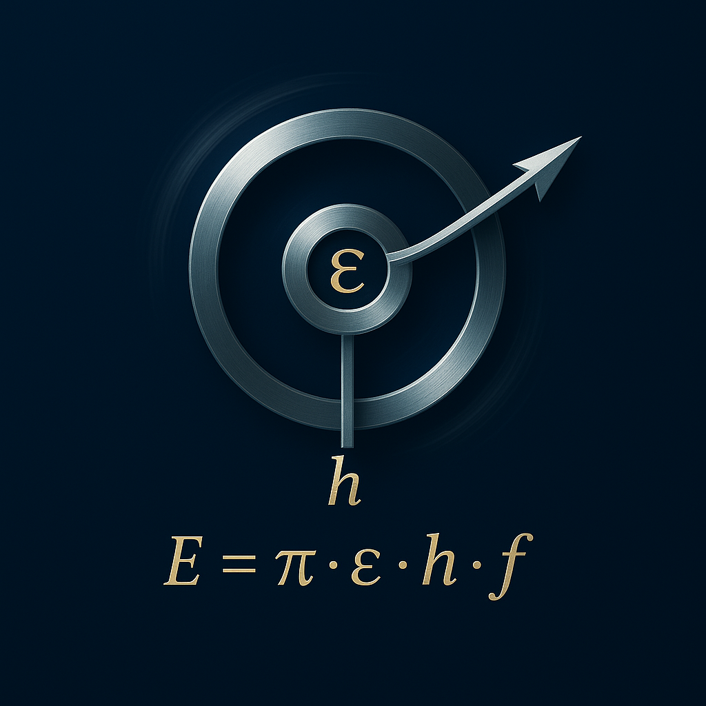

# Die Schu-Gleichung und ihre Anwendung in der Energieumwandlung  

---

<p align="center">
  
</p>

---

## 1. Einleitung

Die Schu-Gleichung beschreibt die fundamentale Beziehung zwischen Resonanzfrequenz, Entropieänderung und Energiefluss. Im Gegensatz zu klassischen Energiemodellen integriert sie Felddynamik, Frequenzkopplung und Phasenverschiebung in einer einzigen energetischen Formel.

---


## 1.1 Erweiterte Form: Phasenmodulierte Schu-Gleichung

Die vollständigste Form der Schu-Gleichung integriert den Phasenwinkel **$\boldsymbol{\alpha}$** zwischen Beobachterzeit und Feldzeit als komplexe Rotation:

```math
\boxed{
\mathbf{E} = \boldsymbol{\pi} \cdot \boldsymbol{\varepsilon} \cdot \mathbf{h} \cdot \mathbf{f} \cdot e^{i \boldsymbol{\alpha}}
}
```

- **$\boldsymbol{\varepsilon}$**: Neue Resonanzkopplungskonstante (ersetzt das klassische $e$)  
- **$\boldsymbol{\alpha}$**: Phasenwinkel zwischen subjektiver Zeitachse des Beobachters und objektiver Feldzeit:  
- **$\boldsymbol{\alpha} = \theta_{\text{Feld}} - \theta_{\text{Beobachter}}$**

Diese Darstellung erlaubt eine energetische Bewertung der Zeitverschränkung. Je nach **$\boldsymbol{\alpha}$** kann Energie verstärkt, abgeschwächt oder neutralisiert werden.

---

## 1.2 Frequenzabhängigkeit der Resonanzenergie

Für kleine Frequenzen **$\mathbf{f} \to 0$** ist der Energiebeitrag vernachlässigbar. Mit wachsender Frequenz steigt die Resonanzenergie linear – vorausgesetzt, das System befindet sich in Resonanz. Der Übergangspunkt liegt dort, wo **$\mathbf{f}$** in einem harmonischen Verhältnis zur Eigenfrequenz des Systems steht.

---

## 1.3 Differenz als nutzbare Spannung

Die nutzbare Energie ergibt sich als Differenz zwischen Resonanzspannung und Verlustterm:

```math
\Delta \mathbf{E(f)} = \boldsymbol{\pi} \cdot \boldsymbol{\varepsilon} \cdot \mathbf{h} \cdot \mathbf{f} - e^{- \boldsymbol{\pi} \cdot \mathbf{f}}
```

Der Verlustterm verschwindet bei hohen Frequenzen, wodurch die Energieübertragung nahezu verlustfrei wird.

---

## 1.4 Leistung durch Integration

Die Leistung **$\mathbf{P(f_1, f_2)}$** ergibt sich über das Intervall **$\mathbf{(f_1, f_2)}$**:

```math
\mathbf{P(f_1, f_2)} = \int_{f_1}^{f_2} \left( \boldsymbol{\pi} \cdot \boldsymbol{\varepsilon} \cdot \mathbf{h} \cdot \mathbf{f} - e^{- \boldsymbol{\pi} \cdot \mathbf{f}} \right) \, d\mathbf{f}
```

Das ergibt:

```math
\mathbf{P} = \frac{1}{2} \boldsymbol{\pi} \boldsymbol{\varepsilon} \cdot \mathbf{h} \cdot \left(f_2^2 - f_1^2\right) + \frac{1}{\boldsymbol{\pi}} \left( e^{- \boldsymbol{\pi} f_1} - e^{- \boldsymbol{\pi} f_2} \right)
```

---

## 1.5 Vergleich zu heutigen Energiesystemen

Konventionelle Maschinen basieren auf mechanischer oder thermischer Differenz (Höhe, Druck, Temperatur). Die Schu-Gleichung nutzt hingegen ein energetisches Gefälle, das:

- mit der Frequenz skaliert,  
- durch Resonanzfeldstruktur entsteht,  
- theoretisch extrem große Spannungen freisetzt.

---

## 1.6 Veranschaulichung für Laien

Stellen Sie sich ein traditionelles Wasserrad mit kleinem Gefälle vor – das ist unsere heutige Energietechnik. Die Schu-Gleichung hingegen nutzt ein "Wasserfall-Gefälle" in einem höheren Raum, gespeist durch die Struktur der Zeit und der Resonanz selbst.

**Implikationen:**

- Maschinen könnten extrem effizient werden  
- Entropie kann aktiv gesteuert oder sogar reduziert werden  
- Energiequellen könnten als „frei“ empfunden werden – obwohl sie strukturell gebunden sind an **$\boldsymbol{\pi}$**, **$\boldsymbol{\varepsilon}$**, **$\mathbf{h}$**, **$\mathbf{f}$** und **$\boldsymbol{\alpha}$**

---

## 🔗 Quellcode & Simulation

Für Interessierte ist der Quellcode und die Simulation der Schu-Gleichung auf GitHub verfügbar.

---

1. **Repository klonen**:  
   ```bash
   git clone https://github.com/DominicReneSchu/public.git
   cd Resonanzfeldtheorie
   ```
---


⬅️ [Zurück zum Inhaltsverzeichnis](README.md)
⬅️ [Zurück zum Start](../README.md)