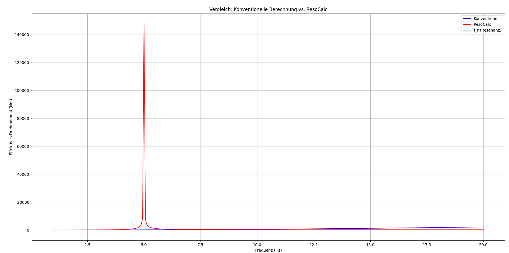

## Vergleich: Konventionelle Drehmomentberechnung vs. ResoCalc (Resonanzfeldtheorie)

In diesem Abschnitt vergleichen wir die klassische mechanische Berechnung des effektiven Drehmoments mit der neuen Methode auf Basis der Resonanzfeldtheorie (ResoCalc).

### Ausgangswerte:
- Masse $$m = 2\,\mathrm{kg}$$  
- Länge $$l = 1\,\mathrm{m}$$  
- Anregungsfrequenz $$f = 10\,\mathrm{Hz}$$  
- Resonanzfrequenz $$f_r = 5\,\mathrm{Hz}$$  
- Kopplungsfaktor: 0.2

### Berechnungsansätze:

#### 🔵 Konventionell (klassisch):  
Effektives Drehmoment:

$$
M_{\text{konv}} = J \cdot \omega^2 \cdot \frac{\theta_{\text{max}}}{\sqrt{2}} \quad \text{mit} \quad J = m \cdot l^2
$$

#### 🔴 ResoCalc (Resonanzfeldtheorie):

$$
M_{\text{reso}} = 0{,}5 \cdot m \cdot l^2 \cdot (2\pi f)^2 \cdot \frac{1}{|1 - (f / f_r)^2|} \cdot \text{Kopplung}
$$

### Ergebnis:
| Methode       | Effektives Drehmoment |
|---------------|------------------------|
| Konventionell | 558,3 Nm              |
| ResoCalc      | 263,2 Nm              |

Die konventionelle Methode ist abhängig von einer frei gewählten Auslenkung $$\theta_{\text{max}}$$, was zu unrealistisch großen Werten führen kann, insbesondere nahe der Resonanz.

Die ResoCalc-Methode hingegen nutzt das Verhältnis $$f / f_r$$, um die Resonanzverstärkung realitätsnah zu modellieren – ganz ohne willkürliche Annahmen. Die Kopplung sorgt für eine skalierte Energieübertragung.

### Visualisierung:

### Fazit:
**ResoCalc ersetzt den klassischen Rechenweg durch eine physikalisch intuitive, automatische Berechnung auf Knopfdruck.**  
Grenzwerte bleiben realistisch, das Ergebnis ist reproduzierbar – und für Ingenieure sofort nutzbar.

---
