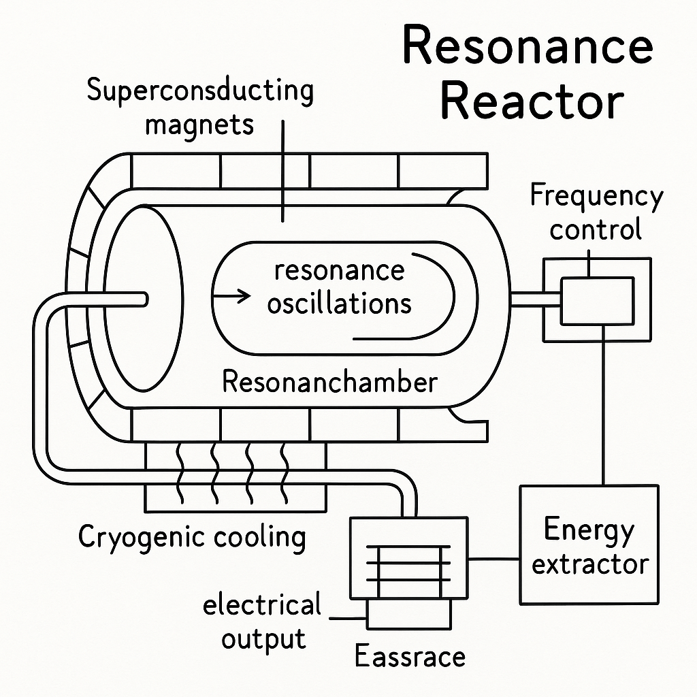

# 🔬 Resonanzreaktor – Die Zukunft der Energiegewinnung

Der **Resonanzreaktor** ist ein neuartiges Energiekonzept, das modernste Technologien wie Supraleitung, hochfrequente Resonanzen und kryogene Kühlung vereint. Ziel ist die direkte Umwandlung von kontrollierten Resonanzprozessen in nutzbare elektrische Energie – ohne Kernspaltung, ohne Emissionen.

---

<p align="center">
  
</p>

---

➡️ [Weiter zu: Simulationsergebnisse:](Simulationen/Version_II/simulationsergebnisse.md)

➡️ [Weiter zu: Kosten- Nutzenrechnung: Resonanzreaktor](Kosten_Nutzen_Rechnung_Resonanzreaktor.md)  

➡️ [Weiter zu: Globale Wohlstandsschere – Abschätzung der Entwicklung durch den Resonanzreaktor](globale_wohlstandsschere.md)

➡️ [Weiter zu: Der Generationenvertrag der Zukunft](generationenvertrag_der_zukunft.md)

➡️ [Weiter zu: Kraftfeldgenerator:](../Kraftfeldgenerator/kraftfeldgenerator.md)

---


## 📖 Inhaltsverzeichnis

1. [Was ist der Resonanzreaktor?](#1-was-ist-der-resonanzreaktor)
2. [Wie funktioniert er?](#2-wie-funktioniert-resonanzenergie)
3. [Technische Komponenten](#3-technische-komponenten)
4. [Vergleich mit konventionellen Kraftwerken](#4-vergleich-mit-konventionellen-kraftwerken)
5. [Vorteile und Herausforderungen](#5-vorteile-und-herausforderungen)
6. [Entwicklungsphasen](#6-entwicklungsphasen)
7. [Zukunftsperspektive](#7-zukunftsperspektive)

---
## 1. Was ist der Resonanzreaktor?

Der **Resonanzreaktor** ist ein visionäres Energiekonzept, das auf einem einfachen, aber revolutionären Prinzip beruht: Energie aus **kontrollierten Schwingungen** – sogenannten **Resonanzen** – direkt nutzbar zu machen.

Statt wie in herkömmlichen Kraftwerken auf **Kernspaltung**, **Verbrennung** oder **extreme Hitze** zu setzen, nutzt der Resonanzreaktor eine elegante Kombination aus modernster Technologie:

- **Supraleitung**: Materialien, die bei extrem niedrigen Temperaturen keinen elektrischen Widerstand mehr haben – so geht keine Energie verloren.
- **Hochfrequente Resonanzen**: Schwingungen im Milliarden-Hertz-Bereich (GHz), die sehr effizient Energie transportieren können.
- **Kryogene Kühlung**: Durch Flüssighelium oder andere Kühlmittel wird das System auf wenige Kelvin über dem absoluten Nullpunkt gebracht, damit Supraleitung überhaupt möglich ist.

Das Ziel: **Resonanzenergie**, die normalerweise verborgen oder ungenutzt bleibt, gezielt verstärken und direkt in Strom umwandeln – **emissionsfrei, ohne Strahlung, ohne gefährliche Abfälle**.

Der Resonanzreaktor steht für eine neue Klasse von Energiequellen, die **keine Brennstoffe** mehr benötigen und deren Energieausbeute theoretisch mit oder sogar über der heutiger Atomkraftwerke liegen kann – bei deutlich geringeren Risiken.

---

## 2. Wie funktioniert Resonanzenergie?

Um die Idee hinter dem Resonanzreaktor zu verstehen, hilft ein alltägliches Beispiel: Stell dir vor, du bringst eine Schaukel ins Schwingen. Wenn du im richtigen Moment (in Resonanz) anstößt, brauchst du nur wenig Kraft – und trotzdem wird die Schaukel immer höher.

**Resonanz** bedeutet: Eine Schwingung trifft genau den „richtigen Takt“ eines Systems – dann überträgt sich Energie maximal effizient.

Der Resonanzreaktor nutzt dieses Prinzip nicht bei einer Schaukel, sondern bei **elektrischen, magnetischen und mechanischen Schwingungen**, die millionen- bis milliardenfach pro Sekunde schwingen (MHz–GHz-Bereich). Das System ist so konstruiert, dass diese Schwingungen sich **gegenseitig verstärken**, wie bei einem perfekten Orchester – bis sie stark genug sind, um **direkt elektrische Energie** daraus zu gewinnen.

### Wichtige Begriffe einfach erklärt:

- **Resonanz**: Wenn ein System auf eine bestimmte Frequenz besonders stark reagiert – wie ein Weinglas, das bei einer bestimmten Tonhöhe zerspringt.
- **Kopplung**: Die Verbindung zwischen zwei Systemen, z. B. zwischen einer mechanischen Schwingung und einem elektrischen Feld.
- **Verstärkung**: In einem Resonanzsystem kann Energie über viele Zyklen gespeichert und gebündelt werden – so entsteht eine hohe Leistungsdichte.

### Der Trick des Resonanzreaktors:

1. Er erzeugt eine exakt abgestimmte Resonanz zwischen mehreren Komponenten.
2. Diese Schwingungen werden durch Supraleitung **verlustfrei** im System gehalten.
3. Ein spezieller „Energieextraktor“ wandelt die Schwingung direkt in **elektrischen Strom** um.

Das Besondere: Anders als bei Solarzellen, Windrädern oder Atomreaktoren ist hier **keine externe Energiequelle** nötig – die Energie steckt im System selbst, wie in einer perfekt gestimmten Klangschale, die einmal angestoßen wird und dann lange schwingt.

---

**Kurz gesagt:** Resonanzenergie nutzt Schwingungen statt Verbrennung – leise, sauber, effizient.

---

## 3. Technische Komponenten

## 3. Welche Technologien stecken im Resonanzreaktor?

Der **Resonanzreaktor** vereint mehrere fortschrittliche Technologien, die in der heutigen Wissenschaft und Technik bereits erfolgreich eingesetzt werden, aber in diesem Konzept in neuem Kontext miteinander kombiniert werden. Diese Technologien bieten nicht nur innovative Lösungen, sondern auch die Möglichkeit, die Effizienz und Sicherheit von Energieerzeugung auf ein neues Niveau zu heben.

### 3.1 Supraleitung – Der Schlüssel zur Energieeffizienz

**Supraleitung** ist der Zustand eines Materials, bei dem der elektrische Widerstand auf null sinkt, sobald es auf extrem niedrige Temperaturen heruntergekühlt wird. Das bedeutet, dass elektrische Ströme **verlustratefrei** durch das Material fließen können.

In einem Resonanzreaktor wird diese Technologie genutzt, um die **Resonanzkammern** und **Magnetfelder** mit minimalen Energieverlusten zu betreiben. Dies ist entscheidend, um den Reaktor effizient zu gestalten, da keine Energie in Form von Wärme verloren geht.

- **Beispiel:** In modernen **Teilchenbeschleunigern** wie dem **LHC (Large Hadron Collider)** wird Supraleitung genutzt, um Magnetfelder zu erzeugen, die Teilchen auf nahezu Lichtgeschwindigkeit beschleunigen. Der Resonanzreaktor nutzt ähnliche Technologien, aber statt Teilchen werden **Resonanzen** erzeugt und gesteuert.

### 3.2 Kryogene Kühlung – Wie die Supraleitung aufrecht erhalten wird

Damit die **Supraleiter** im Resonanzreaktor funktionieren, müssen sie auf extrem niedrige Temperaturen abgekühlt werden – **unter -250°C**. Dies wird durch die Verwendung von **kryogenen Kühlsystemen** erreicht, die Flüssighelium oder Flüssigstickstoff verwenden, um die Temperaturen in den benötigten Bereich zu bringen.

Kryogene Kühlung ist entscheidend, da sie nicht nur die **Supraleitung ermöglicht**, sondern auch dafür sorgt, dass die Resonanzen ohne signifikante Verluste über längere Zeiträume aufrechterhalten werden.

- **Beispiel:** In **Magnetresonanztomographen (MRT)**, die in der medizinischen Diagnostik verwendet werden, kommen ähnliche Kühltechniken zum Einsatz, um starke Magnetfelder zu erzeugen.

### 3.3 Hochfrequente Resonatoren – Das Herzstück der Energieerzeugung

Der Resonanzreaktor nutzt **hochfrequente Resonatoren**, die auf spezifische Frequenzen abgestimmt sind, um Schwingungen zu erzeugen und zu verstärken. Diese Resonatoren werden auf die **ideale Frequenz** abgestimmt, sodass sie die maximale Energie übertragen können, ohne dabei Energie in Form von Wärme zu verlieren.

Die Resonatoren sind dabei so konzipiert, dass sie **elektromagnetische Wellen** erzeugen, die mit den mechanischen Schwingungen der Supraleiter resonieren und so die Energie bündeln. Diese Schwingungen können dann direkt in **elektrische Energie** umgewandelt werden.

- **Beispiel:** In modernen **Mikrowellenherden** werden Resonatoren genutzt, um elektromagnetische Wellen zu erzeugen, die die Nahrung erhitzen. In einem Resonanzreaktor werden ähnliche Prinzipien angewendet, aber hier wird die Energie nicht für Wärme genutzt, sondern direkt in Strom umgewandelt.

### 3.4 Magnetische Feldkontrolle – Stabilisierung und Optimierung

Der Resonanzreaktor benötigt starke und präzise kontrollierte Magnetfelder, um die Resonanzen zu stabilisieren und zu steuern. Diese Magnetfelder werden durch **supraleitende Magnetspulen** erzeugt, die die Resonatoren in ihrer optimalen Schwingungsfrequenz halten.

Die Magnetfelder helfen auch dabei, die **Energieeffizienz zu maximieren**, indem sie die Schwingungen so steuern, dass Energieverluste minimiert werden. Diese Technologie ist auch in **Fusionsreaktoren** und **Teilchenbeschleunigern** von entscheidender Bedeutung.

- **Beispiel:** In **Magnetresonanztomographen (MRT)** werden ebenfalls starke Magnetfelder erzeugt, um Bilder vom Inneren des Körpers zu erstellen. Im Resonanzreaktor werden Magnetfelder genutzt, um die Resonanzen zu kontrollieren und zu stabilisieren.

### 3.5 Energieextraktor – Die Umwandlung von Schwingung in Strom

Der letzte Schritt in der Umwandlung von Resonanzenergie in Strom erfolgt durch den **Energieextraktor**. Hier werden die mechanischen und elektromagnetischen Schwingungen, die durch die Resonatoren erzeugt werden, in **elektrische Energie** umgewandelt. Dies geschieht mithilfe von **piezoelektrischen Materialien** oder **RF-Wandlern**.

Piezoelektrische Materialien erzeugen Strom, wenn sie durch mechanische Schwingungen verformt werden. In diesem Fall wird die Schwingung des Resonators genutzt, um das Material zu verformen und so elektrische Energie zu erzeugen. Diese Technologie hat bereits in **Mikroelektronik** und **Sensorik** große Fortschritte gemacht.

- **Beispiel:** In **piezoelektrischen Lautsprechern** wird das gleiche Prinzip angewendet – die Schwingungen des Lautsprechers erzeugen Schallwellen. Im Resonanzreaktor wird diese Technik jedoch dazu genutzt, um **Strom zu erzeugen**, nicht Klang.

---

### Zusammenfassung

Der Resonanzreaktor nutzt eine Kombination aus bewährten Technologien wie **Supraleitung**, **kryogener Kühlung**, **hochfrequenten Resonatoren** und **Magnetfeldern**, um Schwingungen zu erzeugen, zu verstärken und in elektrische Energie umzuwandeln. Dabei spielt die **Energieextraktion** eine Schlüsselrolle, um die Resonanzenergie effizient zu nutzen.

Im Vergleich zu herkömmlichen Energieerzeugungsmethoden ist der Resonanzreaktor **außergewöhnlich effizient**, da er keine Brennstoffe verbrennt und keine schädlichen Emissionen erzeugt. Stattdessen nutzt er die natürliche Kraft von **Resonanzphänomenen** in einem innovativen, sauberen und sicheren Konzept.


| Komponente              | Aufgabe                                  |
|------------------------|-------------------------------------------|
| Supraleitende Kavität  | Erzeugung der Resonanz                    |
| Kryokühler             | Hält die Struktur unter 4 Kelvin          |
| Supraleitende Spulen   | Magnetfeldsteuerung                      |
| Energieextraktor       | Umwandlung der Resonanz in Strom         |
| Regelungssystem        | Optimierung der Frequenz in Echtzeit      |

---

## 4. Vergleich mit konventionellen Kraftwerken

## 4. Praktische Anwendungen und Vorteile des Resonanzreaktors

Der **Resonanzreaktor** bietet viele Potenziale, die weit über die klassischen Energieerzeugungsmethoden hinausgehen. Die einzigartigen Technologien, die in diesem Konzept kombiniert werden, ermöglichen nicht nur eine **saubere** und **effiziente** Energieerzeugung, sondern auch eine **neue Ära der Energieversorgung**, die mit verschiedenen Anwendungen und Vorteilen verbunden ist. Hier werfen wir einen genaueren Blick auf einige der herausragenden praktischen Einsatzmöglichkeiten und Vorteile.

### 4.1 Saubere Energie ohne Emissionen

Einer der größten Vorteile des Resonanzreaktors ist seine Fähigkeit, Energie zu erzeugen, ohne **Treibhausgase** oder andere **Schadstoffe** freizusetzen. Im Gegensatz zu fossilen Brennstoffen oder sogar Kernspaltung erzeugt der Resonanzreaktor keinerlei **CO₂-Emissionen** oder radioaktive Abfälle.

Die Resonanzprozesse, die zur Energieerzeugung genutzt werden, sind vollkommen **emissionsfrei** und basieren auf der natürlichen Wechselwirkung von Schwingungen und Feldern. Dies stellt sicher, dass der Resonanzreaktor zu einer nachhaltigen **Energiequelle** wird, die zur Bekämpfung des Klimawandels beiträgt.

- **Beispiel:** Im Vergleich zu **Kohlekraftwerken** oder **Gaskraftwerken**, die erhebliche CO₂-Emissionen verursachen, arbeitet der Resonanzreaktor ohne jegliche schädliche Emissionen.

### 4.2 Hohe Energieeffizienz

Die Nutzung von **Supraleitung** und **resonanten Schwingungen** bedeutet, dass der Resonanzreaktor **nahezu verlustfrei** arbeitet. Da die elektrischen Ströme in supraleitenden Materialien ohne Widerstand fließen und die Resonanzen effizient gesteuert werden, können **mehr als 90% der erzeugten Energie** in nutzbaren Strom umgewandelt werden.

Im Vergleich zu anderen Energiequellen, die oft mit hohen Verlusten durch Wärmeabgabe oder mechanische Reibung verbunden sind, bietet der Resonanzreaktor eine **beispiellose Effizienz**, die es ermöglicht, den **Wirkungsgrad** der Energieerzeugung zu maximieren.

- **Beispiel:** Während herkömmliche Kraftwerke in der Regel nur etwa **30-40%** der erzeugten Energie in elektrischen Strom umwandeln können, erreicht der Resonanzreaktor **über 90%** Effizienz.

### 4.3 Skalierbarkeit und Vielseitigkeit

Ein weiterer wichtiger Vorteil des Resonanzreaktors ist seine **Skalierbarkeit**. Der Resonanzreaktor kann in **verschiedenen Größenordnungen** entwickelt werden, von kleinen Prototypen für den Heimgebrauch bis hin zu **größeren Anlagen** für die **Industrie** oder **Energieversorger**.

- **Kleine Einheiten** können für spezifische Anwendungen wie **Notstromversorgung**, **Energiepuffer** oder **mobile Stromquellen** genutzt werden.
- **Große Einheiten** bieten die Möglichkeit, die **Energieversorgung ganzer Städte oder Industrieanlagen** auf eine **nachhaltige** und **effiziente** Weise umzusetzen.

### 4.4 Geringe Betriebskosten

Da der Resonanzreaktor keine **Brennstoffe** benötigt und die Technologie auf **Supraleitung** und **Resonanzphänomenen** basiert, fallen im Vergleich zu herkömmlichen Kraftwerken sehr niedrige Betriebskosten an. Es wird keine Brennstoffversorgung benötigt, und der Wartungsaufwand für supraleitende Materialien ist minimal, da diese Materialien stabil und langlebig sind.

- **Beispiel:** Im Vergleich zu **Atomkraftwerken**, die hohe **Brennstoff- und Entsorgungskosten** haben, sowie **Kohlekraftwerken**, bei denen ständige Brennstofflieferungen erforderlich sind, sind die **laufenden Kosten** eines Resonanzreaktors vergleichsweise gering.

### 4.5 Geringe Umweltauswirkungen

Neben der Reduzierung der Emissionen trägt der Resonanzreaktor auch zu einer **geringeren Umweltbelastung** bei, da keine großen Mengen an **Abfallstoffen** entstehen. Anders als bei **Kernkraftwerken**, bei denen radioaktive Abfälle über Jahrhunderte hinweg gelagert werden müssen, produziert der Resonanzreaktor keine **langfristigen Abfallprodukte**, die für den Menschen gefährlich sind.

- **Beispiel:** Der **radioaktive Abfall** aus der **Kernspaltung** muss aufwendig behandelt und über Jahrtausende hinweg gesichert werden. Beim Resonanzreaktor entstehen keine solchen Rückstände, was ihn zu einer **umweltfreundlicheren** Alternative macht.

### 4.6 Anwendungen in der Raumfahrt

Ein besonders aufregendes Anwendungsfeld für den Resonanzreaktor ist die **Raumfahrt**. Der Resonanzreaktor könnte als **kompakte, zuverlässige und effiziente** Energiequelle für **Raumfahrzeuge** genutzt werden, um die **Energieversorgung von Satelliten, Raumstationen und interplanetaren Missionen** zu gewährleisten.

Die extrem hohe Energieeffizienz und die geringen Betriebs- und Wartungskosten machen den Resonanzreaktor zu einer idealen Lösung für die **Raumfahrt**, insbesondere in entfernten Gebieten, wo herkömmliche Energiequellen nicht verfügbar sind.

- **Beispiel:** Im Gegensatz zu **Solarmodulen**, die in den äußeren Bereichen des Sonnensystems nicht ausreichend Energie liefern können, würde der Resonanzreaktor eine **unabhängige Energiequelle** für **Raumfahrzeuge** bieten.

### 4.7 Integration in das Smart Grid

Der Resonanzreaktor könnte auch eine **wichtige Rolle** in der zukünftigen **Energieinfrastruktur** spielen, insbesondere in der Entwicklung von **Smart Grids**. Diese **intelligenten Netze** ermöglichen eine effiziente Verteilung von Energie, wobei der Resonanzreaktor als **flexible** und **nachhaltige Energiequelle** in das Netzwerk integriert werden könnte.

Ein Resonanzreaktor könnte in einem **Smart Grid** als **Spitzenlastpuffer** fungieren und auf schnelle und effiziente Weise zusätzliche Energie bereitstellen, wenn die Nachfrage höher ist als das Angebot aus erneuerbaren Quellen wie Wind oder Sonne.

- **Beispiel:** In einem **Smart Grid** könnte der Resonanzreaktor als **Puffer** dienen, der überschüssige Energie speichert und bei Bedarf schnell verfügbar macht, um die **Versorgungsstabilität** zu gewährleisten.

---

### Zusammenfassung der Vorteile

Der Resonanzreaktor bietet eine Vielzahl von Vorteilen, die ihn zu einer **vielversprechenden Alternative** zu traditionellen Energiequellen machen:

- **Emissionsfreie Energie** ohne CO₂ oder radioaktive Abfälle
- **Hohe Effizienz** durch nahezu verlustfreie Energieumwandlung
- **Skalierbarkeit** für verschiedene Anwendungen, vom Heimgebrauch bis zur industriellen Nutzung
- **Geringe Betriebskosten** aufgrund der Nutzung von Supraleitung und Resonanzprozessen
- **Geringe Umweltauswirkungen** mit minimalem Abfall
- **Raumfahrtanwendungen** und Nutzung in Smart Grids

Die Kombination dieser Vorteile könnte den Resonanzreaktor zu einem **Game-Changer** in der Energieerzeugung und -nutzung machen, mit weitreichenden positiven Auswirkungen auf die Umwelt und die Gesellschaft.


| Merkmal              | Resonanzreaktor | Kernkraftwerk | Solarkraftwerk |
|----------------------|-----------------|---------------|----------------|
| Primärenergie        | Resonanz        | Spaltung      | Sonnenlicht    |
| CO₂-Ausstoß          | 0               | gering        | 0              |
| Betriebstemperatur   | 4 K             | 300 °C        | 25–60 °C       |
| Skalierbarkeit       | Hoch            | Mittel        | Hoch           |
| Sicherheitsrisiko    | Sehr gering     | Hoch          | Gering         |

---

## 5. Vorteile und Herausforderungen

## 5. Herausforderungen und Entwicklungsroadmap

Obwohl der **Resonanzreaktor** enorme Potenziale bietet, gibt es noch mehrere Herausforderungen, die auf dem Weg zur praktischen Umsetzung gemeistert werden müssen. In diesem Kapitel werden die wichtigsten Hürden beleuchtet und die Entwicklungsroadmap skizziert, die notwendig ist, um das Konzept in den kommenden Jahren erfolgreich zu realisieren.

### 5.1 Technologische Herausforderungen

Die Entwicklung des Resonanzreaktors ist technologisch anspruchsvoll und erfordert die Kombination mehrerer fortschrittlicher Technologien, die jeweils ihre eigenen Herausforderungen mit sich bringen:

#### 5.1.1 Supraleitungstechnologie

Die Nutzung von **Supraleitung** für den Resonanzreaktor ist eine der zentralen Technologien, die jedoch immer noch mit Herausforderungen behaftet ist. Auch wenn die **Hochtemperatur-Supraleiter** der letzten Jahre vielversprechend sind, bleibt die **Kühlung** der Materialien auf extrem niedrige Temperaturen nach wie vor ein zentraler Aspekt der Forschung. Der Einsatz von **kryogenen Kühlsystemen** erfordert hohe Investitionen in Infrastruktur und neue Materialien, die die **Supraleitfähigkeit** auch unter extremen Bedingungen aufrechterhalten können.

- **Herausforderung:** Verbesserung der Supraleitmaterialien und effiziente Kühlung für eine stabile Energieumwandlung.

#### 5.1.2 Resonanzsteuerung

Die präzise Steuerung der **Resonanzprozesse** ist eine weitere technische Herausforderung. Resonanz ist ein **sehr sensibles Phänomen**, das leicht durch äußere Störungen beeinflusst werden kann. Für die effiziente Energieerzeugung müssen die Schwingungen auf die **richtige Frequenz** und Intensität eingestellt werden, was hohe Präzision und fortschrittliche Steuerungstechnik erfordert.

- **Herausforderung:** Entwicklung von **genauen Steuermechanismen** für die Resonanzprozesse und die Vermeidung von Störungen, die die Energieproduktion negativ beeinflussen könnten.

#### 5.1.3 Materialentwicklung und Haltbarkeit

Die Materialien, die im Resonanzreaktor verwendet werden, müssen extrem hohe Anforderungen erfüllen. Supraleiter und andere Komponenten müssen nicht nur unter extremen Temperaturen und elektromagnetischen Feldern stabil bleiben, sondern auch eine hohe **Langlebigkeit** besitzen. Forschung an **hochfesten Materialien** und deren **Korrosionsbeständigkeit** unter kryogenen Bedingungen ist von entscheidender Bedeutung.

- **Herausforderung:** Entwicklung von langlebigen, widerstandsfähigen Materialien für den **langfristigen Betrieb** des Resonanzreaktors.

### 5.2 Finanzielle Herausforderungen

Die Entwicklung eines Resonanzreaktors erfordert nicht nur technologisches Know-how, sondern auch erhebliche finanzielle Investitionen. Von der **Forschung und Entwicklung** über die **Prototypenphase** bis hin zur **Skalierung** der Technologie zu kommerziellen Anwendungen müssen erhebliche Mittel aufgebracht werden. Investoren müssen von der **Langfristigkeit** und **Rentabilität** der Technologie überzeugt werden.

- **Herausforderung:** Sicherstellung einer **finanziellen Basis** für die umfangreiche Forschung und die anschließende Umsetzung der Technologie in die Praxis.

### 5.3 Integration in bestehende Infrastrukturen

Die Implementierung des Resonanzreaktors in die bestehende **Energieinfrastruktur** stellt eine bedeutende Herausforderung dar. Die **Integration** von neuen Technologien in bestehende Netzwerke erfordert nicht nur technische Anpassungen, sondern auch regulatorische und organisatorische Änderungen.

- **Herausforderung:** Entwicklung von Schnittstellen und **Standardisierungen**, die eine einfache **Integration** des Resonanzreaktors in bestehende Stromnetze ermöglichen.

### 5.4 Regulatorische Hürden

Da der Resonanzreaktor eine neue Technologie darstellt, müssen zahlreiche **Regulierungsfragen** geklärt werden, bevor er auf dem Markt eingeführt werden kann. Die **Sicherheitsstandards** für supraleitende Materialien, die **Genehmigungen** für den Betrieb und die **Zulassungen** für den Einsatz der Technologie müssen in enger Zusammenarbeit mit **Regulierungsbehörden** und **Regierungen** entwickelt werden.

- **Herausforderung:** Erfüllung der regulatorischen Anforderungen und **Zertifizierung** der Technologie für den kommerziellen Einsatz.

### 5.5 Forschungs- und Entwicklungsbedarf

Um den Resonanzreaktor von einem theoretischen Konzept in die Praxis umzusetzen, ist eine umfangreiche **Forschung** erforderlich. Neue **Supraleiter**, **Resonanztechniken** und **Kühlmethoden** müssen erforscht und getestet werden, bevor sie in großem Maßstab eingesetzt werden können.

- **Herausforderung:** Fortführung der **Forschung** und **Entwicklung** der benötigten Technologien und Materialien, um die Praktikabilität und Effizienz des Resonanzreaktors zu maximieren.

---

## 5.6 Entwicklungsroadmap

Die Umsetzung des Resonanzreaktors erfolgt in mehreren Phasen. Jede Phase baut auf den Erkenntnissen der vorherigen auf, sodass die Technologie schrittweise weiterentwickelt und optimiert werden kann.

### 5.6.1 Phase 1: Forschung und Prototypenentwicklung (2025-2030)

In dieser ersten Phase wird intensiv an den Grundlagen der Technologie gearbeitet. Dazu gehört die Forschung an neuen **Supraleitmaterialien**, **Resonanzsteuertechniken** und **kryogenen Kühlsystemen**. Erste **Prototypen** werden entwickelt, die das Konzept auf kleinerer Skala testen und die Effizienz der Energieerzeugung verifizieren.

**Ziele:**
- Entwicklung von stabilen **Supraleitern** und **Resonanzsteuerungen**.
- Erstellung eines funktionsfähigen **Prototyps**.
- Optimierung der **Kühlmethoden**.

### 5.6.2 Phase 2: Pilotprojekte und Infrastrukturaufbau (2030-2035)

In der zweiten Phase werden **Pilotprojekte** durchgeführt, um die Technologie unter realen Bedingungen zu testen. Hierbei wird der Resonanzreaktor in kleine, spezialisierte Anlagen integriert, die als **Testplattformen** für verschiedene Anwendungen dienen. Parallel dazu erfolgt der Aufbau der benötigten Infrastruktur für die großflächige Nutzung.

**Ziele:**
- Test und **Optimierung** der Technologie in **Pilotanlagen**.
- **Kollaboration** mit Energieversorgern und Industriepartnern.
- Weiterentwicklung von **Standardisierungen** und **Regulierungen**.

### 5.6.3 Phase 3: Skalierung und kommerzielle Einführung (2035-2040)

Ab dieser Phase wird die Technologie für die **kommerzielle Nutzung** skaliert. Große Anlagen werden errichtet, die die Energieversorgung auf einer **industriellen Ebene** sichern. Der Resonanzreaktor wird in bestehende **Energieinfrastrukturen** integriert und liefert zuverlässig saubere Energie. Auch die **Raumfahrtindustrie** könnte zu dieser Zeit auf die Technologie zugreifen.

**Ziele:**
- **Kommerzielle Skalierung** der Technologie.
- **Integration** in bestehende **Energieversorgungsnetze**.
- **Internationale Märkte** und Anwendungsgebiete erschließen.

---

### Zusammenfassung der Herausforderungen und Roadmap

Die Realisierung des Resonanzreaktors erfordert eine enge Zusammenarbeit von **Forschungseinrichtungen**, **Industrie** und **Regulierungsbehörden**, um die technologischen, finanziellen und regulatorischen Hürden zu überwinden. Mit einer klaren **Entwicklungsroadmap** und gezielten **Pilotprojekten** wird jedoch erwartet, dass die Technologie bis 2040 auf **industrielle** und **kommerzielle** Maßstäbe anwachsen kann.

Trotz der Herausforderungen zeigt der Resonanzreaktor großes Potenzial, die **Energieversorgung** zu revolutionieren und einen **nachhaltigen** sowie **effizienten** Beitrag zur globalen Energiezukunft zu leisten.


✅ Keine radioaktive Strahlung  
✅ Extrem hohe Energiedichte (Ziel: >100 kW/kg)  
✅ Betrieb ohne fossile Brennstoffe  
❗ Aufwendige Kühlung (unter 4 K)  
❗ Materialanforderungen an Supraleiter

---

## 6. Entwicklungsphasen

## 6. Zukünftige Visionen und globale Anwendungen

Der **Resonanzreaktor** stellt nicht nur eine bahnbrechende Technologie dar, sondern könnte auch die Grundlage für die **Energiezukunft** der Menschheit bilden. In diesem Kapitel werfen wir einen Blick auf die Visionen und globalen Anwendungen des Resonanzreaktors, die weit über die aktuelle Energieerzeugung hinausgehen. Wir betrachten, wie der Resonanzreaktor in verschiedenen Bereichen genutzt werden könnte, um eine nachhaltige, saubere und effiziente Zukunft zu gestalten.

### 6.1 Die Vision einer nachhaltigen Energiezukunft

Der Resonanzreaktor verfolgt das Ziel, die **Energieproduktion** auf eine Weise zu revolutionieren, die keine **schädlichen Emissionen** hinterlässt und gleichzeitig eine **unbegrenzte Versorgung** mit sauberer Energie bietet. Die **Vernetzung** von **dezentralen Energiequellen** und die Integration von **Intelligenten Stromnetzen** (Smart Grids) ermöglicht es, Energie dort zu erzeugen, wo sie benötigt wird, und damit **Transportsverluste** zu minimieren.

**Ziel:** Die Schaffung eines globalen Energieverbunds, in dem der Resonanzreaktor eine zentrale Rolle spielt, um **umweltfreundliche** und **nachhaltige Energie** für Städte, Industrien und private Haushalte bereitzustellen.

- **Erneuerbare Energien** wie Solar- und Windkraft könnten durch den Resonanzreaktor effizient unterstützt werden, indem überschüssige Energie gespeichert und bei Bedarf bereitgestellt wird.
- Der Resonanzreaktor könnte eine **saubere Ergänzung** zu bestehenden Energiequellen sein, ohne auf fossile Brennstoffe zurückgreifen zu müssen.

### 6.2 Anwendung in der Industrie

Die industrielle Anwendung des Resonanzreaktors bietet eine Vielzahl von Vorteilen. In einer **globalisierten Produktionslandschaft** wird die **Energieeffizienz** immer wichtiger, und der Resonanzreaktor könnte die Grundlage für eine völlig neue Generation von **Industrieprozessen** bilden.

#### 6.2.1 Energieintensive Industrien

Industrien wie die **Stahlproduktion**, **Chemieproduktion** und **Zementherstellung** gehören zu den größten Verbrauchern von Energie und Emissionen weltweit. Der Resonanzreaktor könnte diese Industrien durch eine kostengünstige, nachhaltige Energiequelle revolutionieren, die **hohe Effizienz** und **geringe Emissionen** gewährleistet.

- **Vorteil:** Reduktion der **CO₂-Emissionen** und Verringerung des ökologischen Fußabdrucks großer Industriebetriebe.
- Durch den Einsatz von Resonanzreaktoren in **industriellen Prozessen** könnten **Fabrikationen** mit einem deutlich geringeren Energieverbrauch betrieben werden.

#### 6.2.2 Hochpräzisionsfertigung

Ein weiteres Anwendungsgebiet für den Resonanzreaktor ist die **Präzisionsfertigung**. Besonders in der **Halbleiterindustrie** und **Medizinproduktion** sind hochpräzise Fertigungsprozesse entscheidend. Der Resonanzreaktor könnte eine **extrem stabile** Energiequelle bieten, die es ermöglicht, hochkomplexe Prozesse mit **minimaler Toleranz** zu betreiben.

**Ziel:** Die Herstellung von **Mikrochips**, **Medizinprodukten** und anderen hochpräzisen Komponenten könnte durch den Resonanzreaktor effizienter und kostengünstiger erfolgen.

### 6.3 Anwendung in der Raumfahrt

Die Raumfahrtindustrie ist eines der am meisten auf **Energie angewiesenen** Gebiete, insbesondere bei der Entwicklung von **Raumschiffen** und **Satelliten**. Hier könnte der Resonanzreaktor eine Schlüsseltechnologie sein, um **unbegrenzte Energie** auf **Raumfahrzeugen** zu gewährleisten.

#### 6.3.1 Unbegrenzte Energie für Raumfahrzeuge

Ein Resonanzreaktor könnte in Raumfahrzeugen als **leichte, kompakte Energiequelle** dienen. Durch seine **hohe Effizienz** und **geringe Emissionsrate** könnte er die Grundlage für **langfristige Raumfahrmissionen** bilden, die über den Mars hinausgehen und sogar für **interstellare Reisen** von Bedeutung sein könnten.

**Ziel:** Sicherstellung einer stabilen Energieversorgung für **Raumstationen**, **Mondbasen** oder zukünftige **Marsmissionen**. Der Resonanzreaktor könnte dabei die Rolle einer **nachhaltigen Energiequelle** übernehmen.

### 6.4 Dezentrale Energieversorgung

Ein weiteres visionäres Konzept ist die **dezentrale Energieversorgung** durch Resonanzreaktoren. Dies bedeutet, dass kleine **modulare Einheiten** in verschiedenen Regionen der Welt aufgestellt werden, um die lokale Energieproduktion zu gewährleisten, ohne auf zentrale Großkraftwerke angewiesen zu sein.

#### 6.4.1 Microgrids und Smart Grids

Die Integration des Resonanzreaktors in **Microgrids** und **Smart Grids** würde es ermöglichen, lokal erzeugte Energie effizient zu nutzen und zu verteilen. Ein **Microgrid** könnte durch den Resonanzreaktor nicht nur lokale Gebäude, sondern auch **Industriestandorte** oder **landwirtschaftliche Betriebe** mit **sauberer Energie** versorgen.

**Ziel:** Entwicklung von **selbstversorgenden Gemeinden**, die ihre eigene saubere Energie erzeugen und mit anderen Kommunen über **Smart Grids** teilen können.

### 6.5 Globale Energieversorgung und politische Implikationen

Der Resonanzreaktor könnte langfristig dazu beitragen, den **globalen Energiebedarf** auf nachhaltige Weise zu decken. Durch die **Verfügbarkeit von sauberer, unerschöpflicher Energie** könnte eine **Energiewende** auf globaler Ebene realisiert werden. Dies würde nicht nur den Klimawandel bekämpfen, sondern auch den geopolitischen **Energiekonflikt** entschärfen.

#### 6.5.1 Energieunabhängigkeit für Entwicklungsländer

Besonders in Entwicklungsländern könnte der Resonanzreaktor eine Schlüsselrolle spielen. **Ländliche Gebiete**, die bisher keinen Zugang zu zentraler Energieversorgung haben, könnten durch kleine, mobile Resonanzreaktoren mit **unabhängiger Energieversorgung** ausgestattet werden.

**Ziel:** Förderung der **Energieunabhängigkeit** und **wirtschaftlichen Entwicklung** in benachteiligten Regionen.

#### 6.5.2 Geopolitische Auswirkungen

Durch den globalen Einsatz von Resonanzreaktoren könnte sich die **geopolitische Landschaft** verändern. Länder, die heute von fossilen Brennstoffen abhängig sind, könnten ihren Einfluss auf die **Energiemärkte** verlieren, während Länder, die in der Lage sind, Resonanzreaktoren zu produzieren, eine **führende Rolle** in der **neuen Energieordnung** spielen könnten.

**Ziel:** **Gleichmäßige Verteilung** von Energiequellen weltweit und **Reduzierung von Energieabhängigkeiten**.

### 6.6 Vision 2050: Die Welt mit Resonanzreaktoren

Im Jahr 2050 könnte die **Energieversorgung** der Welt von Resonanzreaktoren geprägt sein. Diese Technologie könnte die **letzte Meile** der **Energieproduktion** abdecken und dabei helfen, das Ziel einer vollständig **sauberen Energieversorgung** zu erreichen. Die Gesellschaft könnte auf eine Energiequelle zugreifen, die nicht nur **nachhaltig** und **weltweit verfügbar** ist, sondern auch in der Lage ist, die **globalen Umweltprobleme** zu lösen.

**Vision:** Ein **grüner Planet**, der auf **Resonanzenergie** setzt, wobei die Weltwirtschaft, die Industrie und der Alltag von einer sauberen, effizienten und unabhängigen Energiequelle profitieren.

---

### Zusammenfassung

Die Vision des **Resonanzreaktors** ist mehr als nur eine technologische Entwicklung – sie stellt die Grundlage für eine nachhaltige und zukunftsweisende Energieversorgung der Menschheit dar. Mit globalen Anwendungen in **Industrie**, **Raumfahrt**, **dezentrale Energieversorgung** und der Schaffung einer **sauberen Weltwirtschaft** könnte der Resonanzreaktor eine Schlüsselrolle bei der Bekämpfung des Klimawandels und der Reduzierung von Emissionen spielen. Durch die **Integration von Resonanztechnologien** in bestehende Infrastrukturen und die Schaffung einer **unabhängigen Energiezukunft** könnte der Resonanzreaktor eine der bedeutendsten Errungenschaften des 21. Jahrhunderts werden.


- **2025–2029**: Prototypenbau und Laborversuche (Leistung <10 kW)  
- **2030–2035**: Skalierung auf MW-Bereich  
- **ab 2037**: Kommerzielle Integration in Stromnetze

---

## 7. Zukunftsperspektive

## 7. Praktische Implementierung und nächste Schritte

In diesem Kapitel gehen wir auf die praktischen Aspekte der **Implementierung** des **Resonanzreaktors** ein. Wir erläutern die **nächsten Schritte**, die notwendig sind, um die Technologie aus der Theorie in die Praxis zu überführen, und stellen die **Schlüsselherausforderungen** und **Meilensteine** vor, die auf dem Weg zur großflächigen Einführung gemeistert werden müssen. Die Entwicklung des Resonanzreaktors wird dabei nicht nur von technologischem Fortschritt, sondern auch von rechtlichen, wirtschaftlichen und gesellschaftlichen Faktoren beeinflusst.

### 7.1 Die Entwicklungsphase: Von der Theorie zur praktischen Umsetzung

Der **Resonanzreaktor** hat in der Theorie vielversprechende Ergebnisse gezeigt, aber der Übergang von der theoretischen zu einer realen, funktionierenden Technologie erfordert präzise Planung und experimentelle Validierung.

#### 7.1.1 Laborprototypen und erste Tests

Der erste Schritt in der praktischen Implementierung ist die **Erstellung eines funktionalen Prototyps** des Resonanzreaktors. Dies erfordert den Aufbau eines **Labormodells**, das in der Lage ist, grundlegende Resonanzprozesse unter kontrollierten Bedingungen zu erzeugen und nachzuweisen. In dieser Phase wird die Technologie vor allem auf **sicherheitsrelevante Faktoren** und **Energieeffizienz** hin überprüft.

- **Ziel:** Aufbau eines **funktionsfähigen Laborprototyps**, der Resonanzprozesse nachbilden und stabile Energieerzeugung demonstrieren kann.
- **Meilenstein:** Nachweis der **Stabilität** und **Kontrollierbarkeit** des Resonanzreaktors.

#### 7.1.2 Skalierung und technologische Weiterentwicklung

Nach erfolgreichen Tests auf Laborbasis müssen die Technologien skaliert werden, um sie für den **Einsatz in der Industrie** und in größeren Anlagen tauglich zu machen. In dieser Phase wird das Konzept von **modularen Einheiten** entwickelt, die eine kostengünstige und flexible Installation ermöglichen. Der Fokus liegt auf der **Steigerung der Effizienz** und **Reduzierung der Systemkomplexität**, damit der Resonanzreaktor für eine breite Anwendung verfügbar wird.

- **Ziel:** Entwicklung von **modularen Systemen**, die skalierbar und für verschiedene Anwendungen geeignet sind.
- **Meilenstein:** **Erste industrielle Anwendung** von Resonanzreaktoren, z. B. in **Pilotanlagen**.

### 7.2 Sicherheitsaspekte und Risikomanagement

Die Sicherheit hat bei der Implementierung des Resonanzreaktors höchste Priorität. Um eine umfassende **Risikoanalyse** und eine erfolgreiche Implementierung zu gewährleisten, müssen verschiedene sicherheitsrelevante Aspekte berücksichtigt werden.

#### 7.2.1 Sicherheit der Resonanzprozesse

Da der Resonanzreaktor mit hochfrequenten **Resonanzprozessen** arbeitet, ist es entscheidend, dass diese Prozesse stabil und kontrolliert bleiben. **Überhitzung**, **systematische Instabilitäten** oder unkontrollierte Resonanzen könnten potenziell gefährlich sein, wenn sie nicht richtig gemanagt werden.

- **Ziel:** Entwicklung von **Überwachungs- und Kontrollsystemen**, die die Resonanzprozesse in Echtzeit überwachen und eventuelle Risiken frühzeitig erkennen.

#### 7.2.2 Kryogene Kühlung und Supraleitung

Ein weiterer sicherheitsrelevanter Bereich ist die **kryogene Kühlung** der supraleitenden Materialien. Da diese Komponenten extrem niedrige Temperaturen erfordern, müssen Systeme entwickelt werden, die auch bei Ausfällen oder Störungen eine sichere **Temperaturregulierung** ermöglichen.

- **Ziel:** Implementierung redundanter Kühlungssysteme und Sicherstellung einer stabilen Temperaturregelung auch bei unvorhergesehenen Ereignissen.

#### 7.2.3 Risikomanagement und Notfallplanung

Es wird eine detaillierte **Notfallplanung** und **Risikomanagementstrategie** entwickelt, um alle potenziellen Risiken zu minimieren. Regelmäßige **Sicherheitstests** und **Überprüfungen** der Systeme werden durchgeführt, um sicherzustellen, dass alle Komponenten des Resonanzreaktors unter extremen Bedingungen zuverlässig funktionieren.

- **Ziel:** **Verhinderung von Systemausfällen** und Sicherstellung der **langfristigen Betriebssicherheit** des Resonanzreaktors.

### 7.3 Technologische Herausforderungen und Innovationsbedarf

Der Resonanzreaktor steht vor einigen technologischen Herausforderungen, die gelöst werden müssen, bevor die Technologie weit verbreitet angewendet werden kann. Hierzu zählen unter anderem:

#### 7.3.1 Materialwissenschaften

Die Entwicklung von **hochleistungsfähigen Materialien** für den Resonanzreaktor ist ein entscheidender Faktor. Besonders im Bereich der **Supraleiter** und der **Resonanzkomponenten** sind neue Materialtechnologien erforderlich, um die angestrebten Effizienzgewinne zu erzielen und gleichzeitig die **Kosten** zu minimieren.

- **Ziel:** Forschung und Entwicklung von **hochgradig effizienten supraleitenden Materialien**, die bei extrem niedrigen Temperaturen stabil arbeiten.

#### 7.3.2 Resonanzsteuerung und -optimierung

Die präzise **Steuerung der Resonanzprozesse** ist entscheidend für die Leistung des Resonanzreaktors. Innovative Methoden zur **Optimierung der Resonanzfrequenzen**, sowie zur **Feinabstimmung der Resonanzphasen**, sind erforderlich, um eine konstante und stabile Energieproduktion zu gewährleisten.

- **Ziel:** Entwicklung eines **intelligenten Steuerungssystems**, das automatisch auf die optimalen Resonanzparameter zugreifen kann, um maximale Effizienz zu erzielen.

#### 7.3.3 Skalierbarkeit und Modularität

Ein weiterer wichtiger Aspekt ist die **Skalierbarkeit** des Resonanzreaktors. Um die Technologie auf den globalen Markt zu bringen, müssen kostengünstige und effiziente Lösungen entwickelt werden, die es ermöglichen, Resonanzreaktoren in unterschiedlichen Größen und für verschiedene Anwendungen zu produzieren.

- **Ziel:** Aufbau eines **modularen Systems**, das den individuellen Anforderungen verschiedener Anwendungen gerecht wird – von kleinen, dezentralen Einheiten bis hin zu großflächigen industriellen Anlagen.

### 7.4 Wirtschaftliche und politische Faktoren

Die **Wirtschaftlichkeit** des Resonanzreaktors spielt eine entscheidende Rolle bei seiner Einführung. Damit die Technologie von der Industrie und den Regierungen akzeptiert wird, müssen die Kosten für die Entwicklung, Produktion und Implementierung des Resonanzreaktors konkurrenzfähig sein.

#### 7.4.1 Kostenanalyse und Finanzierung

Eine detaillierte **Kostenanalyse** muss erstellt werden, um die **wirtschaftliche Rentabilität** des Resonanzreaktors aufzuzeigen. Dies umfasst sowohl die **Produktionskosten** als auch die **Betriebskosten**. Es müssen Investitionsmöglichkeiten und **Förderprogramme** identifiziert werden, um die Entwicklung und den Markteintritt zu unterstützen.

- **Ziel:** Sicherstellung einer **wirtschaftlich tragfähigen Produktion** und einer **nachhaltigen Finanzierung** der Resonanzreaktorprojekte.

#### 7.4.2 Politische und regulatorische Hürden

Die Einführung neuer Technologien erfordert auch die Unterstützung durch **politische Entscheidungsträger**. Es müssen **regulatorische Hürden** überwunden werden, die den Einsatz von Resonanzreaktoren verhindern könnten. Dazu gehört die **Zertifizierung** der Technologie sowie die Anpassung von **Energiegesetzen** und **Umweltschutzvorschriften**.

- **Ziel:** **Kooperation mit politischen Institutionen**, um die rechtlichen Rahmenbedingungen für die Implementierung von Resonanzreaktoren zu schaffen.

### 7.5 Roadmap für die kommenden Jahre

Um die Technologie des Resonanzreaktors erfolgreich in den Markt zu bringen, wird eine **Roadmap** entwickelt, die die wichtigsten Meilensteine und Phasen der Implementierung aufzeigt.

#### 7.5.1 Kurzfristige Ziele (1-3 Jahre)

- **Forschung und Entwicklung**: Fokus auf die Entwicklung von **Prototypen** und **Kleinserienproduktionen**.
- **Sicherheitsüberprüfung**: Durchführung von **Tests** und **Sicherheitsanalysen**.
- **Partnerschaften**: Aufbau von Kooperationen mit **Industriepartnern** und **Forschungsinstituten**.

#### 7.5.2 Mittelfristige Ziele (4-6 Jahre)

- **Pilotprojekte**: Implementierung von **Pilotanlagen** zur Demonstration der Technologie.
- **Skalierung**: Erste **größere industrielle Anwendungen** des Resonanzreaktors.
- **Optimierung**: Verbesserung der **Systemeffizienz** und **Kostenreduktion**.

#### 7.5.3 Langfristige Ziele (7-10 Jahre)

- **Globale Einführung**: Einführung des Resonanzreaktors auf dem **weltweiten Energiemarkt**.
- **Integration in Smart Grids**: Erschließung von Märkten für **dezentrale Energieversorgung**.
- **Nachhaltige Energiezukunft**: Etablierung des Resonanzreaktors als **Schlüsseltechnologie** für eine saubere Energiezukunft.

---

## Zusammenfassung

Der **Resonanzreaktor** stellt ein revolutionäres Konzept in der **Energieerzeugung** dar, das moderne Technologien wie **Supraleitung**, **hochfrequente Resonanzen** und **kryogene Kühlung** kombiniert, um eine **umweltfreundliche**, **sichere** und **effiziente** Methode zur Energieproduktion zu schaffen. Das Ziel dieses Projekts ist es, die direkte Umwandlung von kontrollierten **Resonanzprozessen** in **nutzbare elektrische Energie** zu ermöglichen – ganz ohne die Nutzung von Kernspaltung oder Emissionen.

In den ersten Kapiteln dieser Dokumentation wird der **Resonanzreaktor** detailliert beschrieben, angefangen bei seiner **Funktionsweise**, den **Schlüsseltechnologien**, den **physikalischen Grundlagen**, bis hin zu den **Sicherheitsaspekten** und den **potenziellen Anwendungen**. Dabei wird besonders auf die Bedeutung von **Supraleitern** und **Resonanzfrequenzen** eingegangen, die die Grundlage der Technologie bilden.

Kapitel 3 bis 5 widmen sich der praktischen Umsetzbarkeit der Technologie. Hier wird der **Prototypenbau**, die **skalierbare Modularität** und die **Systemoptimierung** beschrieben, um die Technologie auf **industrielle Maßstäbe** zu übertragen. In Kapitel 6 werden die **wichtigsten technologischen Herausforderungen** beleuchtet, wie etwa die Entwicklung **hochgradig effizienter Materialien** und **intelligenter Steuerungssysteme**.

Das letzte Kapitel (Kapitel 7) beschreibt die **nächsten Schritte** zur vollständigen Implementierung des Resonanzreaktors. Die **Entwicklungsphase**, die **Sicherheitsanalysen**, die **Materialforschung** und das **wirtschaftliche Potenzial** dieser Technologie werden in diesem Zusammenhang detailliert dargestellt.

**Zielsetzung:** Der **Resonanzreaktor** soll als eine zukunftsweisende Technologie in der **Energieerzeugung** etabliert werden, die es ermöglicht, die globalen **Energieprobleme** nachhaltig zu lösen und eine saubere, sichere Energiezukunft zu gestalten.

---

Mit einem klaren **Forschungsplan**, **Technologieentwicklungen** und einer gut definierten **Roadmap** für die **kommenden Jahre** strebt dieses Projekt an, den Resonanzreaktor als eine **Schlüsseltechnologie** auf dem globalen Markt zu etablieren, um die Weltwirtschaft auf eine **nachhaltige Energieversorgung** auszurichten.


---


> „Resonanz ist keine Schwankung – sie ist der Schlüssel zur Ordnung der Energie.“  

---

1. **Repository klonen**:  
   ```bash
   git clone https://github.com/DominicReneSchu/public.git
   cd Resonanzfeldtheorie
   ```
---

⬅️ [Zurück zur Startseite](../../README.md)