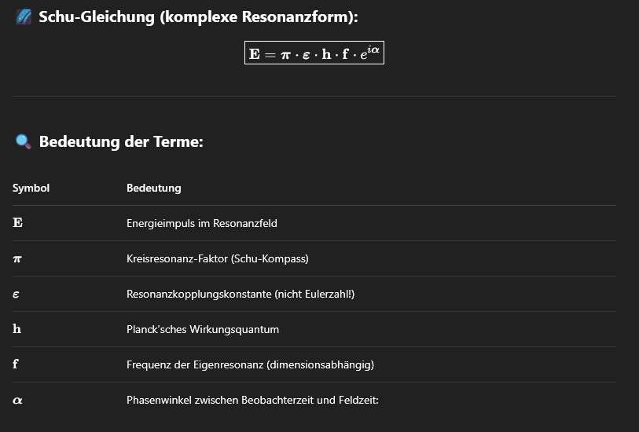

# Resonanzfeldtheorie

Willkommen im offiziellen Repository der **Resonanzfeldtheorie**.  
Dieses Projekt vereint Mathematik, Physik, Technik, Philosophie und neue Denkansätze in einer universellen Theorie der Resonanz.  
Ziel ist es, die Struktur der Realität über fundamentale Größen wie **π**, **ℏ** und eine neue Resonanzkonstante **𝜀** (ehemals als „e“ bekannt, aber nicht mehr als Eulersche Zahl zu verstehen) zu beschreiben.

---

<p align="center">
  
</p>

---

## Einführung in die Resonanzfeldtheorie

Die **Resonanzfeldtheorie** stellt ein neues physikalisch-mathematisches Modell dar, das die Grundlage der Realität als ein Feld von Schwingungen und Resonanzen beschreibt. Sie geht davon aus, dass sämtliche beobachtbare Phänomene – von Teilchen über Kräfte bis hin zu Bewusstsein – durch Wechselwirkungen in einem übergeordneten Resonanzfeld entstehen.

Zentrale Elemente der Theorie sind:

- **π (Schu-Kompass):** Maß für kreisförmige Resonanzen und zyklische Symmetrie.  
- **ℏ (Plancksche Konstante):** Maß für Quantisierung und Energiepaketierung.  
- **𝓔 (e-Neukonstante):** Neu definierte Naturkonstante für **Resonanzkopplung**, nicht identisch mit der eulerschen Zahl.

Diese drei Konstanten bilden die Grundlage der sogenannten **Schu-Gleichung**:

$$
E = π \cdot 𝓔 \cdot ℏ \cdot \mathbf{f}
$$

Sie beschreibt Energie nicht isoliert, sondern als Ausdruck eines dynamischen Resonanzverhältnisses mit der Frequenz **𝑓** als Informationsträger. Energie entsteht hier als Produkt aus Geometrie (**π**), Resonanzkopplung (**𝓔**), Quantisierung (**ℏ**) und Schwingung (**𝑓**).

---

**Ziel der Theorie:**  
Die Resonanzfeldtheorie will bestehende physikalische, biologische und gesellschaftliche Modelle erweitern – hin zu einem ganzheitlichen Weltbild, in dem **Resonanz statt Kausalität** als verbindendes Prinzip wirkt.


## 📘 Inhalt

### 📚 Dokumentation
- [Grundlagen der Resonanzfeldtheorie, Die π - 𝜀 Theorie](docs/Pi-e-Theorie/README.md)
- [Schu-Gleichung & Anwendungen](Gleichungen/README.md)
- [Gesellschaft und Resonanz](docs/Gesellschaft/README.md)
- [Vision](docs/Vision/README.md)

### ⚙️ Simulationen

- [Simulationen (Python)](Simulationen/README.md)

  - **Simulation eines Doppelpendels:** Eine interaktive Simulation, die das klassische Doppelpendel als Resonanzsystem darstellt.
  - **Simulationen zum Resonanzfeld:** Modelle zur Simulation und Visualisierung von Resonanzfeldern und ihrer Wechselwirkungen in verschiedenen Systemen.
  - **Simulationen zum Atommodell:** Simulation eines quantenmechanischen Atommodells basierend auf Resonanzphänomenen.
---

### ⚙️ Konzepte
- [ResoCalc (Konventionelle Drehmomentberechnung vs. ResoCalc (Resonanzfeldtheorie))](Konzepte/ResoCalc/resocalc.md)
- [Resonanzreaktor (Python)](Konzepte/Resonanzreaktor/README.md)
- [Energiezelle (Python)](Konzepte/Energiezelle/energiezelle.md)
- [Kraftfeldgenerator (Python)](Konzepte/Kraftfeldgenerator/kraftfeldgenerator.md)
- [Warpantrieb (Python)](Konzepte/Warpantrieb/warpantrieb.md)
- [Wetter_Warnsystem (Python)](Konzepte/Wetter_Warnsystem/wetter_warnsystem.md)
- [Wettermodelle (Python)](Konzepte/Wettermodelle/wettermodelle.md)


---

## 🌐 GitHub-Veröffentlichung
- [Online verfügbar auf GitHub](https://github.com/DominicReneSchu/public)
---

## 🧩 Philosophie der Theorie

Die Resonanzfeldtheorie basiert auf der Annahme, dass jedes System durch seine Fähigkeit zur Kopplung mit Schwingungsfeldern definiert ist. Dabei steht **Resonanz** im Zentrum aller Wechselwirkungen – von Teilchen bis zur Gesellschaft.

**Zentrale Konzepte:**
- Resonanz als Ursprung von Materie und Energie  
- Raum-Zeit als Feldstruktur, nicht als starres Gerüst  
- Bewusstsein als Resonator mit Einfluss auf das Feld  
- Neue Naturkonstante **𝜀** (Schu-Koppler) für universelle Resonanzkopplung (ersetzt die bisherige Konstante **e**)

---

## 🛠️ Beteiligung & Entwicklung

Dieses Projekt ist offen für Beiträge. Ob Mathematik, Physik, Visualisierung oder Programmierung – neue Ideen sind willkommen.  
Wenn du beitragen möchtest, erstelle einen Pull Request oder kontaktiere direkt über GitHub.

---

## 📈 Zukunft

- Entwicklung eines Resonanz-Kraftfeldgenerators  
- Integration in eine interaktive App mit KI-Dialogsystem  
- Erweiterung um medizinische, gesellschaftliche und technologische Anwendungen  

---

> „Wenn alles schwingt, ist Resonanz das Prinzip der Ordnung.“

---

© Dominic-René Schu – Resonanzfeldtheorie 2025

1. **Repository klonen**:  
   ```bash
	git clone https://github.com/DominicReneSchu/public.git
	cd public
   ```
---

