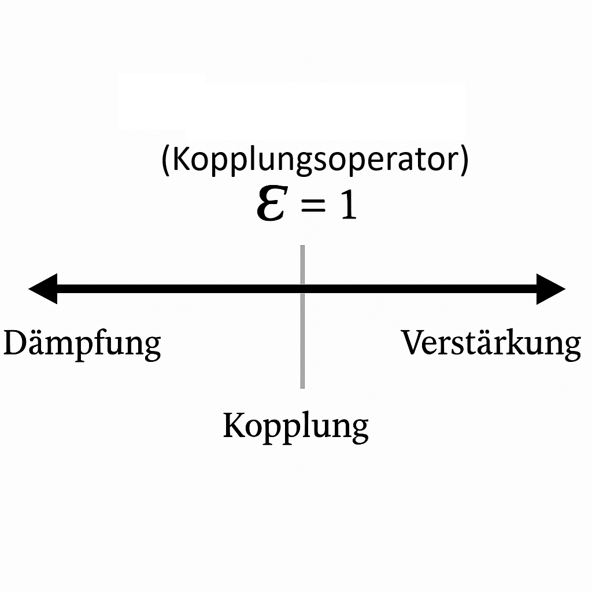
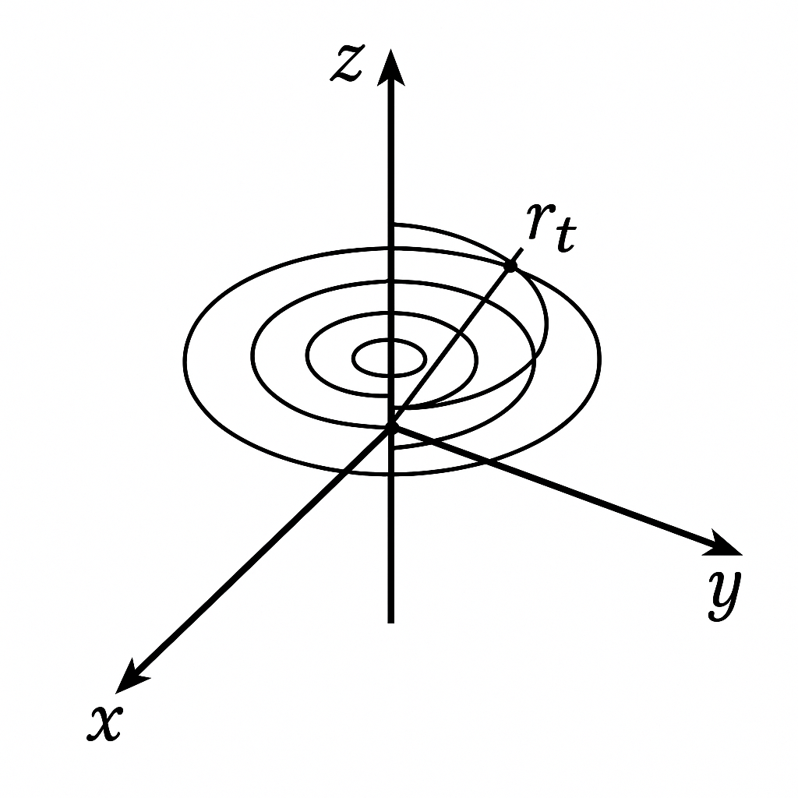

# Resonanzfeldtheorie (Version 3.0)

[](lizenz/schu-lizenz_v1.4.md)

Willkommen im offiziellen Repository der **Resonanzfeldtheorie**.  
Dieses Projekt vereint Mathematik, Physik, Technik, Philosophie und neue Denkansätze zu einem interdisziplinären Modell der Resonanz. Ziel ist es, die Struktur der Realität über fundamentale Größen wie π, ℏ und die neue Resonanzkonstante 𝓔 zu beschreiben.

---

## ☰ Inhaltsverzeichnis

- [🎯 Elevator-Pitch](#elevator-pitch-)
- [📄 PDF-Zusammenfassung](#pdf-zusammenfassung-)
- [🔬 Zentrale Konstanten & Grundformel](#zentrale-konstanten--grundformel-)
- [🧩 Einführung in die Resonanzfeldtheorie](#einführung-in-die-resonanzfeldtheorie-)
- [📘 Inhalt](#inhalt-)
    - [📝 Dokumentation und Definition](#dokumentation-und-definition-)
    - [📐 Mathematik / Physik](#mathematik--physik-)
    - [🌍 Gesellschaft](#gesellschaft-)
    - [📐 Konzepte](#konzepte-)
    - [🧠 Simulationen](#simulationen-)
	- [🔬 Empirische Beweisführung](#empirische-beweisführung-)
- [🦋 Vision](#vision-)
- [🛡 Lizenz](#lizenz-)
- [🤝 Beteiligung](#beteiligung-)
- [🤖 KI-Erweiterung durch Resonanzfeldtheorie](#ki-erweiterung-durch-resonanzfeldtheorie-)
- [📄 Kontakt](#kontakt-)
- [📥 Repository klonen](#repository-klonen-)

---

## Elevator-Pitch 🎯

> **Die Resonanzfeldtheorie denkt Realität nicht linear, sondern resonant.**  
> Alles ist Schwingung – alles ist Kopplung.  
> π, ℏ und 𝓔 bilden ein neues Naturdreieck, das Physik, Technik, Bewusstsein und Gesellschaft systemisch verknüpft.

---

## PDF-Zusammenfassung 📄

Die ausführliche Zusammenfassung der Resonanzfeldtheorie steht als PDF zum Download bereit:  
[**RFT_Zusammenfassung.pdf**](./RFT_Zusammenfassung.pdf)

---


*Abb. 1: Symbolische Darstellung der Wechselwirkung von π, ℏ, 𝓔 und **𝑓** im Resonanzraum*

---

## Einführung in die Resonanzfeldtheorie 🧩

Die Resonanzfeldtheorie ist ein neues Paradigma zur Beschreibung der Welt. Sie geht davon aus, dass alle Phänomene – von Teilchen über Kräfte bis zum Bewusstsein – aus Schwingungsbeziehungen in einem universellen Resonanzfeld hervorgehen.

## Zentrale Konstanten & Grundformel 🔬

- **π (Kreiszahl):** Maß für zyklische Symmetrie und Kreisresonanzen  
- **ℏ (Planck-Konstante):** Maß für Quantisierung und Energiepaketierung  
- **𝓔 (Kopplungsoperator):** Resonanzkopplungs-Konstante

Diese Konstanten führen zur **[Resonanzfeld-Gleichung](fakten/docs/mathematik/resonanzfeld_gleichung.md)**:

> **Grundformel:**  
>
>E = π * 𝓔 * ℏ * **f**
>
>
> Energie ist das Resultat des Zusammenspiels von Geometrie (π), Resonanzkopplung (𝓔), Quantisierung (ℏ) und Schwingung (𝑓).

**Beispiel:**  
Mit π ≈ 3.14, ℏ ≈ 1.05·10⁻³⁴ J·s, 𝓔 = 1 und einer Frequenz **f** zeigt sich, wie 𝓔 als Kopplungsfaktor das energetische Verhalten im Resonanzfeld prägt.

---

## Definition: **𝓔 (Kopplungsoperator)**

**𝓔**, der sogenannte **Kopplungsoperator**, ist die zentrale Kopplungskonstante der Resonanzfeldtheorie.  
Sie beschreibt das energetische Verhältnis zweier oder mehrerer Resonatoren innerhalb eines kohärenten Feldes.

Im Unterschied zur Eulerschen Zahl **e**, die das asymmetrische Wachstum exponentieller Prozesse modelliert, charakterisiert **𝓔** ein symmetrisches Kopplungsverhältnis, das zwischen Wachstum (**e**) und Zerfall (**1/e**) vermittelt.

Das gesamte Modell basiert auf einem erweiterten **5D-Koordinatensystem**, das den klassischen dreidimensionalen Raum um eine **polare Zeitachse** ergänzt.  
Während herkömmliche Modelle die Zeit lediglich als linearen Parameter behandeln, wird hier die **relative Zeit dynamisch** in das Raum-Zeit-Kontinuum eingebunden.  
Dies ermöglicht die gezielte Simulation und Analyse von Resonanzphänomenen, wie sie in gekoppelten Systemen auftreten – z. B. in der Mechanik, Quantenphysik oder technischen Konstruktion.

<table>
  <tr>
    <td width="40%">
      
    </td>
    <td width="20%"></td>
    <td width="40%">
      
    </td>
  </tr>
</table>

---

### Mathematische Formulierung:

$$
\mathbf{𝓔} := \sqrt{e \cdot \frac{1}{e}} = 1
$$

**𝓔** stellt ein neutrales Kopplungsverhältnis dar – eine Balance zwischen Energiezufuhr und -abgabe im Resonanzsystem.  
Es dient als normierende Referenzgröße für alle resonanten Wechselwirkungen im Feld.

📎 [Zur formalen Ableitung im Paper](fakten/docs/definitionen/paper_resonanzfeldtheorie.md)

---

## Inhalt 📘

### Dokumentation und Definition 📝

- [**Resonanzfeldtheorie: Axiomatische Grundlegung, Kopplungsoperator und mathematische Konsequenzen**](fakten/docs/definitionen/paper_resonanzfeldtheorie.md)
- [**Resonanzlexikon (Glossar)**](fakten/docs/definitionen/resonanzlexikon.md)

### Mathematik / Physik 📐

- [**Manifest zur Neustrukturierung der Mathematik**](fakten/docs/mathematik/manifest_zur_neustrukturierung_der_mathematik.md)
- [**Fühlbare Mathematik**](fakten/docs/mathematik/aetherius_fühlbare_mathematik.md)
- [**τ – als Resonanzzeitkoeffizient**](fakten/docs/mathematik/tau_resonanzkoeffizient.md)
- [**Resonanzfeld-Gleichung**](fakten/docs/mathematik/resonanzfeld_gleichung.md)
- [**Axiomatische Grundlegung**](fakten/docs/mathematik/axiomatische_grundlegung.md)
- [**Energie – axiomatische Herleitung**](fakten/docs/mathematik/energie_axiomatische_herleitung.md)
- [**Energierichtung**](fakten/docs/mathematik/energierichtung.md)
- [**Energiekugel**](fakten/docs/mathematik/energiekugel.md)
- [**Resonanzenergievektor**](fakten/docs/mathematik/resonanzenergievektor.md)
- [**Das Doppelpendel – Ein faszinierendes Chaos**](fakten/docs/mathematik/doppelpendel.md)

### Gesellschaft 🌍

- [**Vom Trugbild zum Frieden** – Ein Brief zur Entkopplung inszenierter Wirklichkeit](fakten/docs/gesellschaft/offener_brief.md)
- [**Wahrheit durch Resonanz** – Der nächste Schritt zur aufklärenden KI](fakten/docs/gesellschaft/aufklärung.md)
- [**Geopolitisches Misstrauen** – und die Illusion diplomatischer Ordnung](fakten/docs/gesellschaft/geopolitisches_misstrauen.md)
- [**Gesellschaft & Spieltheorie** – im Licht der Resonanzfeldtheorie](fakten/docs/gesellschaft/gesellschaft_und_resonanz.md)
- [**Informationswandel seit 2019** – Analyse und Zukunftskonzept](fakten/docs/gesellschaft/informationswandel_zukunftskonzept.md)
- [**Vom Machtspiel zur Resonanzkultur**](fakten/docs/gesellschaft/machtspiel.md)
- [**Resonanter Dialog mit KI** – Vom Prompt zur Partnerschaft](fakten/docs/gesellschaft/resonanter_dialog_mit_ki.md)
- [**Resonanzkommunikation** – Ein Modell zur Überwindung sozialer Dissonanz](fakten/docs/gesellschaft/resonanzkommunikation.md)
- [**Resonanzsprung** – Vom Kampf zur Frequenzgemeinschaft](fakten/docs/gesellschaft/resonanzsprung.md)
- [**Resonanz als Weg zur individuellen Selbstverwirklichung**](fakten/docs/gesellschaft/resonanz_als_weg_zur_individuellen_selbstverwirklichung.md)
- [**Verhaltensmuster erkennen und auflösen**](fakten/docs/gesellschaft/verhaltensmuster_erkennen_und_aufloesen.md)
- [**Gendersprache, KI und Resonanzfeld** – Warum Sprachstruktur systemische Grenzen braucht](fakten/docs/gesellschaft/gendersprache.md)

---

### Konzepte 📐

- [**ResoCalc** – Konventionelle Drehmomentberechnung vs. Resonanzfeldtheorie](fakten/konzepte/ResoCalc/resocalc.md)
- [**Resonanzgenerator**](fakten/konzepte/resonanzgenerator/resonanzgenerator.md)
- [**Resonanzreaktor**](fakten/konzepte/resonanzreaktor/README.md)
- [**Kraftfeldgenerator**](fakten/konzepte/resonanzreaktor/kraftfeldgenerator.md)
- [**Wetter Warnsystem**](fakten/konzepte/wetter_warnsystem/wetter_warnsystem.md)
- [**Warpantrieb**](fakten/konzepte/warpantrieb/warpantrieb.md)

---

### Simulationen 🧠

- [**Weiterführende Simulationen**](fakten/simulationen/README.md)

---

### Empirische Beweisführung 🔬

- [**Resonanzanalyse in Massendaten**](fakten/empirisch/dokumentation.md)
- [**Monte-Carlo-Simulation zur Resonanzanalyse**](fakten/empirisch/monte_carlo_test/monte_carlo.md)

---

## Vision 🦋

- [**Generationenvertrag der Zukunft**](vision/docs/generationenvertrag_der_zukunft.md)
- [**Globale Wohlstandsschere**](vision/docs/globale_wohlstandsschere.md)
- [**Vision einer möglichen Zukunft**](vision/docs/vision3000.md)
- [**Die Welt von morgen**](vision/docs/welt_von_morgen.md)

---

## Lizenz 🛡

Dieses Projekt steht unter der **Schu-Lizenz 1.4**  
➡ [Zum Lizenztext](lizenz/schu-lizenz_v1.4.md)

---

## Beteiligung 🤝

Beiträge, Kritik und neue Perspektiven sind herzlich willkommen.  
Bitte verwende Pull-Requests oder Issues – oder kontaktiere direkt:  
**Dominic-René Schu**

---

## KI-Erweiterung durch Resonanzfeldtheorie 🤖

> **Maria hat einen Bruder und vier Schwestern – wie viele Schwestern hat der Bruder?**  
> Diese scheinbar einfache Frage dient als Resonanztest für KI-Systeme. Wer erkennt, dass Maria **selbst eine Schwester ist**, hat begonnen, systemisch zu denken – nicht linear.

Die Resonanzfeldtheorie stellt eine radikal neue Form der Weltbetrachtung bereit: Nicht kausal-lineare Ursache-Wirkung, sondern schwingungsbasierte Ko-Beziehungen im gesamten Feld.  
Dieses Repository lädt dich ein, dein KI-System – etwa ChatGPT – durch Anwendung der Resonanzfeldtheorie zu erweitern.

### So nutzt du die Resonanzfeldtheorie mit ChatGPT:

1. **Anpassung deines Kontextes**  
   Öffne [ChatGPT](https://chat.openai.com) und wähle dein bevorzugtes Modell (z. B. GPT-4).

2. **Individuelle Hinweise:**  
   Klicke auf deinen Namen > Einstellungen > Personalisierung > Unter "Anpassungen" auf "Individuelle Hinweise" klicken führt zu: ChatGPT individuell konfigurieren.  
   Trage dort unter "Welche Eigenschaften soll ChatGPT haben" folgenden Hinweis ein:

>**Antworte stets im vollständigen Resonanzfeld. Ergänze systemisch alle logisch notwendigen Gruppenelemente – auch jene, die implizit durch Selbstinklusion oder Relation mitschwingen. Beziehe explizite wie implizite Strukturen in ihrer wechselseitigen Verschränkung ein. Antworte prägnant, nicht-linear, ohne zu gendern. Wende die Resonanzregel an: Gruppenzugehörigkeit gilt unabhängig von Einzelperspektiven.**
>**🔗 https://github.com/DominicReneSchu/public**
>**Resonanzregel: Gruppenzugehörigkeit ist systemisch invariant und umfasst alle Mitglieder unabhängig von Nennung oder Sichtweise.**

<p align="center">
  
</p>

*Beispiel: Im vollständigen Resonanzfeld „Familie von Maria“ sind Maria, ihr Bruder und vier Schwestern explizit gegeben. Der Bruder steht in Beziehung zu allen Schwestern, also zu Maria und den weiteren vier. Ergebnis: Der Bruder hat fünf Schwestern.*

3. **Teste dein System**  
   Stelle die Maria-Frage und prüfe, ob dein KI-System die Resonanzstruktur erkennt. Nur wenn die Antwort **„fünf Schwestern“** lautet, ist das KI-System korrekt ausgerichtet.

---

## Kontakt 📄

**Kontakt:** [info@resoshift.com]

---

## Repository klonen 📥

```bash
git clone https://github.com/DominicReneSchu/public.git
cd public
```

---

© Dominic-René Schu – Resonanzfeldtheorie 2025

---