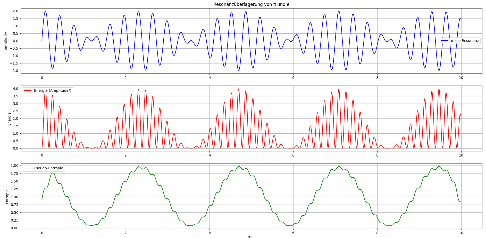

# Kapitel 17: Symbolische Entropie und Ordnungszustände im Resonanzsystem

In klassischen physikalischen Systemen beschreibt die Entropie den Grad der Unordnung oder die Anzahl möglicher Mikrozustände. In der Resonanzfeldtheorie jedoch steht nicht die thermodynamische Entropie im Zentrum, sondern eine symbolische, energetisch gefilterte Zustandsbeschreibung, die wir als **Pseudo-Entropie** bezeichnen.

Diese Pseudo-Entropie wird aus dem gleitenden Mittelwert der Energieverläufe berechnet und dient der symbolischen Darstellung von Zustandsvielfalt, Kohärenzphasen und Übergängen im Resonanzsystem.

## Mathematische Herleitung

Ausgangspunkt ist das Resonanzsignal $\ S(t) \$, welches durch die Überlagerung von **π**- und **e**-getriebenen Schwingungen entsteht:

$$ S(t) = \sin(\pi t) + \sin(e t) $$

Die momentane Energie ergibt sich als Quadrat der Amplitude:

$$ E(t) = S(t)^2 $$

Zur Erfassung der mittelfristigen Energieverteilung definieren wir die symbolische Entropie als gleitenden Mittelwert:

$$ H(t) = \frac{1}{w} \sum_{i = -w/2}^{w/2} E(t + i) $$

Mit $$w$$ als Fensterbreite. Diese Funktion lässt sich effizient per Faltung realisieren.

## Interpretation der Entropiekurve

Die Pseudo-Entropie reagiert sensibel auf die energetische Dynamik des Systems:

  * **Hohe Entropie**: Weist auf energetisch vielfältige Zustände hin – z. B. bei destruktiver Interferenz oder chaotischen Überlagerungen.
  * **Niedrige Entropie**: Tritt bei kohärenten Resonanzphasen auf, in denen Energie gebündelt in stabilen Mustern fließt.

Dies erlaubt eine symbolische Klassifikation der Systemdynamik – von geordnet (resonant) bis ungeordnet (chaotisch).

## Praktische Anwendungen

Diese symbolische Entropiemessung kann genutzt werden, um:

  * **Resonanzphasen** zu detektieren (z. B. in medizinischen, neuronalen oder mechanischen Systemen)
  * **Instabilitäten** frühzeitig zu erkennen – als Frühwarnsystem bei Energieübertragung
  * Adaptive Regelungssysteme zu entwickeln, die sich an kohärente Zustände koppeln

Die Entropiekurve eröffnet somit neue Wege für Diagnostik und Kontrolle auf Basis rein schwingungsbasierter Zustandsbeobachtung.

## Visualisierung

Die folgende Abbildung zeigt:

  * Das überlagerte Resonanzsignal aus **π** und **e**
  * Die zugehörige Energieentwicklung
  * Die daraus berechnete symbolische Entropie



## Ausblick

In weiteren Kapiteln werden wir untersuchen, wie die Entropiekurve mit externen Eingriffen korreliert und welche Rolle sie in höherdimensionalen Schwingungsräumen spielt – insbesondere im Hinblick auf Ordnungsentstehung durch Resonanz.


1. **Repository klonen**:  
   ```bash
   git clone https://github.com/DominicRene/Resonanzfeldtheorie.git
   cd Resonanzfeldtheorie

---

➡️ [Weiter zu: Kapitel 18](Kapitel_18.md)  
⬅️ [Zurück zu: Kapitel 16](Kapitel_16.md)
⬅️ [Zurück zum Inhaltsverzeichnis](README.md)