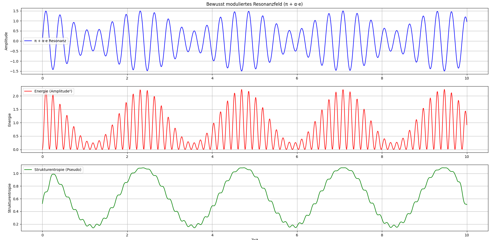

# Kapitel 18: Modulation des Resonanzfelds durch den Bewusstseinsfaktor

In diesem Kapitel untersuchen wir, wie der sogenannte **Bewusstseinsfaktor** $$\alpha$$ die Dynamik eines Resonanzsystems beeinflusst. Dieser Faktor moduliert die Wechselwirkung zwischen der natürlichen Grundresonanz $\pi$ und der evolutionären Veränderung oder dem Lernimpuls $e$. Der Wert von $$\alpha$$ variiert zwischen 0 und 1:

- $\alpha = 0$: Keine Beeinflussung durch $e$ – das System verhält sich rein resonant.
- $\alpha = 1$: Maximale Beeinflussung durch $e$ – das System folgt vollständig dem Lernimpuls.

## Mathematische Darstellung

Das kombinierte Signal $S(t)$ setzt sich aus der Grundresonanz $\sin(\pi t)$ und dem modulierten Lernimpuls $\alpha \cdot \sin(e t)$ zusammen:

$$
S(t) = \sin(\pi t) + \alpha \cdot \sin(e t)
$$

Die momentane Energie $E(t)$ ergibt sich als Quadrat der Amplitude:

$$
E(t) = S(t)^2
$$

Zur Berechnung der **Strukturentropie** definieren wir diese als gleitenden Mittelwert der Energie über ein Fenster der Breite $\ w \$:

$$
H(t) = \frac{1}{w} \sum_{i=-w/2}^{w/2} E(t + i)
$$

## Interpretation der Strukturentropie

Die Strukturentropie $H(t)$ gibt Aufschluss über die Dynamik des Systems, indem sie die Energieverteilung im Zeitverlauf erfasst und die Übergänge zwischen verschiedenen Ordnungszuständen sichtbar macht. Ein hoher Wert von $H(t)$ deutet auf eine hohe Unordnung oder eine starke Beeinflussung durch den Lernimpuls hin, während ein niedriger Wert auf einen stabilen, resonanten Zustand hindeutet.

## Praktische Anwendungen

Die Modulation des Resonanzfelds durch den Bewusstseinsfaktor hat weitreichende Implikationen:

- **In der Medizin**: Anpassung von Therapien an den aktuellen Zustand des Patienten durch gezielte Beeinflussung des Resonanzsystems.
- **In der Technologie**: Entwicklung adaptiver Systeme, die auf Veränderungen in ihrer Umgebung reagieren können.
- **In der Biologie**: Verständnis von Lernprozessen und Anpassungsmechanismen auf zellulärer und organismischer Ebene.

## Visualisierung

Die folgende Abbildung zeigt die Auswirkungen verschiedener Werte von $\alpha$ auf das kombinierte Signal $S(t)$ und die daraus resultierende Energie $E(t)$:



## Ausblick

In zukünftigen Kapiteln werden wir untersuchen, wie die Strukturentropie zur Vorhersage von Systemverhalten genutzt werden kann und welche Rolle sie in komplexen, mehrdimensionalen Resonanzfeldern spielt.


1. **Repository klonen**:  
   ```bash
   git clone https://github.com/DominicRene/Resonanzfeldtheorie.git
   cd Resonanzfeldtheorie

---

➡️ [Weiter zu: Kapitel 19](Kapitel_19.md)  
⬅️ [Zurück zu: Kapitel 17](Kapitel_17.md)
⬅️ [Zurück zum Inhaltsverzeichnis](README.md)