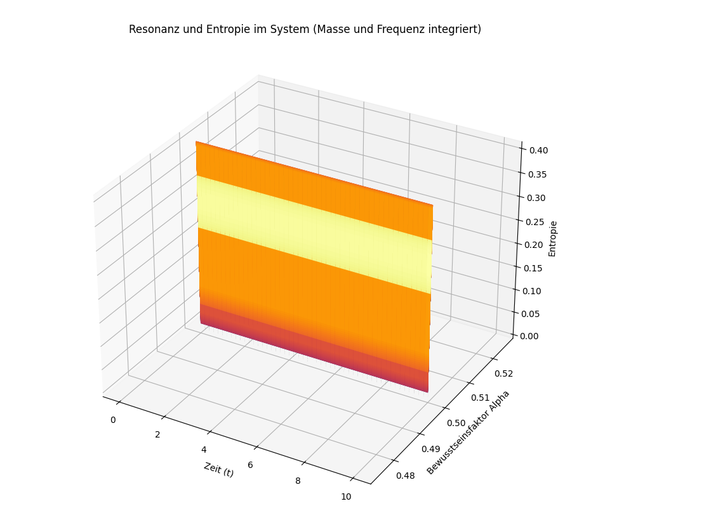

# Kapitel 21 – Resonanz, Energie und Bewusstsein: Entropie im dynamischen System

In dieser Simulation wird ein neues Modell vorgestellt, das die Kopplung zwischen fundamentalen mathematischen Schwingungen – dargestellt durch $\pi$ und $e$ – mit physikalischen Parametern wie Masse, Frequenz und einem Bewusstseinsfaktor $\alpha$ untersucht. Ziel ist es, zu zeigen, wie **Energie** im Resonanzfeld entsteht und wie sich daraus eine **Entropie** ableiten lässt – also ein Maß für Informationsverteilung und dynamische Ordnung im System.

---

## Grundidee der Simulation

Die Simulation kombiniert zwei Grundschwingungen:

- Eine **$\pi$-Welle**: $\sin(2\pi f t)$
- Eine **$e$-Welle**: $\cos(2\pi f t)$

Diese beiden Schwingungen werden abhängig vom Bewusstseinsfaktor $\alpha$ gemischt:


$R(t) = \alpha \cdot \cos(2\pi f t) + (1 - \alpha) \cdot \sin(2\pi f t)$


Anschließend wird die **Energie** berechnet:


$E(t) = m \cdot R(t)^2$


Und daraus ergibt sich die **Entropie**:


$S(t) = \ln(E(t) + 1)$


Dabei steht:

- $t$ für die Zeit
- $f$ für die Frequenz
- $m$ für die Masse
- $\alpha$ für den Bewusstseinsfaktor (zwischen 0 und 1)

---

## Bedeutung für das Resonanzfeldmodell

Die resultierende Entropiekurve stellt die **Komplexität und innere Dynamik** des Systems dar. Besonders spannend: Durch Variation von $\alpha$ lassen sich direkte Rückschlüsse auf die energetische Ordnung oder Unordnung im System ziehen.

Dies legt nahe, dass das Bewusstsein – als steuerbarer Anteil – **maßgeblichen Einfluss auf die Resonanzqualität und den Energiefluss** im System nimmt.

---

## Simulation als Python-Code

Die zugehörige Simulation findest du unter folgendem Pfad: **../Simulationen/Mathematische Beweisführung**


---

## Abbildung: Entropieentwicklung im Resonanzfeld



---

## Interpretation

Die Grafik zeigt eine 3D-Fläche, in der die **Zeit (x-Achse)**, der **Bewusstseinsfaktor α (y-Achse)** und die resultierende **Entropie (z-Achse)** miteinander verbunden sind.

Die Oberfläche stellt dar, wie sich durch feinste Änderungen des Bewusstseinsgrades $\alpha$ die Energieverteilung verändert – ein Hinweis darauf, dass **Resonanzstrukturen direkt durch Bewusstsein steuerbar sein könnten**.

---

> Dieses Kapitel markiert einen Übergang von der klassischen Wellenphysik hin zu einem erweiterten Verständnis von Energieflüssen, bei denen geistige Parameter eine physikalisch messbare Rolle spielen.

👉 **../Simulationen/Mathematische Beweisführung**

1. **Repository klonen**:  
   ```bash
   git clone https://github.com/DominicRene/Resonanzfeldtheorie.git
   cd Resonanzfeldtheorie