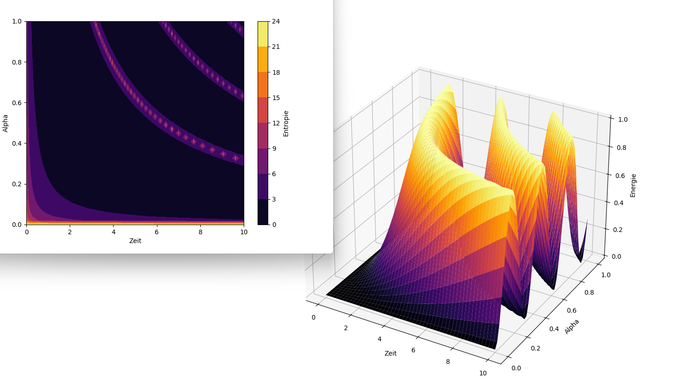

# Kapitel 22 – Dynamische Felder: Energie und Entropie durch variable Bewusstseinsmodulation

In diesem Kapitel wird das Konzept aus Kapitel 21 konsequent weitergeführt. Wir verlassen die lineare Mischung zweier Wellenformen (π- und e-Welle) und untersuchen nun die direkte Kopplung von Bewusstseinsfaktor $\alpha$ mit der Zeit in einer sinusförmigen Energieformel. Dadurch entsteht ein dynamisches Resonanzfeld, das stark abhängig ist von der gewählten Bewusstseinsintensität und deren zeitlicher Einbindung.

## Ziel der Simulation

Die Simulation verfolgt zwei Hauptziele:

1. **Untersuchung des Energieflusses** innerhalb eines Systems, in dem $\alpha$ kontinuierlich moduliert wird.
2. **Ableitung der Systementropie** als Maß für die innere Komplexität und Informationsverteilung im Feld.

Sie stellt damit ein erweitertes Modell dar, bei dem nicht nur die reine Energie zählt, sondern auch ihre implizite Struktur und Ordnung – mit direkter Rückkopplung auf den geistigen Parameter $\alpha$.

## Mathematische Grundstruktur

### Energieformel

$$
E(t, \alpha) = m \cdot f^2 \cdot \sin^2(\alpha \cdot t)
$$

Hierbei wirken Masse $m$, Frequenz $f$ und der Faktor $\alpha$ zusammen, wobei $\alpha$ die zeitabhängige Amplitude der Schwingung beeinflusst. Die Energie schwingt somit nicht einfach periodisch, sondern erhält durch die Modulation mit $\alpha$ eine feinere Struktur.

### Entropieformel

$$
S(t, \alpha) = -\ln(E(t, \alpha) + \varepsilon)
$$

Diese Gleichung berechnet die Entropie als negatives Logarithmusmaß über die Energieverteilung. Der kleine Zusatz $\varepsilon$ (z. B. $10^{-10}$) verhindert, dass der Logarithmus gegen Unendlich läuft, wenn Energie gegen Null strebt.

## Interpretation der Ergebnisse

Die daraus resultierende **3D-Oberfläche** zeigt eindrucksvoll, wie stark die Systemenergie vom bewussten Steuerparameter $\alpha$ beeinflusst wird. Die X-Achse bildet die Zeit $t$, die Y-Achse den Bewusstseinsgrad $\alpha$, die Z-Achse die resultierende Energie. Durch diese dreidimensionale Darstellung lassen sich bestimmte Bereiche identifizieren, in denen das System sehr geordnet (niedrige Entropie) oder sehr komplex/chaotisch (hohe Entropie) ist.

Die parallel berechnete **Entropiekontur** zeigt, dass eine hohe Energiestruktur nicht zwangsläufig mit hoher Ordnung einhergeht. Vielmehr entstehen Regionen mit niedriger Energie, die jedoch ein Maximum an innerer Struktur und damit Entropie aufweisen – ein Hinweis auf sogenannte *stille Informationsfelder*.

## Bedeutung für das Resonanzfeldmodell

Diese Ergebnisse stützen die Annahme, dass Bewusstsein nicht nur als passives Maß für Wahrnehmung verstanden werden darf. Vielmehr wirkt es im Modell als **direkter steuernder Faktor**, der die Energieverteilung und damit das Verhalten des physikalischen Systems beeinflussen kann. Besonders spannend ist, dass bereits kleine Änderungen in $\alpha$ große Auswirkungen auf das gesamte Feldverhalten zeigen – ein Merkmal hochsensibler, resonanter Systeme.

---

## Abbildung: Energieverlauf im Alpha-Zeit-Raum



Diese Grafik zeigt eine farbkodierte Energielandschaft, in der sich durch die bewusste Modulation über $\alpha$ ganze Gebirgszüge und Täler innerhalb des Resonanzfelds formen. Es scheint, als könne ein einziger Gedanke das gesamte energetische Verhalten eines Systems grundlegend verändern – ein faszinierender Hinweis auf die reale Wirksamkeit mentaler Impulse in physikalischen Kontexten.

👉 **../Simulationen/Mathematische Beweisführung**

1. **Repository klonen**:  
   ```bash
   git clone https://github.com/DominicRene/Resonanzfeldtheorie.git
   cd Resonanzfeldtheorie