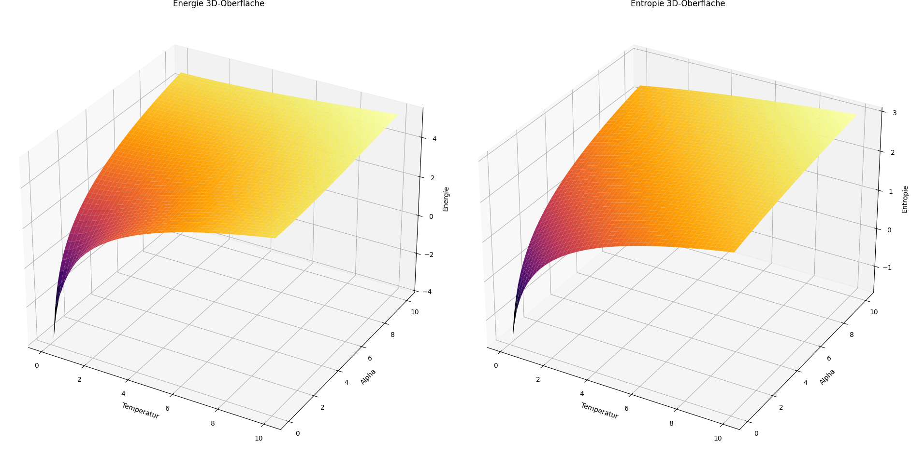
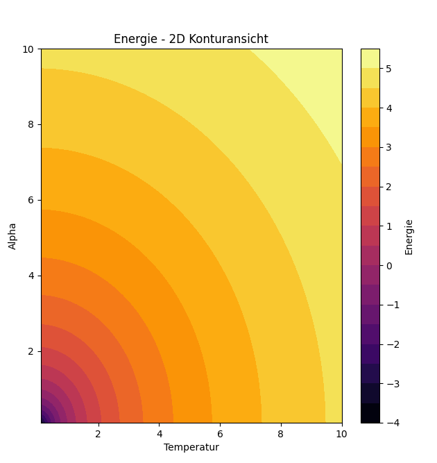
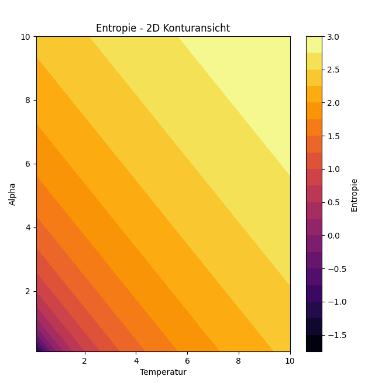

# Kapitel 23 – Thermodynamische Felder: Energie und Entropie bei variierenden Parametern

In diesem Kapitel wird die Untersuchung auf thermodynamische Felder ausgeweitet, wobei wir uns mit der Veränderung der Parameter Temperatur und Bewusstseinsfaktor $\alpha$ befassen. Während die vorherigen Kapitel den Einfluss von $\alpha$ auf die Resonanz und Entropie beleuchtet haben, gehen wir nun einen Schritt weiter und analysieren, wie sich die Entropie und Energie in einem dynamischen System mit einer weiteren Dimension, der Temperatur, verhalten.

## Ziel der Simulation

Die Simulation verfolgt zwei Hauptziele:

1. **Untersuchung der Energieverteilung:** Es wird untersucht, wie sich Energie in einem System mit zwei variierenden Parametern – Temperatur und Bewusstseinsfaktor $\alpha$ – verteilt.
2. **Ableitung der Entropie:** Die Entropie wird als Maß für die Komplexität des Systems hergeleitet und in Abhängigkeit von Temperatur und $\alpha$ visualisiert.

Die Berechnungen basieren auf den Annahmen, dass sowohl die Energie als auch die Entropie logarithmisch in Bezug auf Temperatur und den Bewusstseinsfaktor $\alpha$ sind. Hierzu werden in der Simulation beispielhafte Werte für diese Parameter genutzt, um das Verhalten in einem dreidimensionalen Raum darzustellen.

## Aufbau der Simulation

Die Simulation basiert auf zwei Hauptberechnungen:

- **Energie:** Berechnet als $\log(T^2 + A^2)$, wobei $T$ die Temperatur und $A$ der Bewusstseinsfaktor $\alpha$ ist. Diese Formel stellt eine vereinfachte Annahme über die Energieverteilung im System dar.
- **Entropie:** Berechnet als $\log(T + A)$, wobei ebenfalls $T$ und $A$ als Variablen auftreten.

## Visualisierung der Ergebnisse

Die Ergebnisse werden in Form von 3D-Oberflächen und 2D-Konturansichten dargestellt:

1. **3D-Oberflächen:** Diese Oberflächen zeigen, wie sich die Energie und die Entropie in Abhängigkeit von Temperatur und $\alpha$ verändern. Die Temperatur und $\alpha$ werden als Achsen im Raum betrachtet, wobei die Energie bzw. die Entropie entlang der Z-Achse abgetragen wird.
2. **2D-Konturenansicht:** Hier wird die Energie und Entropie als flache Karte dargestellt, um die Verteilung der beiden Größen für verschiedene Parameter visuell zu erfassen.

## Interpretation der Ergebnisse

- **Energie:** Die 3D-Oberfläche der Energie zeigt, dass sie in Abhängigkeit von Temperatur und $\alpha$ eine charakteristische Form annimmt. Je höher sowohl die Temperatur als auch der Bewusstseinsfaktor, desto mehr Energie wird im System gespeichert. Dies deutet darauf hin, dass bei höherem $\alpha$ und einer höheren Temperatur mehr energetische Ressourcen im System gebunden sind.
- **Entropie:** Die Entropie nimmt mit zunehmender Temperatur und $\alpha$ zu, was bedeutet, dass das System bei höheren Werten dieser Parameter eine höhere Unordnung bzw. eine größere Informationsverteilung aufweist.

Die 2D-Konturenansicht erleichtert es, die energetische Verteilung und die Komplexität des Systems für verschiedene Temperatur- und $\alpha$-Werte schnell zu erfassen. Dies ist besonders nützlich für die Untersuchung von Systemen, bei denen sowohl thermodynamische als auch bewusste Einflussfaktoren eine Rolle spielen.

## Ausblick

Diese Art der Untersuchung bietet neue Einblicke in das Zusammenspiel von thermodynamischen Feldern und bewussten Parametern. Es wird deutlich, dass das System in der Lage ist, mit der Variation von $\alpha$ und Temperatur eine vielschichtige energetische Struktur zu entwickeln, die weiter untersucht werden kann, um ein tieferes Verständnis von komplexen dynamischen Feldern zu erlangen.

## Python-Code für die Simulation

Der vollständige Python-Code für die Simulation ist unter dem Pfad `../Simulationen/Simulation009.py` im Repository gespeichert.

## Bilder der Simulation





👉 **../Simulationen/Mathematische Beweisführung**

1. **Repository klonen**:  
   ```bash
   git clone https://github.com/DominicRene/Resonanzfeldtheorie.git
   cd Resonanzfeldtheorie