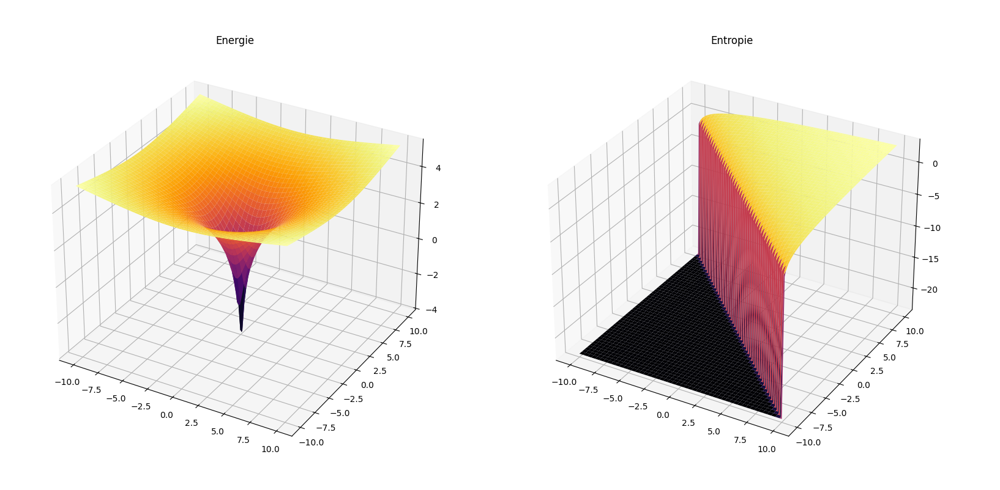

# Kapitel 24 – Singularität und Stabilität: Energie und Entropie in der Nähe kritischer Punkte

In Kapitel 24 untersuchen wir das Verhalten von Energie und Entropie in Systemen, die sich in der Nähe von kritischen Punkten oder Singularitäten befinden. Diese kritischen Punkte treten auf, wenn Temperatur ($T$) und Bewusstseinsfaktor $\alpha$ so gewählt sind, dass die Berechnungen von Energie und Entropie numerisch instabil werden oder extrem hohe Werte annehmen. Die Herausforderung besteht darin, diese instabilen Punkte zu stabilisieren und die physikalischen Phänomene zu verstehen, die in ihrer Nähe auftreten.

## Ziel der Simulation

Die Simulation in diesem Kapitel verfolgt zwei Hauptziele:

1. **Stabilisierung der Berechnungen:** Wir verwenden numerische Techniken, um sicherzustellen, dass die Berechnungen für Energie und Entropie in der Nähe von Singularitäten stabil bleiben, indem wir kleine Werte wie $\epsilon$ in die Berechnungen einfließen lassen.
2. **Untersuchung der Auswirkungen von Singularitäten:** Wir analysieren, wie sich die Energie und Entropie verhalten, wenn Temperatur und $\alpha$ Werte erreichen, die zu extremen oder instabilen Berechnungen führen können.

Die Berechnungen erfolgen unter der Annahme, dass sowohl die Energie als auch die Entropie logarithmische Funktionen von Temperatur und $\alpha$ sind. Bei der Berechnung werden Extremwerte durch die Einführung von kleinen stabilisierenden Faktoren wie $\epsilon$ vermieden.

## Aufbau der Simulation

Die Simulation basiert auf der Berechnung von Energie und Entropie aus den Werten für Temperatur $T$ und Bewusstseinsfaktor $\alpha$:

- **Energie:** Berechnet als $\log(T^2 + A^2)$, wobei $T$ die Temperatur und $A$ der Bewusstseinsfaktor $\alpha$ ist. Um Singularitäten zu vermeiden, wird sichergestellt, dass der Wert immer größer als eine kleine Zahl $\epsilon$ ist.
- **Entropie:** Berechnet als $\log(T + A)$, wobei ebenfalls $T$ und $A$ als Variablen auftreten. Auch hier wird der Logarithmus so angepasst, dass er keine Nullwerte erzeugt.

## Visualisierung der Ergebnisse

Die Ergebnisse werden in Form von 3D-Oberflächen dargestellt:

1. **Energie-Oberfläche:** Diese Oberfläche zeigt, wie sich die Energie in einem System mit variierenden Temperaturen und $\alpha$-Werten verhält. Die Berechnung stellt sicher, dass keine unendlichen oder extrem großen Werte auftreten.
2. **Entropie-Oberfläche:** Die Entropie-Oberfläche gibt Aufschluss darüber, wie die Komplexität des Systems in Abhängigkeit von Temperatur und $\alpha$ verändert wird, wobei die Berechnung ebenfalls stabilisiert wurde.

Durch die Visualisierung der Ergebnisse erhalten wir ein klareres Bild von den Effekten, die entstehen, wenn kritische Werte erreicht werden.

## Interpretation der Ergebnisse

- **Energie:** Die 3D-Oberfläche der Energie zeigt, dass bei extrem niedrigen oder hohen Werten für Temperatur und $\alpha$ die Energie stabil bleibt, da die Berechnungen durch den $\epsilon$-Wert geschützt sind. Die Energie nimmt zu, wenn sowohl die Temperatur als auch der Bewusstseinsfaktor wachsen, aber es gibt keine Singularitäten oder unendlichen Werte.
- **Entropie:** Die Entropie zeigt ein ähnliches Verhalten. Sie nimmt mit zunehmender Temperatur und $\alpha$ zu, bleibt jedoch immer innerhalb eines stabilen Bereichs, dank der Stabilisierung der Berechnungen. Die Entropie wird in den Bereichen, in denen die Berechnungen instabil sein könnten, durch den kleineren $\epsilon$-Wert abgeschwächt.

## Ausblick

Diese Simulation bietet einen wichtigen Schritt in der Untersuchung von Systemen, die nahe an kritischen Punkten operieren. Sie zeigt, dass die Einführung stabilisierender Faktoren es ermöglicht, auch unter extremen Bedingungen zuverlässige Ergebnisse zu erhalten. In zukünftigen Kapiteln werden wir untersuchen, wie sich diese stabilen Systemverhalten auf reale physikalische Systeme übertragen lassen und welche praktischen Anwendungen diese Erkenntnisse haben könnten.

## Python-Code für die Simulation

Der vollständige Python-Code für die Simulation ist unter dem Pfad `../Simulationen/Simulation010.py` im Repository gespeichert.

## Bild der Simulation



👉 **../Simulationen/Mathematische Beweisführung**

1. **Repository klonen**:  
   ```bash
   git clone https://github.com/DominicRene/Resonanzfeldtheorie.git
   cd Resonanzfeldtheorie