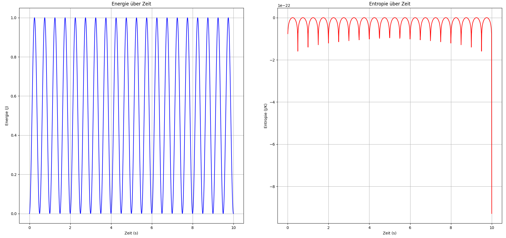

# Kapitel 25 – Energie und Entropie: Zeitliche Entwicklung eines harmonischen Systems

In Kapitel 25 untersuchen wir die zeitliche Entwicklung der Energie und Entropie eines harmonischen Systems, das durch eine sinusförmige Funktion beschrieben wird. Dabei verwenden wir die Boltzmann-Konstante, um die Entropie als Funktion der Energie zu berechnen und zu visualisieren. Das Ziel dieser Simulation ist es, das Verhalten von Energie und Entropie über die Zeit hinweg zu analysieren und zu verstehen, wie sich die thermodynamischen Größen in einem zyklischen System verhalten.

## Ziel der Simulation

Die Simulation hat zwei Hauptziele:

1. **Berechnung der Energie:** Die Energie wird als Funktion der Zeit beschrieben, wobei sie einer sinusförmigen Kurve folgt. Diese Funktion spiegelt die zyklische Natur des Systems wider.
2. **Berechnung der Entropie:** Die Entropie wird in Beziehung zur Energie gesetzt, wobei die Boltzmann-Konstante $k_B$ verwendet wird, um die Entropie als logarithmische Funktion der Energie zu berechnen.

## Aufbau der Simulation

Die Simulation basiert auf der Annahme, dass die Energie eines harmonischen Systems durch die Funktion $E(t) = A \sin^2(\omega t)$ beschrieben wird, wobei $A$ die Amplitude und $\omega$ die Frequenz des Systems sind. Diese Funktion gibt die Energie des Systems zu jedem Zeitpunkt an.

Die Entropie wird dann durch die Beziehung $S(E) = k_B \ln(E)$ berechnet, wobei $k_B$ die Boltzmann-Konstante ist. Diese Entropie beschreibt die Unordnung des Systems und steht in direkter Beziehung zur Energie.

## Visualisierung der Ergebnisse

Die Ergebnisse werden in zwei separaten Diagrammen dargestellt:

1. **Energie über die Zeit:** Die Energie wird als Funktion der Zeit in einem Diagramm dargestellt. Da die Energie einer sinusförmigen Funktion folgt, zeigt das Diagramm eine periodische Kurve, die mit der Zeit schwankt.
2. **Entropie über die Zeit:** Die Entropie wird ebenfalls als Funktion der Zeit dargestellt. Sie folgt der gleichen periodischen Struktur wie die Energie, aber da die Entropie logarithmisch von der Energie abhängt, hat sie eine andere Form.

## Interpretation der Ergebnisse

- **Energie:** Das Diagramm der Energie zeigt eine regelmäßige sinusförmige Schwankung der Energie, die typisch für ein harmonisches System ist. Die Energie erreicht ihren höchsten Wert, wenn die Sinusfunktion ihren Maximalwert erreicht, und den niedrigsten Wert, wenn die Sinusfunktion ihren Minimalwert erreicht.
- **Entropie:** Das Diagramm der Entropie folgt ebenfalls einem periodischen Verlauf, aber da die Entropie logarithmisch von der Energie abhängt, sind die Spitzenwerte der Entropie weniger ausgeprägt als die der Energie. Die Entropie erreicht ihre maximalen Werte, wenn die Energie am höchsten ist, aber der logarithmische Zusammenhang sorgt dafür, dass die Schwankungen in der Entropie weniger ausgeprägt sind.

## Ausblick

Diese Simulation bietet einen grundlegenden Einblick in die Zeitentwicklung von Energie und Entropie in einem harmonischen System. In zukünftigen Kapiteln werden wir weiter untersuchen, wie sich die Entropie in komplexeren Systemen verhält und welche Auswirkungen die zeitliche Entwicklung von Energie und Entropie auf die thermodynamische Stabilität von Systemen hat.

## Python-Code für die Simulation

Der vollständige Python-Code für die Simulation ist unter dem Pfad `../Simulationen/Simulation011.py` im Repository gespeichert.

## Bild der Simulation



👉 **../Simulationen/Mathematische Beweisführung**

1. **Repository klonen**:  
   ```bash
   git clone https://github.com/DominicRene/Resonanzfeldtheorie.git
   cd Resonanzfeldtheorie