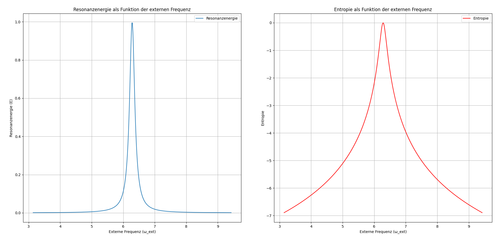

# Kapitel 26 – Resonanz und Entropie: Die Wechselwirkung zwischen Eigenfrequenz und externen Anregungen

Kapitel 26 widmet sich der Untersuchung der Resonanzenergie und der Entropie eines Systems, das einer externen Anregung ausgesetzt ist. Wir betrachten ein gedämpftes harmonisches System, dessen Energie und Entropie von der externen Frequenz abhängen. Ziel der Simulation ist es, das Verhalten der Resonanzenergie und der Entropie als Funktion der externen Frequenz zu analysieren und zu visualisieren.

## Ziel der Simulation

In dieser Simulation betrachten wir die Wechselwirkung zwischen einem gedämpften System mit Eigenfrequenz $\omega_0$ und einer externen Anregung mit variierender Frequenz. Die Simulation verfolgt zwei Hauptziele:

1. **Berechnung der Resonanzenergie:** Die Energie des Systems wird als Funktion der externen Frequenz $\omega_{\text{ext}}$ berechnet, wobei die bekannte Formel für die Resonanzenergie verwendet wird:
   
   $$E_{\text{resonance}} = \frac{A}{1 + \left(\frac{\omega_{\text{ext}} - \omega_0}{\gamma}\right)^2}$$
   
   Hierbei ist $A$ die Amplitude des Systems, $\omega_0$ die Eigenfrequenz und $\gamma$ der Dämpfungskoeffizient.
   
2. **Berechnung der Entropie:** Die Entropie wird als logarithmische Funktion der Resonanzenergie berechnet:
   
   $$S = \ln(E_{\text{resonance}} + 1 \times 10^{-10})$$
   
   Dies stellt sicher, dass die Entropie immer definiert ist, selbst wenn die Resonanzenergie sehr klein wird.

## Aufbau der Simulation

Die Simulation verwendet eine Array von externen Frequenzen $\omega_{\text{ext}}$ von $0.5 \omega_0$ bis $1.5 \omega_0$, was den Frequenzbereich abdeckt, der für das Resonanzverhalten eines gedämpften Systems von Interesse ist.

Die Resonanzenergie wird unter Verwendung der oben genannten Formel für verschiedene Werte von $\omega_{\text{ext}}$ berechnet. Die Entropie wird daraufhin als Logarithmus der Resonanzenergie berechnet, um die Unordnung des Systems in Bezug auf die Energie zu quantifizieren.

## Visualisierung der Ergebnisse

Die Ergebnisse der Simulation werden in zwei Diagrammen dargestellt:

1. **Resonanzenergie als Funktion der externen Frequenz:** Dieses Diagramm zeigt, wie die Resonanzenergie des Systems in Abhängigkeit von der externen Frequenz variiert. Bei Resonanz ($\omega_{\text{ext}} = \omega_0$) erreicht die Energie ihr Maximum, was typisch für ein resonantes System ist.
   
2. **Entropie als Funktion der externen Frequenz:** Die Entropie wird ebenfalls in Abhängigkeit von der externen Frequenz dargestellt. Da die Entropie logarithmisch von der Resonanzenergie abhängt, zeigt das Diagramm eine ähnliche Form wie das der Resonanzenergie, jedoch mit einer abgemilderten Schwankung.

## Interpretation der Ergebnisse

- **Resonanzenergie:** Im Diagramm der Resonanzenergie erkennen wir, dass die Energie des Systems bei der Eigenfrequenz $\omega_0$ einen Peak erreicht, was die klassische Resonanzerscheinung widerspiegelt. Abweichungen von der Eigenfrequenz führen zu einem Rückgang der Energie.
  
- **Entropie:** Die Entropie folgt der gleichen Form wie die Resonanzenergie, jedoch in einer abgeschwächten Form, da sie logarithmisch von der Energie abhängt. Die Entropie ist am höchsten bei Resonanz und sinkt bei Abweichungen von der Eigenfrequenz.

## Ausblick

Diese Simulation liefert einen grundlegenden Überblick über das Verhalten der Resonanzenergie und der Entropie in einem gedämpften System mit externen Anregungen. In zukünftigen Kapiteln werden wir weiter untersuchen, wie sich Resonanz und Entropie in komplexeren Systemen verhalten und welche Auswirkungen die Energie- und Entropieverteilungen auf die thermodynamische Stabilität von Systemen haben.

## Python-Code für die Simulation

Der vollständige Python-Code für die Simulation ist unter dem Pfad `../Simulationen/Simulation012.py` im Repository gespeichert.

## Bild der Simulation



👉 **../Simulationen/Mathematische Beweisführung**

1. **Repository klonen**:  
   ```bash
   git clone https://github.com/DominicRene/Resonanzfeldtheorie.git
   cd Resonanzfeldtheorie