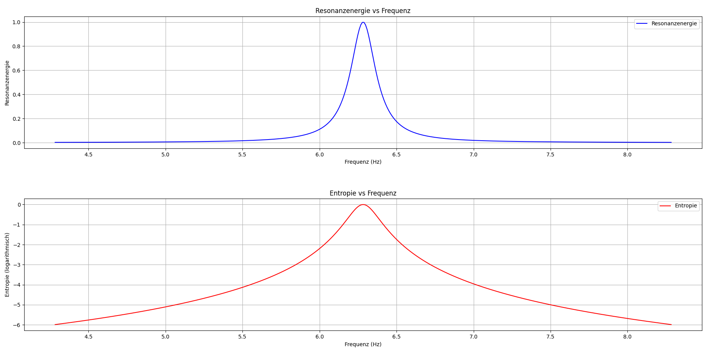

# Kapitel 27 – Resonanz und Entropie: Untersuchung der Frequenzabhängigkeit

Kapitel 27 untersucht die Frequenzabhängigkeit der Resonanzenergie und der Entropie eines Systems. Dabei betrachten wir ein gedämpftes System, dessen Eigenfrequenz $\omega_0$ festgelegt ist und dessen Entropie und Resonanzenergie in Abhängigkeit von einer externen Anregungsfrequenz berechnet werden. Ziel der Simulation ist es, das Verhalten der Entropie und der Resonanzenergie im Frequenzbereich um die Eigenfrequenz zu analysieren.

## Ziel der Simulation

In dieser Simulation wird das Verhalten der Resonanzenergie und der Entropie eines gedämpften Systems mit einer variierenden externen Frequenz untersucht. Die Frequenz der externen Anregung $\omega_{\text{ext}}$ wird über einen Bereich um die Eigenfrequenz $\omega_0$ hinweg variiert, und die Resonanzenergie sowie die Entropie werden in diesem Bereich analysiert.

### Berechnung der Resonanzenergie

Die Resonanzenergie eines gedämpften Systems wird nach der bekannten Formel berechnet:

$$E_{\text{resonance}} = \frac{A}{1 + \left(\frac{\omega_{\text{ext}} - \omega_0}{\gamma}\right)^2}$$

Dabei ist $A$ die Amplitude des Systems, $\omega_0$ die Eigenfrequenz des Systems und $\gamma$ der Dämpfungsfaktor. Diese Formel beschreibt das klassische Resonanzverhalten, bei dem die Energie bei der Eigenfrequenz einen Peak erreicht.

### Berechnung der Entropie

Die Entropie wird als logarithmische Funktion der Resonanzenergie berechnet:

$$S = \ln(E_{\text{resonance}} + 1 \times 10^{-5})$$

Diese logarithmische Beziehung stellt sicher, dass die Entropie immer definiert ist, auch wenn die Resonanzenergie sehr klein wird.

## Visualisierung der Ergebnisse

Die Ergebnisse der Simulation werden in zwei Diagrammen dargestellt:

1. **Resonanzenergie als Funktion der Frequenz:** In diesem Diagramm wird die Resonanzenergie des Systems in Abhängigkeit von der externen Frequenz $\omega_{\text{ext}}$ gezeigt. Bei Resonanz ($\omega_{\text{ext}} = \omega_0$) erreicht die Energie ihr Maximum.
   
2. **Entropie als Funktion der Frequenz:** Die Entropie wird ebenfalls in Abhängigkeit von der externen Frequenz dargestellt. Sie folgt einem ähnlichen Verlauf wie die Resonanzenergie, jedoch in einer logarithmisch abgeschwächten Form.

## Interpretation der Ergebnisse

- **Resonanzenergie:** Im Diagramm der Resonanzenergie ist deutlich zu sehen, dass die Energie des Systems bei der Eigenfrequenz $\omega_0$ einen Peak erreicht. Dies ist die klassische Resonanzerscheinung, bei der das System maximal angeregt wird.
  
- **Entropie:** Das Diagramm der Entropie zeigt, wie die Unordnung des Systems mit der Frequenz variiert. Die Entropie steigt bei Resonanz und fällt bei Abweichungen von der Eigenfrequenz.

## Ausblick

Die hier untersuchten Frequenzabhängigkeiten von Resonanzenergie und Entropie bilden die Grundlage für weitere Untersuchungen in komplexeren Systemen. In den nächsten Kapiteln werden wir tiefer in die Dynamik von Resonanzphänomenen eintauchen und deren Auswirkungen auf die thermodynamische Entropie in verschiedenen physikalischen Kontexten untersuchen.

## Python-Code für die Simulation

Der vollständige Python-Code für die Simulation ist unter dem Pfad `../Simulationen/Simulation013.py` im Repository gespeichert.

## Bild der Simulation



👉 **../Simulationen/Mathematische Beweisführung**

1. **Repository klonen**:  
   ```bash
   git clone https://github.com/DominicRene/Resonanzfeldtheorie.git
   cd Resonanzfeldtheorie