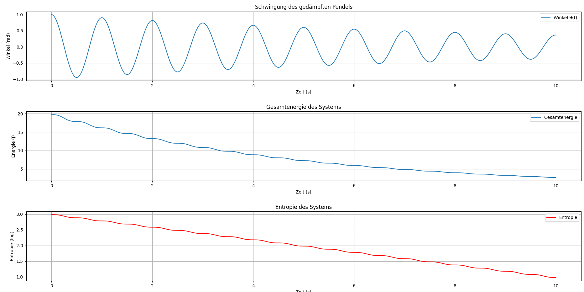

## Kapitel 28 – Entropiedynamik eines gedämpften harmonischen Oszillators

In diesem Kapitel analysieren wir ein klassisches Beispiel der Schwingungsmechanik: das gedämpfte harmonische Pendel. Es dient als ideales System zur Untersuchung der Energiereduktion durch Reibungsverluste und der damit verbundenen Entropieentwicklung im Zeitverlauf. Diese Betrachtung stellt eine direkte Verbindung zwischen klassischer Mechanik und thermodynamischer Ordnung dar – ein zentrales Element der Resonanzfeldtheorie.

### Mathematische Modellierung

Die Bewegungsgleichung des gedämpften Oszillators ergibt sich aus dem zweiten Newtonschen Gesetz unter Einbeziehung eines linearen Dämpfungsterms:

$$
\frac{d^2\theta}{dt^2} + 2\gamma \frac{d\theta}{dt} + \omega_0^2 \theta = 0
$$

Dabei ist:  
- $\theta(t)$: Winkelabweichung zur Ruhelage,  
- $\omega_0 = 2\pi$: Eigenfrequenz des Systems,  
- $\gamma = 0{,}1$: Dämpfungskonstante.  

Die Anfangsbedingungen lauten:  
- $\theta(0) = 1$  
- $\frac{d\theta}{dt}(0) = 0$  

Zur Analyse verwenden wir numerische Integration mittels `solve_ivp`, um die zeitabhängige Lösung zu berechnen. Anschließend bestimmen wir daraus:

- Die kinetische Energie: $E_\text{kin}(t) = \frac{1}{2} \omega(t)^2$
- Die potenzielle Energie: $E_\text{pot}(t) = \frac{1}{2} \omega_0^2 \theta(t)^2$
- Die Gesamtenergie: $E(t) = E_\text{kin}(t) + E_\text{pot}(t)$
- Die Entropie: $S(t) = \log(E(t) + \varepsilon)$ mit $\varepsilon = 10^{-5}$ zur Vermeidung von Singularitäten

### Ergebnis und Interpretation

Die Simulation zeigt drei zentrale Kurven:

1. **Schwingungsverlauf $\theta(t)$**  
   Die Amplitude nimmt exponentiell ab – typisch für ein gedämpftes System. Die Resonanz klingt aus, jedoch bleibt die Eigenfrequenz deutlich erkennbar.

2. **Gesamtenergie $E(t)$**  
   Energieverluste sind klar sichtbar. Die Abnahme ist nicht linear, sondern folgt einer exponentiellen Abschwächung. Sie spiegelt die irreversible Dissipation wider.

3. **Entropie $S(t)$**  
   Die logarithmisch abgeleitete Entropiekurve transformiert die abfallende Energie in eine thermodynamische Ordnungsperspektive: Mit dem Energieverlust wächst die Entropie. Diese Interpretation erlaubt eine direkte Verbindung zwischen Schwingung und Informationsverlust.

### Visualisierung



- Oben: Winkelverlauf $\theta(t)$  
- Mitte: Energieverlauf $E(t)$  
- Unten: Entropie $S(t)$

> Dieses Kapitel ist ein Schlüsselschritt zur Vereinigung mechanischer und thermodynamischer Modelle. Die wachsende Entropie bei schwindender Schwingung demonstriert die natürliche Tendenz zur Resonanzauflösung – ein grundlegendes Prinzip des Resonanzfeldes.

👉 **../Simulationen/Mathematische Beweisführung**

1. **Repository klonen**:  
   ```bash
   git clone https://github.com/DominicRene/Resonanzfeldtheorie.git
   cd Resonanzfeldtheorie
