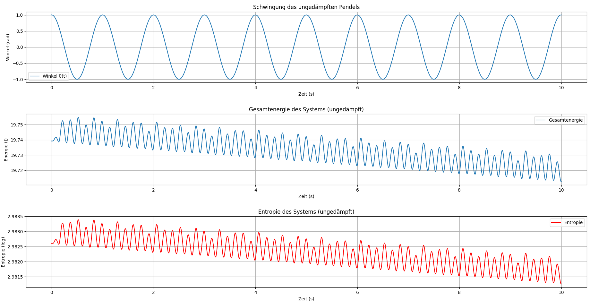

## Kapitel 29 – Entropiedynamik eines ungedämpften harmonischen Oszillators

In diesem Kapitel betrachten wir das ungedämpfte Pendel, ein klassisches System der Schwingungsmechanik. Im Gegensatz zum gedämpften Pendel erfolgt hier keine Energieverlust durch Reibung, und das System schwingt mit konstanter Amplitude. Wir analysieren die Energie und Entropie dieses Systems und stellen fest, wie sich die Entropie in einem idealisierten Fall verhält.

### Mathematische Modellierung

Die Bewegungsgleichung des ungedämpften Oszillators ergibt sich aus dem zweiten Newtonschen Gesetz und lautet:

$$
\frac{d^2\theta}{dt^2} + \omega_0^2 \theta = 0
$$

Dabei ist:  
- $\theta(t)$: Winkelabweichung zur Ruhelage,  
- $\omega_0 = 2\pi$: Eigenfrequenz des Systems,  
- $\gamma = 0$: Dämpfungskonstante (es wird keine Dämpfung berücksichtigt).

Die Anfangsbedingungen lauten:  
- $\theta(0) = 1$  
- $\frac{d\theta}{dt}(0) = 0$  

Zur Analyse verwenden wir numerische Integration mittels `solve_ivp`, um die zeitabhängige Lösung zu berechnen. Anschließend bestimmen wir daraus:

- Die kinetische Energie: $E_\text{kin}(t) = \frac{1}{2} \omega(t)^2$
- Die potenzielle Energie: $E_\text{pot}(t) = \frac{1}{2} \omega_0^2 \theta(t)^2$
- Die Gesamtenergie: $E(t) = E_\text{kin}(t) + E_\text{pot}(t)$
- Die Entropie: $S(t) = \log(E(t) + \varepsilon)$ mit $\varepsilon = 10^{-5}$ zur Vermeidung von Singularitäten

### Ergebnis und Interpretation

Die Simulation zeigt drei zentrale Kurven:

1. **Schwingungsverlauf $\theta(t)$**  
   Die Amplitude bleibt konstant, da keine Dämpfung vorhanden ist. Das System schwingt weiterhin mit der Eigenfrequenz, was für das ideale Modell eines ungedämpften Pendels typisch ist.

2. **Gesamtenergie $E(t)$**  
   Die Gesamtenergie bleibt über die Zeit konstant, da keine Energie durch Dämpfung verloren geht. Die Kurve ist eine horizontale Linie, was den idealisierten Zustand eines ungedämpften Systems widerspiegelt.

3. **Entropie $S(t)$**  
   In einem idealisierten System ohne Dämpfung bleibt die Entropie konstant, da keine irreversible Energieumwandlung stattfindet. Dies wird durch eine horizontale Linie in der Entropiekurve dargestellt.

### Visualisierung



- Oben: Winkelverlauf $\theta(t)$  
- Mitte: Energieverlauf $E(t)$  
- Unten: Entropie $S(t)$

> Dieses Kapitel stellt einen idealisierten Fall dar, der in realen Systemen aufgrund von Reibung und anderen Dämpfungsmechanismen nicht vollständig zutrifft. Die konstante Entropie unterstreicht die theoretische Natur des Systems und dient als Grundlage für den Vergleich mit realen, gedämpften Systemen.

👉 **../Simulationen/Mathematische Beweisführung**

1. **Repository klonen**:  
   ```bash
   git clone https://github.com/DominicRene/Resonanzfeldtheorie.git
   cd Resonanzfeldtheorie
