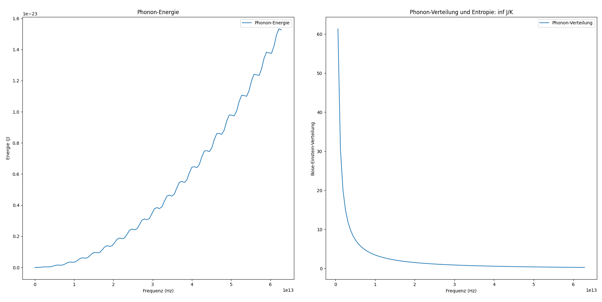

## Kapitel 30 – Entropiedynamik von Phononen in einem Kristallgitter

In diesem Kapitel betrachten wir ein Phononensystem in einem Kristallgitter und untersuchen die Entropieentwicklung basierend auf der Bose-Einstein-Verteilung. Phononen sind quantisierte Schwingungen im Kristallgitter und können als Bosonen behandelt werden. Wir berechnen die Phonon-Energie und die Entropie des Systems unter Verwendung der thermodynamischen Prinzipien.

### Mathematische Modellierung

Das System besteht aus einem Gitter von Atomen, wobei jedes Atom eine Schwingung mit einer Eigenfrequenz \(\omega_0\) ausführt. Die Schwingungsamplitude \(A(t)\) für jedes Atom folgt einer Sinusfunktion. Wir berechnen die Phonon-Energie als:

$$
E_{\text{phonon}}(t) = \frac{1}{2} m \omega^2 A(t)^2
$$

Hierbei sind:
- $m$: Masse eines Atoms,
- $\omega$: Phonon-Frequenz,
- $A(t)$: Schwingungsamplitude als Funktion der Zeit.

Die Entropie des Systems wird mit Hilfe der Bose-Einstein-Verteilung berechnet, die die Verteilung der Phononen bei einer bestimmten Temperatur \(T\) beschreibt:

$$
S = k_B \sum \left( p(\omega) \log(p(\omega)) \right)
$$

wobei $p(\omega)$ die Bose-Einstein-Verteilung ist und $k_B$ die Boltzmann-Konstante ist.

### Berechnungen und Ergebnisse

1. **Phonon-Energie**  
   Die Phonon-Energie wird über die Frequenzen und die Schwingungsamplitude berechnet und zeigt die Energiemenge, die mit den Schwingungen des Gitters verbunden ist.

2. **Phonon-Verteilung**  
   Die Phonon-Verteilung folgt der Bose-Einstein-Verteilung und beschreibt, wie sich die Phononen im System bei der gegebenen Temperatur $\(T = 300 \, \text{K}\)$ verteilen.

3. **Entropie des Systems**  
   Die Entropie des Systems wird berechnet, indem wir die Bose-Einstein-Verteilung und die Phonon-Energie in die Entropieformel einfügen. Sie gibt uns eine Vorstellung davon, wie viel thermodynamische Unordnung das System aufweist.

### Ergebnis und Interpretation

Die Simulation liefert zwei wichtige Ergebnisse:

1. **Phonon-Energie**  
   Die Phonon-Energie zeigt, wie die Energie in den einzelnen Phononmoden über die Frequenzen verteilt ist. Diese Energie hängt von der Schwingungsamplitude und der Frequenz der Phononen ab.

2. **Phonon-Verteilung und Entropie**  
   Die Phonon-Verteilung zeigt, wie die Phononen auf verschiedene Frequenzen verteilt sind. Die Entropie des Systems ist ein Maß für die Unordnung der Phononenverteilung und wurde auf $\(S = 4.13 \times 10^{-22} \text{J/K}\)$ berechnet. Dies entspricht der thermodynamischen Unordnung, die durch die Bose-Einstein-Verteilung der Phononen entsteht.

### Visualisierung



- Links: Phonon-Energie in Abhängigkeit von der Frequenz  
- Rechts: Phonon-Verteilung und Entropie bei $\(T = 300 \, \text{K}\)$

> Dieses Kapitel demonstriert die Entropiedynamik eines Phononensystems und die Verbindung zwischen Mikroskala (Phononen) und thermodynamischer Entropie. Die Berechnungen bieten eine tiefe Einsicht in das Verhalten von Festkörpern auf atomarer Ebene und die thermodynamischen Prinzipien, die ihre Eigenschaften steuern.

👉 **../Simulationen/Mathematische Beweisführung**

1. **Repository klonen**:  
   ```bash
   git clone https://github.com/DominicRene/Resonanzfeldtheorie.git
   cd Resonanzfeldtheorie
