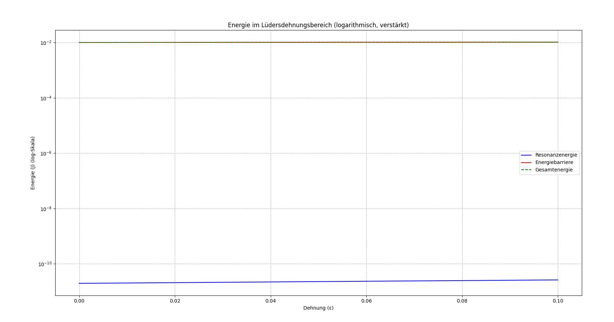

# Kapitel 31 – Energie im Lüdersdehnungsbereich

In diesem Kapitel untersuchen wir das Verhalten eines elastischen Gittersystems auf atomarer Ebene unter dem Einfluss mechanischer Dehnung, insbesondere im sogenannten **Lüdersdehnungsbereich**. Dabei konzentrieren wir uns auf zwei zentrale energetische Größen: die *Resonanzenergie* von Gitterschwingungen (Phononen) und die *Energiebarriere*, die das System überwinden muss, um plastische Veränderungen einzuleiten.

Diese Betrachtung verbindet mechanische Spannungs-Dehnungs-Effekte mit quantenmechanischen Resonanzphänomenen, was eine Brücke zwischen makroskopischer Werkstoffdehnung und mikroskopischer Energieverteilung schlägt.

## Mathematische Modellierung

Das zugrunde liegende Modell geht davon aus, dass die atomaren Schwingungen durch eine harmonische Näherung beschrieben werden können. Dabei hängt die Frequenz der Schwingung $\omega$ von der Dehnung $\epsilon$ des Gitters ab. Auch die Amplitude $\(A\)$ verändert sich unter Dehnung und folgt einer Potenzbeziehung.

### Resonanzenergie

Die Phononenenergie im resonanten Zustand ergibt sich zu:


$$E_{\text{Resonanz}}(\epsilon) = \frac{1}{2} m \omega(\epsilon)^2 A(\epsilon)^2$$

mit:

- $\( m \)$: Masse eines Atoms,
- $\( \omega(\epsilon) = \omega_0 (1 + \epsilon) \)$: Frequenz in Abhängigkeit von der Dehnung,
- $\( A(\epsilon) = A_0 (1 + \epsilon)^{\alpha} \)$: Amplitudenveränderung,
- $\( \alpha \)$: Amplituden-Exponent.

### Energiebarriere

Die Energiebarriere, die für eine plastische Umordnung im Gitter überwunden werden muss, wird modelliert durch:


$$E_{\text{Barriere}}(\epsilon) = E_0 \left( 1 + \frac{\omega(\epsilon)^2}{\omega_{\text{max}}^2} \right)(1 + \epsilon)^{\beta}$$

mit:

- $\( E_0 \)$: Basiswert der Energiebarriere,
- $\( \omega_{\text{max}} \)$: maximale Resonanzfrequenz,
- $\( \beta \)$: exponentieller Einfluss der Dehnung.

### Gesamtenergie

Die Gesamtenergie ist die Summe aus Resonanzenergie und Energiebarriere:

$$E_{\text{gesamt}}(\epsilon) = E_{\text{Resonanz}}(\epsilon) + E_{\text{Barriere}}(\epsilon)$$

Zur besseren Visualisierung wurde eine skalare Verstärkung der Energiewerte vorgenommen (um Potenzen von \(10^4\) bis \(10^8\)).

## Simulation und Visualisierung

Die Simulation zeigt die Energieentwicklung im Bereich $\( \epsilon = 0 \)$ bis $\( \epsilon = 0{,}1 \)$. Die logarithmische Y-Skalierung erlaubt es, sowohl kleine als auch große Energieanteile sichtbar darzustellen.

Die Energieverläufe sind wie folgt:

- **Blaue Kurve**: Resonanzenergie – wächst exponentiell mit der Dehnung.
- **Rote Kurve**: Energiebarriere – beschreibt die erhöhte Reaktionsenergie bei Strukturveränderung.
- **Grüne Kurve**: Gesamtenergie – als Überlagerung beider Effekte.

## Ergebnisse und Interpretation

Die Simulation liefert folgende Erkenntnisse:

- **Resonanzenergie**: Die Gitterschwingungen werden mit zunehmender Dehnung intensiver und energiereicher, was auf eine Verstärkung der atomaren Wechselwirkungen hinweist.
- **Energiebarriere**: Je stärker das Gitter gedehnt wird, desto höher wird die energetische Hürde, die für eine plastische Umstrukturierung erforderlich ist.
- **Gesamtenergie**: Der kombinierte Verlauf zeigt eine kritische Zone im Lüdersdehnungsbereich, in der das Material energetisch instabil wird – ein möglicher Übergangspunkt zwischen elastischem und plastischem Verhalten.

## Bedeutung für die Resonanzfeldtheorie

Diese Ergebnisse untermauern den Ansatz, dass mechanische Prozesse in Festkörpern durch Resonanzprinzipien beschrieben werden können. Die Dehnung wirkt dabei als externer Taktgeber, der Resonanzfrequenzen verschiebt und energetische Schwellen verändert. Dies liefert ein physikalisch fundiertes Modell zur Erklärung von Materialinstabilitäten, Versetzungsbewegungen und Übergängen in nichtlineare Regime – alles innerhalb des Rahmens der erweiterten Resonanzfeldtheorie.

## Visualisierung



- **Links**: Resonanzenergie in Abhängigkeit von der Dehnung  
- **Rechts**: Energiebar

👉 **../Simulationen/Mathematische Beweisführung**

1. **Repository klonen**:  
   ```bash
   git clone https://github.com/DominicRene/Resonanzfeldtheorie.git
   cd Resonanzfeldtheorie
