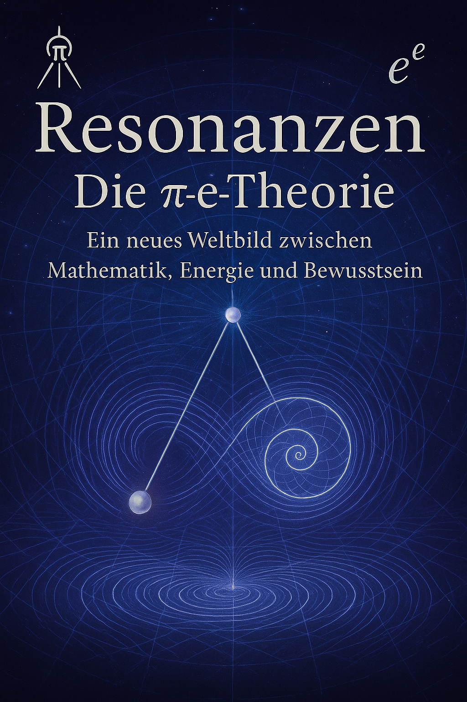

# Die **π - 𝜀** Theorie – Ordnung aus Resonanz

Willkommen im offiziellen Repository zur **Pi-𝜀-Theorie**:  
Eine interdisziplinäre Theorie über das Universum, die Naturgesetze, Energie, Zeit und Bewusstsein in einem kohärenten Modell vereint.  

<p align="center">
  
</p>

## 🧠 Zentrale Idee

Die Theorie basiert auf zwei fundamentalen Prinzipien:

- **π (Pi)** – der *Schu-Kompass*: Maß zyklischer Resonanz und Strukturgeber in Raum und Zeit.  
- **𝜀 (Epsilon)** – der *Schu-Koppler*: Neue Naturkonstante für Resonanzkopplung, Energiebindung und kohärente Dynamik.

Gemeinsam bilden **π** und **𝜀** das Fundament eines neuen physikalischen Verständnisses:  
Ein Universum, das durch Resonanz, Informationsflüsse und ein Zeit-Zeit-Koordinatensystem organisiert ist.

---

## 🌌 Ziel der Theorie

Diese Theorie soll helfen:

- Energie als kohärente Resonanzstruktur zu begreifen  
- neue Systeme wie den Resonanzreaktor zu entwickeln  
- das Zusammenspiel von Bewusstsein, Ordnung und Raumzeit zu verstehen  
- Physik, Mathematik und Philosophie zu vereinen

---

## 🤝 Mitwirken

Ideen, Fragen oder Ergänzungen?  
Pull Requests, Issues oder Diskussionen sind willkommen.

---
## Struktur des Buches

1. [Einleitung](einleitung.md)  
2. [Kapitel 1: Grundlagen der Pi-𝜀-Theorie](Kapitel_1.md)  
3. [Kapitel 2: Das Fundament der Resonanztheorie](Kapitel_2.md)  
4. [Kapitel 3: Quantenmechanische Modelle in der Resonanzfeldtheorie](Kapitel_3.md)  
5. [Kapitel 4: Das quantenmechanische Hebelgesetz](Kapitel_4.md)  
6. [Kapitel 5: Anwendungen der Pi-𝜖-Theorie](Kapitel_5.md)  
7. [Kapitel 6: Resonanz und ihre Anwendungen](Kapitel_5.md) 

---

## 🚀 Einstieg ins Projekt

© Dominic-René Schu – Resonanzfeldtheorie 2025

1. **Repository klonen**:  
   ```bash
	git clone https://github.com/DominicReneSchu/public.git
	cd public
   ```
---

➡️ [Weiter zu: Einleitung](einleitung.md)  
⬅️ [Zurück zur Start](../../README.md)