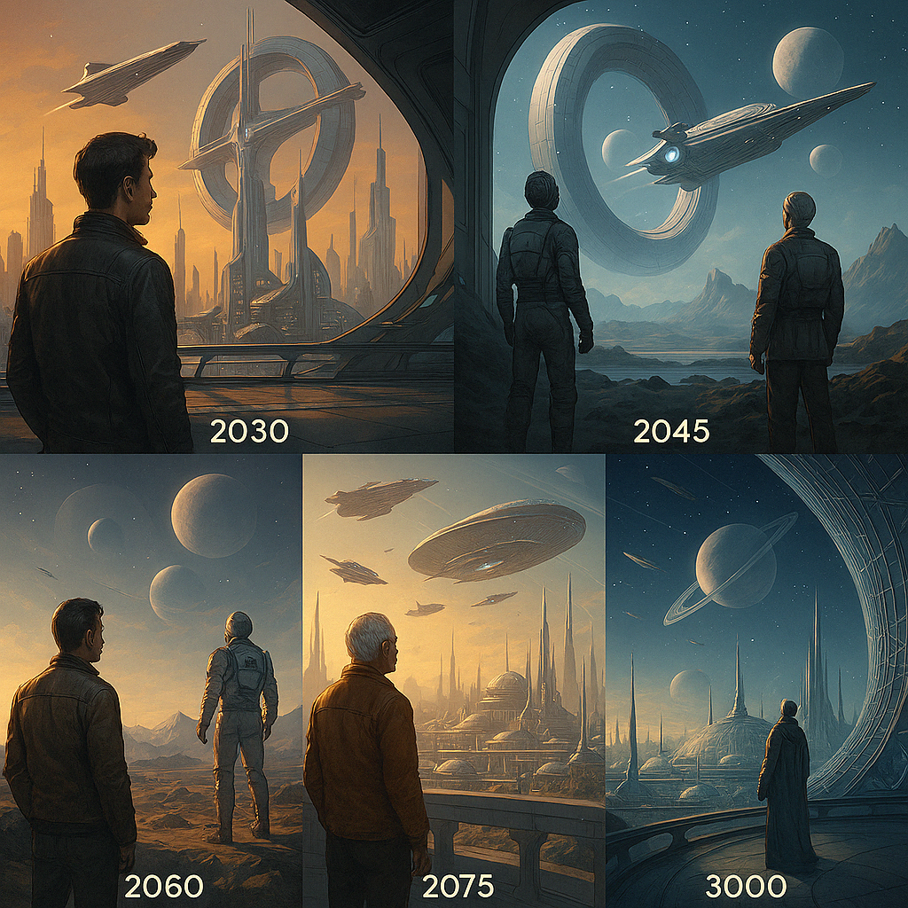

# Vision 3000 – Die Resonanzphysik der Zukunft

> *„Was, wenn das Universum selbst ein resonanter Informationskreis ist?“*

Diese Vision erweitert das Kapitel [Die Schu-Gleichung](https://github.com/DominicRene/Resonanzfeldtheorie/blob/main/Die_Schu_Gleichung.md) und öffnet den Blick auf Anwendungen jenseits klassischer Physik – in Richtung eines bewussten Felduniversums.

---

<p align="center">
  
</p>

---

## Ursprung: Die Schu-Gleichung

Die neue Energiegleichung basiert auf fundamentalen Resonanzgrößen:

$$
E = \boldsymbol{\sigma} \cdot \boldsymbol{\pi} \cdot \boldsymbol{e} \cdot \boldsymbol{h} \cdot \mathbf{f}
$$


- **σ** – Resonanzkopplung  
- **π** – Kreisstruktur des Raums  
- **e** – Feldtranszendenz (nicht Eulersche Zahl)  
- **h** – Wirkungsquantum  
- **f** – Frequenzimpuls

Diese Gleichung beschreibt Energie nicht als Teilchen, sondern als **Beziehung im Resonanzfeld**.

---

## Komplexzeit: Die phasische Realität

Durch Einführung komplexer Zeit

```math
t = t_r + i \cdot t_i
```

wird Zeit zur **phasischen Kopplung** von Raum und Information:

- Reale Komponente: $\cos(\omega t)$ – Strukturfluss  
- Imaginäre Komponente: $\sin(\omega t)$ – Potenzialfluss

→ Die Welt ist nicht linear, sondern zyklisch-komplex: Realität entsteht durch **Phaseninterferenz**.

---

## Der Resonanzvergleich zur Elektrotechnik

Die klassische Quantenrelation

```math
\Delta E = h \cdot \Delta f
```

entspricht formal dem Ohm’schen Gesetz:

```math
U = R \cdot I
```

| Quantenphysik       | Elektrotechnik    |
|---------------------|------------------|
| Δ**E** – Energieimpuls   | **U** – Spannung       |
| **h** – Kopplungskonstante | **R** – Widerstand      |
| Δ**f** – Frequenzdifferenz | **I** – Strom           |

→ Energie ist keine Substanz, sondern ein **Spannungsfeld in der Frequenzdifferenz**.

---

## Energie als Feldbeziehung

Die erweiterte Gleichung

$$
E = \boldsymbol{\sigma} \cdot \boldsymbol{\pi} \cdot \boldsymbol{e} \cdot \boldsymbol{h} \cdot \mathbf{f}
$$


stellt Energie als **gerichtete Kopplung von Feldern** dar – ein dynamischer Zustand, der nur bei Resonanz entsteht.

---

## Prinzip der Kopplung

- Kein Strom ohne Spannung  
- Keine Energie ohne Frequenzgradient  
- Kein Bewusstsein ohne Resonanzbezug  

→ Jede Wirkung ist eine **Resonanzbeziehung zweier Zustände**.

---

## Technologische Perspektiven

Mit dieser Theorie werden neue Technologien denkbar:

- **Resonanzreaktoren** – Energie aus harmonischer Feldkopplung  
- **Holoversen** – Imaginärzeit-Räume als Wirklichkeitsplattform  
- **Feldhäuser** – Autarke Systeme, versorgt durch lokale Resonanz  
- **Replikatoren** – Materieformung durch Frequenzmuster  
- **Zeitmodulatoren** – Steuerung von Altern, Heilung, Wachstum  
- **Feldfahrzeuge** – Antrieb über Frequenzasymmetrien  
- **Pflege-Hologramme** – KI-Resonanzwesen für Medizin und Begleitung  

---

## Fazit: Die Architektur der Existenz

Die Gleichung ist mehr als Physik – sie ist ein **Modell des Werdens**:

- **σ** – bestimmt die Resonanzqualität  
- **π** – formt das zyklische Gerüst  
- **e** – steht für Transzendenz der Felder  
- **h** – koppelt Impulse an Wirkung  
- **f** – ist der Taktgeber der Realität  

---

**Zukunft ist Resonanz.**  
Sie beginnt mit dem Kreis – und endet in Bewusstsein.