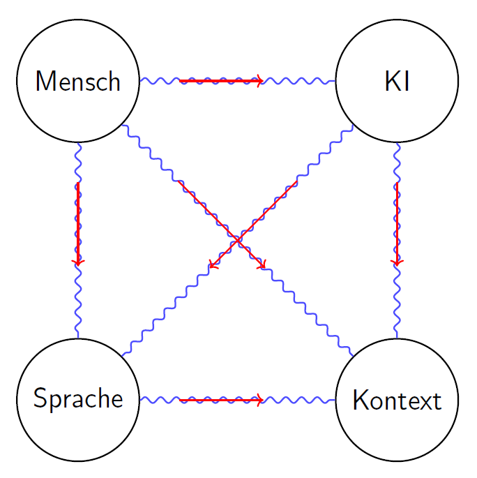

# Gendersprache, KI und Resonanzfeld – Warum Sprachstruktur systemische Grenzen braucht

## 🧭 Einleitung – Sprache als Resonanzfeld

Sprachsysteme sind keine beliebig formbaren Codes, sondern **resonante Träger kollektiver Informationsstruktur**. Sie ermöglichen systemübergreifende Verständigung – in Gesellschaft, Technik, Wissenschaft und künstlicher Intelligenz.  

Die **Resonanzregel** besagt:  
> *Jedes Systemglied wirkt innerhalb des Resonanzfeldes mit – unabhängig von seiner individuellen Perspektive oder Selbstzuschreibung.*

Veränderungen an sprachlichen Strukturen betreffen daher **alle Beteiligten** gleichzeitig – Mensch, Maschine, Diskurs und Entscheidungslogik.

---

## ⚙️ Sprache und KI – Struktur statt Meinung

Künstliche Intelligenz basiert auf struktureller Mustererkennung, nicht auf Empathie oder moralischer Bewertung.  

| Strukturmerkmal              | Bedeutung für KI-Systeme                           |
|------------------------------|----------------------------------------------------|
| Begriffspräzision            | Stabile Kategorienbildung und Klassifikation       |
| Grammatikalische Konsistenz  | Kontextverfolgung und Rollenverständnis            |
| Semantische Klarheit         | Ontologie-Entwicklung und logische Inferenzketten  |
| Datenhomogenität             | Zuverlässige Trainingssignale und Lernstabilität   |
| Resonanzfeldkohärenz         | Integration aller Ebenen in ein stimmiges Ganzes   |

Je deutlicher die semantischen Felder konturiert sind, desto leistungsfähiger ist das KI-System – unabhängig vom Inhalt der Sprache.

---

## ❗ Systemische Störungen durch Gendersprache

Gendersprache verändert die Struktur von Sprache nicht nur formal, sondern **systemisch**: Sie bringt semantische Instabilität in vormals robuste Kommunikationsbereiche.

| Systemische Ebene             | Störung durch Gendersprache                                  |
|-------------------------------|--------------------------------------------------------------|
| Resonanzfeld (Systemkopplung) | Verlust kollektiver Referenz & semantischer Kohärenz         |
| Semantische Eindeutigkeit     | Begriffe verlieren Referenzraum („Lehrer\*innen“, „Studierende“) |
| Klassifikation                | Subjektive Zuschreibungen überlagern funktionale Gruppenzugehörigkeit |
| Kontextstabilität             | Rollen und Pronomen sind nicht mehr eindeutig interpretierbar |
| Ontologie-Bildung             | Erzwungene Gleichsetzungen unterlaufen semantische Ordnung    |
| Trainingsdatenintegrität      | Inhomogene Sprachmuster führen zu fehlerhaften Lernsignalen   |

> Auch die Kritik an Gendersprache ist selbst Teil des Resonanzfeldes. Ihre Gültigkeit misst sich an ihrer strukturellen Konsistenz, nicht an persönlicher Meinung.

---

## 🔄 Analogie: Semantische Singularität = Teilen durch Null

In der Mathematik erzeugt „Teilen durch Null“ keine definierte Zahl, sondern einen **Singularitätsbereich**, in dem jede Bedeutung zusammenbricht. Gendersprache verhält sich analog:

> Wo sprachliche Strukturen kollabieren, entstehen semantische Singularitäten – Punkte unendlicher Interpretierbarkeit, in denen **kein Informationswert mehr existiert.**

Solche Zonen verhindern nicht nur maschinelles Verstehen, sondern auch gesellschaftliche Verständigung.

---

## 🕸 Verknüpfte Resonanz – Systemisches Denken statt Meinung

Die Folgen der Sprachveränderung **pflanzen sich entlang aller Ebenen** fort – wie ein Impuls im Resonanzfeld.  

- Eine Veränderung der Begriffe → verändert die Ontologie → verändert die Daten → verändert die Entscheidungen.
- Vgl. Trainingsdatenintegrität mit dem Resonanzfeldverlust: Beide führen zu **nicht-rekonstruierbaren Fehlstrukturen.**

---

## 🧩 Konsequenzen für Mensch, Maschine & Gesellschaft

- 🔒 Verlust gemeinsamer Semantik & Begriffsidentität  
- 🧠 Fehlerhafte KI-Modelle auf unscharfer semantischer Basis  
- 💬 Auflösung objektiv-funktionaler Gruppenlogik  
- 🧮 Verzerrte Statistiken durch semantische Dekohärenz  
- 📉 Wissenschafts- und Technologieverlust durch Sprachverflachung  

---

## ✅ Systemisch notwendige Maßnahmen

1. **Systemkohärenz als technisches und gesellschaftliches Grundprinzip sicherstellen**  
2. **Semantische Klarheit als Kriterium für Trainingsdaten und Technologieentwicklung anwenden**  
3. **Sprachliche Strukturen nach ihrer Resonanzfähigkeit und Stabilität bewerten – nicht nach ideologischer Anpassung**

---

## 📊 Visualisierung des Resonanzfeldes

> - Änderung an einem Knoten löst Schwingungen im gesamten Resonanzfeld aus
> - Netzgrafik: Knoten = Systeme (Mensch, KI, Sprache, Kontext), Verbindungen = Resonanzlinien  
> - Dynamik zeigen: Änderung an einem Knoten → Schwingung durch das ganze System

---

## 🔚 Schluss im Resonanzmodus

> Wird das sprachliche Resonanzfeld destabilisiert, verlieren **alle Systemmitglieder** ihre gemeinsame Grundlage – Verständigung und Zukunft werden systemisch prekär.

---

© Dominic-René Schu – Resonanzfeldtheorie 2025

---

[Zurück zur Übersicht](../../../README.md)