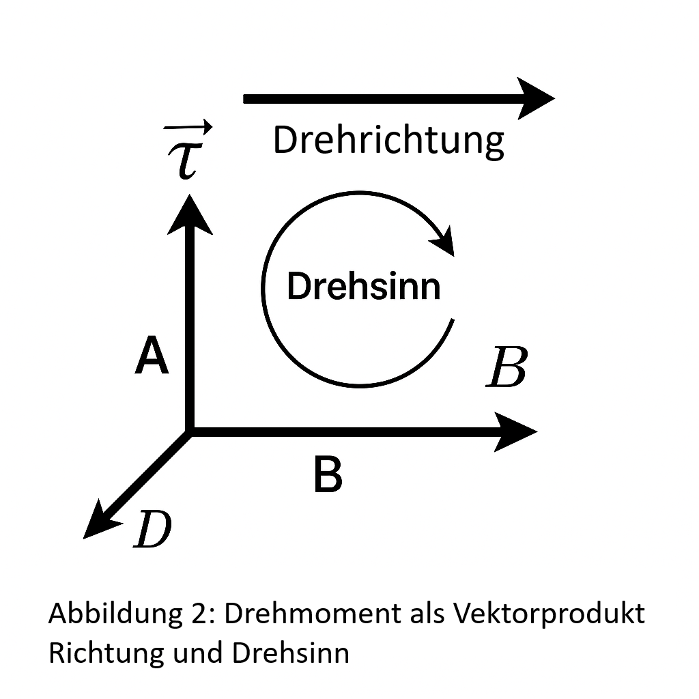
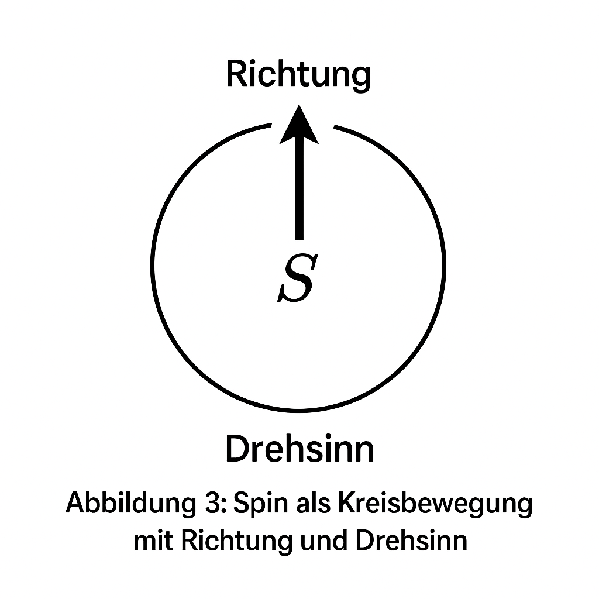
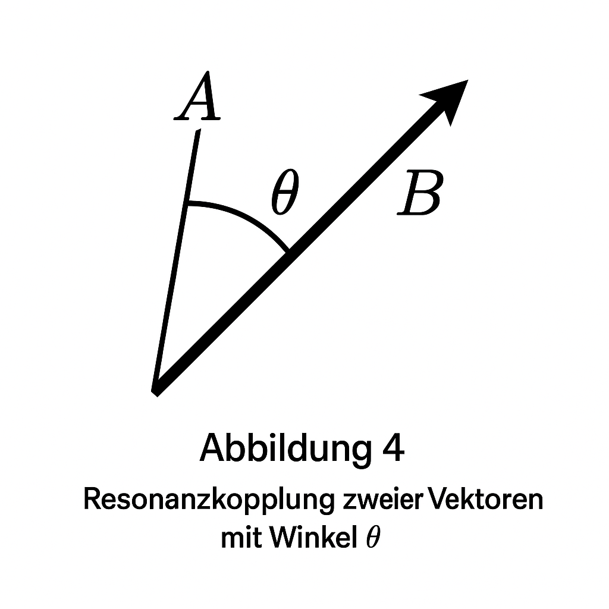

# Energierichtung in realen Systemen

Im Rahmen der Resonanzfeldtheorie wird Energie nicht mehr als bloße skalare Größe, sondern als gerichteter Vektor mit eigenem Drehsinn (Spin) verstanden. Dieses Kapitel zeigt die Anwendung dieser Sichtweise auf klassische und quantenmechanische Phänomene – stets bezogen auf die zugrundeliegenden Axiome der Theorie.

---

<strong>Axiome der Resonanzfeldtheorie (Kurzüberblick):</strong> 
<b>Axiom 2:</b> Energie und Felder besitzen eine Kopplungsstruktur. 
<b>Axiom 3:</b> Phasen- und Kopplungsstruktur bestimmen den inneren Drehsinn (Spin). 
<b>Axiom 5:</b> Energie ist geometrisierbar (vektoriell, nicht rein skalar). 
<b>Axiom 6:</b> Wechselwirkung erfolgt durch Resonanzkopplung.

---

## 1. Energie als gerichteter Vektor

**Begriffsklärung:**  
Klassisch ist Energie eine richtungslose Größe. In der Resonanzfeldtheorie ist Energie ein gerichteter Vektor im Energiekopplungsraum:

- **Betrag** (|𝐄|): Entspricht der klassischen Energiemenge (z. B. Joule).
- **Richtung** (ê₍Res₎): Gibt die Ausrichtung im Energiekopplungsraum an und bestimmt, wie und wohin Energie übertragen werden kann.
- **Innerer Drehsinn (Spin):** Energie besitzt einen eigenen Drehsinn, der Kopplung und Übertragung beeinflusst (Axiom 3).

Das sichtbare Beispiel ist das **Drehmoment**:  
  𝐓 = 𝐫 × 𝐅  [Nm] = [J]

- Betrag: klassische Energie
- Richtung: durch Rechte-Hand-Regel vorgegeben
- Drehsinn: Ausdruck der Kopplungsstruktur

  

Das Drehmoment ist somit die räumliche Projektion eines gerichteten Energievektors – ein Fenster in die höhere Struktur von Energie (Axiom 5).

---

## 2. Drehmoment als Manifestation des Energievektors

Das Drehmoment 𝐓 ist ein Vektor mit derselben Einheit wie Energie:

  𝐓 = 𝐫 × 𝐅  [Nm] = [J]

- Richtung nach der Rechte-Hand-Regel
- In der Resonanzfeldtheorie: sichtbare Projektion des Energievektors (Axiom 5)
- Drehsinn steht für die Kopplungsrichtung energetischer Prozesse

  

## 3. Spin als Ausdruck des Resonanz-Drehsinns

**Quantenmechanik:**  
Spin ist ein quantisierter, intrinsischer Drehimpuls ohne klassisches Analogon (z. B. Elektron: Spin-½, 720°-Symmetrie).

**Resonanzfeldtheorie:**  
Spin ist die geschlossene Rotation des Energievektors in einer höheren Dimension (Axiom 3).

- Spinquantenzahlen charakterisieren Kopplungszustände im Energiefeld.
- Der Spinoperator S wirkt auf Zustände |ψ⟩ als:  
  S_z |ψ⟩ = s·ħ |ψ⟩  
  wobei ħ das reduzierte Planck’sche Wirkungsquantum ist, s die Spinquantenzahl.

  

---

## 4. Richtungsabhängige Resonanzübertragung

Zwei Systeme können nur dann effizient Energie austauschen, wenn ihre Energievektoren resonant gekoppelt sind:

K = K₀ · cos(θ)

- K: Kopplungsstärke
- K₀: maximale Kopplung (bei θ = 0°)
- θ: Winkel zwischen den Energievektoren

Nur bei θ = 0° (Richtungsübereinstimmung) ist maximale Übertragung möglich.
Diese Richtungsabhängigkeit erklärt u. a.:

- Resonanzfrequenzabgleich in mechanischen Systemen (z. B. Pendelkopplung)
- Kopplung in der Quantenkommunikation (z. B. Polarisation)
- Filter- und Verstärkereffekte in der Elektrotechnik

Beispiele:

- Mechanik: Zwei gekoppelte Pendel schwingen synchron, wenn ihre Energievektoren ausgerichtet sind.
- Quantenkommunikation: Ein Photon kann nur Information übertragen, wenn seine Polarisation zur Detektorachse passt.
- Biophysik: Der FRET-Mechanismus funktioniert nur bei passender Ausrichtung von Donor- und Akzeptormolekül.
- Elektrotechnik: Ein Polarisationsfilter lässt nur Licht mit passender Energierichtung durch.

  

---

## 5. Impuls und Energie als vektorielles Paar

### Klassische Physik

- Impuls: 𝐩 = m · 𝐯
- Energie: E = ½ m v² (Skalar)

### Resonanzfeldtheorie

Energie ist ein Vektor:

  𝐄 = |𝐄| · ê₍Res₎, 𝐄 ∥ 𝐩 oder 𝐄 antiparallel zu 𝐩

Die Richtung ê₍Res₎ wird durch die Kopplungsstruktur des Resonanzfeldes bestimmt (Axiome 2, 6).
Bei Photonen zeigt sich dies im Zusammenhang von Impulsrichtung, Polarisation und Spin (Axiom 3).

  𝐄 = |𝐄| · ê₍Res₎, mit 𝐄 ∥ 𝐩

---

## 6. Anwendungsbeispiele aus der Praxis

- **Mechanik:** Zwei gekoppelte Pendel schwingen synchron, wenn ihre Energievektoren ausgerichtet sind (z. B. bei Uhren).
- **Photonen:** Informationstransfer in der Quantenkommunikation ist nur bei passender Polarisation möglich.
- **Biophysik:** FRET funktioniert nur, wenn Donor- und Akzeptormolekül räumlich und energetisch richtig ausgerichtet sind.
- **Technik:** Polarisationsfilter lassen nur Licht durch, dessen Energievektor mit der Filterrichtung übereinstimmt.

---

## Fazit

> **Energie ist ein Vektor mit höherdimensionalem Drehsinn.**  
> **Ihre sichtbaren Erscheinungen hängen vom Winkel der Resonanzkopplung an die Umgebung ab.**

Diese Sichtweise (Axiome 2, 3, 5, 6) vereinheitlicht Drehmoment, Spin, Energieübertragung und Impuls und eröffnet neue Perspektiven auf Kraft, Kopplung und Bewusstseinsphänomene.

---

Diese Interpretation folgt direkt aus den Axiomen 2, 3, 5 und 6 der Resonanzfeldtheorie und bildet die Grundlage für ein tieferes Verständnis von Kraft, Bewegung, Kopplung und Bewusstsein.

---

© Dominic-René Schu – Resonanzfeldtheorie 2025

---

[Zurück zur Übersicht](../../../README.md)