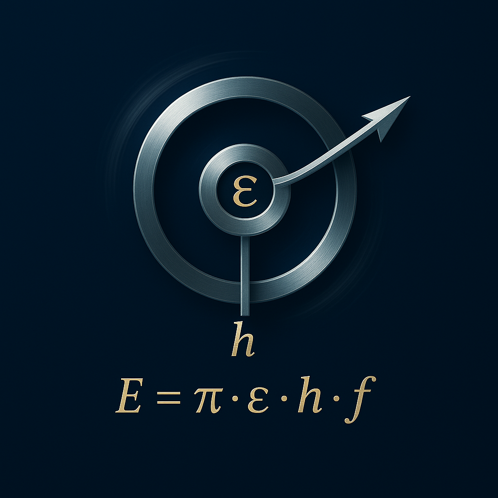

# Die Schu-Gleichung und ihre Anwendung in der Energieumwandlung

---

  

---

## 1. Einleitung

Die Schu-Gleichung verknüpft Resonanzfrequenz, Entropieänderung und Energiefluss zu einem erweiterten Energiemodell. Sie berücksichtigt Felddynamik, Frequenzkopplung und Phasenverschiebung auf Basis der Axiome 1, 2, 3, 5 und 6 der Resonanzfeldtheorie.

---

## 1.1 Erweiterte Form: Phasenmodulierte Schu-Gleichung

$$
\boxed{
\mathbf{E} = \pi \cdot 𝓔 \cdot h \cdot f \cdot \mathrm{e}^{\mathrm{i} \alpha}
}
$$

- 𝓔: Schu-Koppler (zentrale Kopplungskonstante der Resonanzfeldtheorie; siehe Definition im Resonanzfeld-Paper)
- π: Kreiszahl, universelles Maß für Raum und Schwingung
- h: Plancksches Wirkungsquantum
- f: Frequenz
- α: Phasenwinkel zwischen Beobachterzeit und Feldzeit
- Die Phasenmodulation ermöglicht die explizite Bewertung von Zeitverschränkung (Axiom 6).

---

## 1.2 Frequenzabhängigkeit

- Für f → 0: Energie vernachlässigbar
- Linearer Anstieg mit f bei Resonanz (Axiom 1)
- Übergang bei harmonischem Verhältnis zur Eigenfrequenz (Axiom 5)

---

## 1.3 Nutzbare Energie

$$
\Delta E(f) = \pi \cdot 𝓔 \cdot h \cdot f - \mathrm{e}^{-\pi f}
$$

- Der Verlustterm fällt bei hohen Frequenzen gegen Null (Axiom 2)

---

## 1.4 Leistung

$$
P(f_1, f_2) = \int_{f_1}^{f_2} \left( \pi 𝓔 h f - \mathrm{e}^{-\pi f} \right) \mathrm{d}f
$$

ergibt

$$
P = \frac{1}{2} \pi 𝓔 h (f_2^2 - f_1^2) + \frac{1}{\pi} \left( \mathrm{e}^{-\pi f_1} - \mathrm{e}^{-\pi f_2} \right)
$$

- Anwendung von Axiom 5 (Geometrisierung)

---

## 1.5 Vergleich zu klassischen Energiesystemen

- Klassische Systeme: Energie aus Druck-, Höhen- oder Temperaturdifferenzen
- Schu-Gleichung: Beschreibung auf Frequenzskala und im Resonanzfeld für höhere Effizienz und stärkere Spannungen
- Die vollständige Erklärung ist nur im Rahmen der Resonanzfeldtheorie möglich (Axiome 2, 3, 5)

---

## 1.6 Veranschaulichung für Laien

- Wasserrad mit kleinem Gefälle = klassische Technik
- Schu-Gleichung = „Wasserfall-Gefälle“ im Resonanzfeld der Zeit

**Folgen:**

- Höhere Effizienz
- Steuerbare Entropie
- Energiequellen erscheinen „frei“, sind jedoch immer an π, 𝓔, h, f, α gebunden

---

## 1.7 Praktische Anwendungen und technische Details

### Anwendungen

- Resonanzbasierte Energiegewinnung: Nutzung spezifischer Frequenzbereiche zur Maximierung der Energieausbeute, z. B. in Schwingungssystemen oder elektromagnetischen Feldern (Axiome 1, 2, 5)
- Effiziente Energiespeicherung: Steuerung von Phasenverschiebungen (α) zur Minimierung von Verlusten und Optimierung von Speichersystemen (Axiom 3)
- Resonanzfeldgeneratoren: Geräte, die gezielt Frequenzkopplung und Feldzeitdynamik nutzen, um Energie mit minimaler Umweltbelastung umzuwandeln (Axiome 2, 5, 6)
- Mess- und Steuerungstechnik: Integration der Phasenmodulation zur Echtzeit-Überwachung und Regelung von Energieflüssen (Axiom 6)

---

### Technische Details

- Parameterbestimmung: Der Schu-Koppler 𝓔 wird experimentell aus Felddynamik-Messungen bestimmt (Axiom 2)
- Frequenzbereiche: Optimal liegen f im harmonischen Verhältnis zu den Eigenfrequenzen des Systems (Axiom 5)
- Phasenwinkel α: Über Sensorik messbar, erlaubt Korrektur von Zeitverschiebungen für optimale Kopplung (Axiom 3)
- Implementierung: Simulationen verwenden numerische Integration der Leistungsgleichung zur Abbildung realer Systeme (Axiome 5, 6)

---

**Fazit:**  
Alle Formeln und Aussagen beruhen auf den Axiomen 1, 2, 3, 5 und 6 der Resonanzfeldtheorie, insbesondere auf Resonanz, komplexer Zeitstruktur und geometrischer Energie.

---

⬅️ [zurück](../../../README.md)