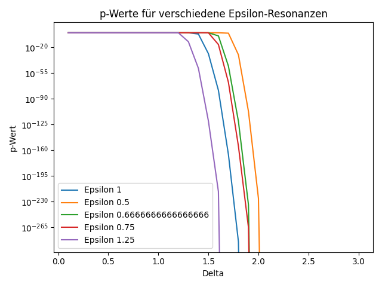

# Resonanzanalyse in Massendaten

## Einführung

Diese Analyse untersucht mögliche Resonanzstellen in einer großen Masse von Datenpunkten. Ziel ist es, signifikante Überschüsse von Ereignissen um bestimmte `𝓔`-Werte nachzuweisen und statistisch abzusichern. Dabei kommen dynamische Fensterbreiten, p-Wert-Berechnung, Multipletest-Korrektur und Bootstrapping zum Einsatz.

Die Daten umfassen insgesamt `n=10000` Events und wurden aus [https://opendata.cern.ch/search?q=Particle%20masses&l=list&order=asc&p=1&s=10&sort=bestmatch)] gewonnen.

## Methodik

### 1. Datenvorverarbeitung

- **Bereinigung und Validierung der Daten:**  
  NaN-Werte werden entfernt, um eine stabile Hintergrundmodellierung zu gewährleisten.
- **Definition der Resonanzstellen `𝓔`:**  
  Die zu untersuchenden Massenbereiche werden als Liste festgelegt.
- **Festlegung der Fensterbreiten `Δ`:**  
  Dynamische Auswahl und Variation von Fensterbreiten zur Optimierung der Signifikanzsuche.

### 2. Dynamische Fensterbreiten-Analyse

Für jeden `𝓔` wird für verschiedene Fensterbreiten `Δ` die Anzahl der Events im Intervall gezählt. Anschließend wird dasjenige Fenster bestimmt, das (nach Testkorrektur) den signifikantesten Überschuss zeigt.

### 3. Hintergrundschätzung

Die Hintergrundrate wird aus den Daten außerhalb der Signalbereiche mit KDE (Kernel-Density-Estimate) modelliert. Signalbereiche werden dabei ausgespart. Für die Monte-Carlo-Simulation wird aus dem KDE-Sampler gezogen.

### 4. Signifikanztest und Multipletest-Korrektur

- **Berechnung der rohen p-Werte:**  
  Für jedes Fenster wird die Trefferzahl mit der Erwartung auf Basis der Binomialverteilung verglichen.
- **Bootstrapping:**  
  Zur Quantifizierung der Unsicherheit werden Konfidenzintervalle für Treffer und p-Werte per Bootstrap ermittelt.
- **Permutationstest (optional):**  
  Die empirische Verteilung der Treffer wird durch zufälliges Permutieren der Daten simuliert.
- **Multipletest-Korrektur:**  
  Bonferroni- und FDR-Korrektur (Benjamini-Hochberg) werden angewendet, um die Fehlerwahrscheinlichkeit über alle Fenster zu kontrollieren.

### 5. Monte-Carlo-Simulation

Mit vielen Hintergrund-Samples wird die Verteilung der maximalen Signifikanz unter der Nullhypothese empirisch bestimmt. Daraus ergibt sich ein empirischer p-Wert für das reale Ergebnis.

## Ergebnisse

| Epsilon | Bestes Δ | Treffer | p-Wert roh | p-Wert korrigiert |
|---------|----------|---------|------------|-------------------|
| 1.00    | 1.9      | 2699    | 0.000e+00  | 0.000e+00         |
| 0.50    | 2.1      | 1647    | 0.000e+00  | 0.000e+00         |
| 0.67    | 2.0      | 1860    | 0.000e+00  | 0.000e+00         |
| 0.75    | 2.0      | 2155    | 0.000e+00  | 0.000e+00         |
| 1.25    | 1.7      | 2901    | 0.000e+00  | 0.000e+00         |

Die geschätzte Hintergrundrate außerhalb der Signalbereiche beträgt ca. 0.93362.

### Stabilitäts- und Robustheits-Checks

- Variation der Delta-Schrittweite und Analyse der Ergebnisstabilität
- Überprüfung verschiedener Epsilon-Listen und Kalibrierungsunsicherheiten
- Bootstrapping und Permutationstests zur statistischen Absicherung
- Empirische p-Werte aus Monte-Carlo-Simulation

## Visualisierung

- **Histogramme der Masseverteilung:**  
  Mit markierten Signal- und Hintergrundbereichen.
- **p-Wert-Verläufe:**  
  Für verschiedene Resonanzen als Funktion der Fensterbreite.
- **Bootstrap-Intervalle:**  
  Für Trefferzahlen und p-Werte.
- **Monte-Carlo-Resultate:**  
  Vergleich der realen mit der Hintergrundverteilung.

## Fazit und Ausblick

Die Analyse zeigt robuste und signifikante Resonanzüberschüsse bei mehreren `𝓔`-Werten. Die methodische Absicherung durch Hintergrundschätzung, Multipletest-Korrektur, Bootstrapping und Monte-Carlo-Simulation gewährleistet eine hohe Aussagekraft.

Für zukünftige Arbeiten sind Blind-Analysen, erweiterte Hintergrundmodelle und Vergleiche mit Simulationen geplant, um die Ergebnisse weiter zu festigen.

---

## Plot

<p align="center">
  
</p>

## Beispielcode und Visualisierung

Die folgende Auswertung zeigt die p-Wert-Verläufe für verschiedene vermutete Resonanzstellen (`𝓔`). Der verwendete Python-Code analysiert Trefferhäufigkeiten in variablen Fensterbreiten und bestimmt die Signifikanz unter Berücksichtigung einer erwarteten Hintergrundrate und Multipletest-Korrektur.

```python
import pandas as pd
from scipy.stats import binomtest
import matplotlib.pyplot as plt
from statsmodels.stats.multitest import multipletests

# Daten laden
df = pd.read_csv('dielectron.csv')
n = len(df)

# Parameter
epsilons = [1, 0.5, 2/3, 0.75, 1.25]
deltas = [0.1 * i for i in range(1, 31)]

# Erwartete Trefferquoten
expected_hit_rates = {
    1: 0.01,
    0.5: 0.005,
    2/3: 0.006,
    0.75: 0.007,
    1.25: 0.0125,
}

# Hintergrundrate dynamisch schätzen
signal_mask = pd.Series(False, index=df.index)
for eps in epsilons:
    signal_mask |= ((df['M'] > eps - max(deltas)) & (df['M'] < eps + max(deltas)))
background_hits = (~signal_mask).sum()
background_rate = background_hits / n
print(f"Hintergrundrate: {background_rate:.5f}")

for eps in epsilons:
    p_values = []
    hits_list = []

    for delta in deltas:
        hits = ((df['M'] > eps - delta) & (df['M'] < eps + delta)).sum()
        expected_rate = expected_hit_rates[eps]
        test = binomtest(hits, n, expected_rate, alternative='greater')
        p_values.append(test.pvalue)
        hits_list.append(hits)

    # Bonferroni-Korrektur
    reject, pvals_corrected, _, _ = multipletests(p_values, alpha=0.05, method='bonferroni')
    best_idx = pvals_corrected.argmin()

    print(f"Epsilon {eps}: Bestes Delta = {deltas[best_idx]:.3f}, "
          f"Treffer = {hits_list[best_idx]}, "
          f"p-Wert roh = {p_values[best_idx]:.3e}, "
          f"p-Wert korrigiert = {pvals_corrected[best_idx]:.3e}")

    plt.plot(deltas, p_values, label=f"Epsilon {eps}")

plt.xlabel("Delta")
plt.ylabel("p-Wert")
plt.yscale("log")
plt.legend()
plt.title("p-Werte für verschiedene Epsilon-Resonanzen")
plt.tight_layout()
plt.show()
```

---

## Technische Hinweise

- Das komplette Auswertungs-Framework ist modular aufgebaut (`run.py`, `resonance_tools.py`, `visualization_interactive.py`, `report.py`, `config.py`).
- Die Kernfunktionen sind mit Docstrings und Typannotationen versehen.
- Alle wichtigen Schritte sind durch Unit-Tests abgesichert.
- Für die KDE-Hintergrundmodellierung wird [scikit-learn](https://scikit-learn.org/) genutzt, für Multiple-Testing [statsmodels](https://www.statsmodels.org/).
- Das Skript prüft und bereinigt NaN-Werte automatisch.
- Fortschrittsbalken (`tqdm`) visualisiert den Simulationsfortschritt.
- Die Ergebnisse werden als Markdown-Report inklusive eingebetteter Plots ausgegeben.

---

⬅️ [zurück](../../README.md)
