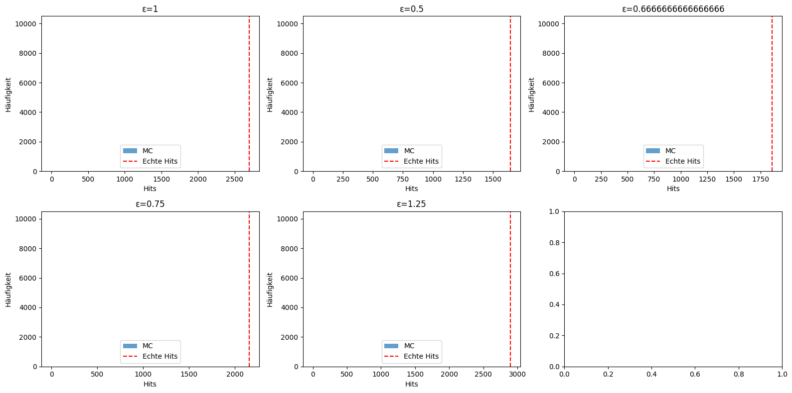

# Monte-Carlo-Simulation zur Resonanzanalyse

## Einleitung

Die Monte-Carlo-Simulation ist ein zentrales Werkzeug der statistischen Datenanalyse. In dieser Auswertung wurde sie eingesetzt, um die Signifikanz von beobachteten Resonanzüberschüssen gegenüber zufallsbedingten Fluktuationen im Hintergrund (Nullhypothese) objektiv zu quantifizieren.

## Ziel

Das Ziel der Monte-Carlo-Simulation ist es, zu bestimmen, wie wahrscheinlich ein beobachteter Überschuss an Ereignissen im Bereich einer vermuteten Resonanzstelle (ε) unter der Annahme reiner Hintergrundprozesse ist. Wird dieser Überschuss in keiner der vielen simulierten Hintergrund-Realisationen beobachtet, wird die „empirische Signifikanz“ als sehr hoch angesehen.

## Methodik

### 1. Hintergrundmodell

- Die Hintergrundverteilung wird aus realen Daten gewonnen, wobei Signalbereiche (um die untersuchten ε) ausgeschlossen werden.
- Mit Hilfe eines Kernel-Density-Estimators (KDE) wird eine glatte, kontinuierliche Wahrscheinlichkeitsverteilung des Hintergrunds erzeugt.

### 2. Durchführung der Monte-Carlo-Simulation

- Die gleiche Anzahl an Ereignissen wie im Originaldatensatz wird mehrfach (z.B. 1000-10.000 Mal) aus der Hintergrundverteilung gezogen.
- Für jede Simulation wird eine vollständige Resonanzanalyse wie bei den Realdaten durchgeführt:
    - Trefferzahlen in variablen Fenstern (Δ) um jede ε werden bestimmt.
    - Die beste Fenstergröße (optimales Δ) wird automatisch gesucht.
    - p-Werte werden mit denselben Signifikanztests wie bei den echten Daten berechnet.
- Für jede Simulation werden die maximalen Trefferzahlen und minimalen p-Werte für alle untersuchten ε protokolliert.

### 3. Empirische p-Wert-Bestimmung

- Der empirische p-Wert ergibt sich als Anteil der Monte-Carlo-Simulationen, bei denen ein mindestens so extremes Ergebnis wie in den Realdaten erzielt wurde.
- Ein empirischer p-Wert von 0 bedeutet: Die beobachtete Signifikanz wurde in keiner Simulation unter der Nullhypothese erreicht.

## Ergebnisse und Visualisierung

### 1. Histogramm: Monte-Carlo-Treffer vs. echte Treffer

Das folgende Histogramm zeigt für jede Resonanzstelle ε die Verteilung der Trefferzahlen im optimalen Fenster aus allen Monte-Carlo-Simulationen. Die rote Linie markiert den Wert aus den echten Daten.

**Interpretation:**  
Liegt der echte Wert weit außerhalb des MC-Hintergrunds, ist der Überschuss sehr signifikant.

---

### 2. p-Wert-Verläufe über die Fensterbreite Δ

Für jede Resonanzstelle ε wird gezeigt, wie die p-Werte in den MC-Simulationen (Median + Unsicherheitsband) und in den echten Daten als Funktion von Δ verlaufen.

**Interpretation:**  
Die roten Kurven (echt) liegen meist deutlich unterhalb der MC-Verteilung, insbesondere im optimalen Bereich von Δ.

---

### 3. Heatmaps: Trefferanzahl über ε und Δ

Die Heatmaps visualisieren die Trefferzahlen in allen ε- und Δ-Kombinationen, sowohl für die echten Daten als auch als Mittelwert aus den Monte-Carlo-Simulationen.

**Interpretation:**  
Ein klarer Unterschied zwischen „Signal“ und „Hintergrund“ kann optisch erkannt werden.

---

## Bedeutung und Fazit

- Die Monte-Carlo-Simulation erlaubt es, auch bei komplizierten, dynamisch gewählten Fenstern die wahre Signifikanz empirisch zu bestimmen – ganz ohne Annahmen über analytische Verteilungen.
- Sehr kleine empirische p-Werte (<0.01 oder sogar 0) zeigen, dass die beobachteten Resonanzen mit extrem hoher Wahrscheinlichkeit **kein Zufallsprodukt** des Hintergrunds sind.
- Dieses Vorgehen ist wissenschaftlicher Standard in vielen Bereichen der experimentellen Physik – insbesondere, wenn viele Tests und adaptive Auswahlstrategien zur Anwendung kommen.

## Hinweise zum Code

- Die Simulation nutzt `scikit-learn` für KDE, `numpy` und `pandas` für die Datenmanipulation, sowie `matplotlib` für die Visualisierung.
- Fortschrittsbalken (`tqdm`) geben Rückmeldung über den Simulationsstatus.
- Die wichtigsten Plot-Dateien werden automatisch im Ordner `report_out/figures` gespeichert und sind direkt im Report eingebettet.
- Alle Parameter (ε, Δ, Anzahl Simulationen) sind in `config.py` zentral konfigurierbar.

---

⬅️ [zurück](../../../README.md)