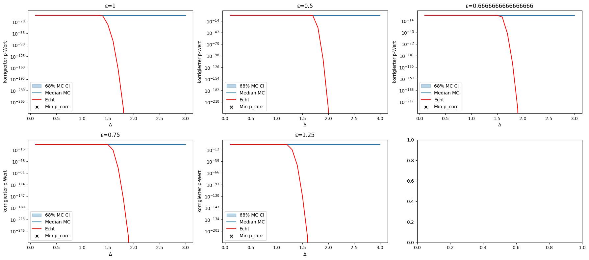
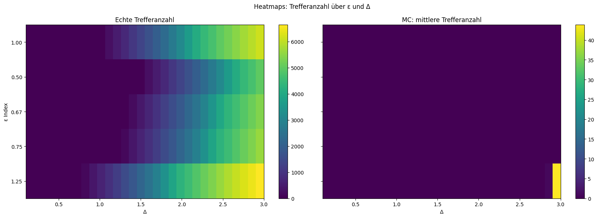

# Monte-Carlo-Simulation zur Resonanzanalyse

## Einleitung

Die Monte-Carlo-Simulation ist ein zentrales Werkzeug in der statistischen Auswertung wissenschaftlicher Datensätze. In dieser Analyse dient sie dazu, die Wahrscheinlichkeit zu bestimmen, mit der ein beobachteter Überschuss an Ereignissen im Bereich einer vermuteten Resonanzstelle (**𝓔**) rein zufällig durch den Hintergrund erklärt werden könnte.

### Wissenschaftlicher Kontext

Monte-Carlo-Tests sind Standard in der modernen Physik, Data Science und vielen anderen Forschungsfeldern, wenn analytische Lösungen zu komplex oder nicht verfügbar sind. Sie erlauben eine robuste, empirische Bestimmung von Signifikanzen, insbesondere bei adaptiven oder nicht-trivialen Suchverfahren wie in dieser Resonanzanalyse.

## Ziel

Das Ziel ist es, die empirische Signifikanz (p-Wert) der Beobachtungen zu quantifizieren, indem viele Hintergrund-Szenarien simuliert und mit den realen Daten verglichen werden.

## Methodik

### Hintergrundmodellierung

* Die Hintergrundverteilung wird aus den Messdaten extrahiert – unter explizitem Ausschluss der Signalbereiche (um die untersuchten **𝓔**).
* Ein Kernel-Density-Estimator (KDE) wird verwendet, um daraus eine glatte Wahrscheinlichkeitsverteilung zu erzeugen.

### Durchführung der Monte-Carlo-Simulation

* Es werden viele (z.B. 1.000–10.000) *Pseudo-Experimente* durchgeführt, bei denen jeweils die gleiche Anzahl an Events wie im Originaldatensatz aus dem KDE-Modell gezogen wird.
* Für jedes *Pseudo-Experiment* wird die vollständige Resonanzanalyse wiederholt:
  * Trefferzahlen in variablen Fenstern (**Δ**) um jedes **𝓔** werden bestimmt.
  * Die p-Werte werden mit den gleichen Tests wie für die Originaldaten berechnet.
  * Die jeweils optimalen Fenstergrößen werden automatisch bestimmt.
* Es werden die jeweils extremsten Trefferzahlen und p-Werte dokumentiert.

### Bestimmung des empirischen p-Werts

* Der empirische p-Wert ist der Anteil der Simulationsdurchläufe, in denen ein ebenso extremer oder extremerer Überschuss wie in den realen Daten gefunden wurde.
* Beispiel: Ist der empirische p-Wert ≈ 0, wurde in keiner Simulation ein so starkes Signal wie in den echten Daten beobachtet.

## Visualisierung der Ergebnisse

### 1. Monte-Carlo-Hits vs. echte Treffer

Das Histogramm zeigt, wie häufig in der Monte-Carlo-Simulation bestimmte Trefferzahlen im optimalen Fenster für jedes **𝓔** vorkommen. Die rote Linie markiert den Wert aus den echten Daten.


---

### 2. p-Wert-Verläufe über die Fensterbreite **Δ**

Hier siehst du für jede Resonanzstelle **𝓔** die p-Werte aus den MC-Simulationen (Median und 68%-Intervall) und den realen Daten in Abhängigkeit von **Δ**.



---

### 3. Heatmaps: Trefferanzahl über **𝓔** und **Δ**

Die Heatmaps zeigen die Trefferzahlen für alle Kombinationen aus **𝓔** und **Δ**, einmal für die realen Daten und einmal als Mittelwert der Monte-Carlo-Simulationen.



---

## Interpretation

* Die Monte-Carlo-Simulation zeigt, wie außergewöhnlich die beobachteten Überschüsse im Vergleich zum Hintergrund sind.
* Empirische p-Werte < 0,01 – insbesondere p ≈ 0 – sprechen für eine extrem geringe Wahrscheinlichkeit, dass die Befunde durch Zufall entstehen.
* Die grafische Gegenüberstellung (Histogramme, p-Wert-Kurven, Heatmaps) macht die Differenz zwischen Signal und Hintergrund anschaulich.

## Hinweise zum Code

* Die Simulation nutzt `scikit-learn` für KDE, `numpy` und `pandas` für Datenhandling und `matplotlib` für die Visualisierung.
* Fortschrittsbalken (`tqdm`) zeigen den Simulationsfortschritt an.
* Alle wichtigen Parameter wie **𝓔**, **Δ** und die Anzahl der Simulationen sind zentral in `config.py` eingestellt.
* Die wichtigsten Plots werden automatisch im Ordner `report_out/figures` abgelegt und sind hier direkt eingebunden.

### Ausführung der Simulation

Um die Monte-Carlo-Simulation selbst auszuführen, folge diesen Schritten:

1. Navigiere in das Verzeichnis des Projekts.
2. Stelle sicher, dass alle erforderlichen Python-Pakete installiert sind (siehe ggf. `requirements.txt`).
3. Starte das Hauptskript, z.B. mit:

   ```bash
   python fakten/empirisch/monte_carlo_test/run.py
   ```

   oder führe das begleitende Jupyter Notebook aus, falls vorhanden.

4. Die erzeugten Ergebnisse und Plots findest du im Ordner `report_out/figures`.

## Fazit

Die Monte-Carlo-Methode bietet eine robuste Möglichkeit zur statistischen Validierung von Resonanzeffekten. Durch die gezielte Modellierung des Hintergrunds und die wiederholte Zufallssimulation kann die Signifikanz von Beobachtungen empirisch und nachvollziehbar bestimmt werden.

Zukünftige Erweiterungen könnten adaptive Fenstergrößen, multiple Hypothesentests oder bayesianische Ansätze integrieren.

---

© Dominic-René Schu – Resonanzfeldtheorie 2025

---

[Zurück zur Übersicht](../../../README.md)