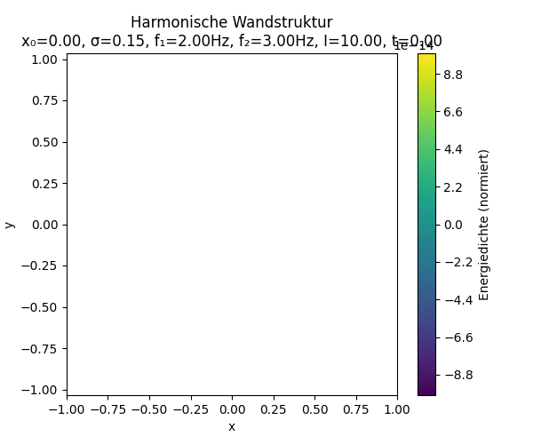

# Interaktive Resonanzfeld-Animation mit Exportfunktion

## Einleitung

Dieses Notebook/Script ermöglicht die **interaktive Simulation, Visualisierung und den Export** einer harmonischen Resonanzfeld-Struktur mit verschiebbarer Wand.  
Die Nutzer können Wandposition, Wandbreite, Kopplungsintensität, Frequenzen, Farbschema und die Bildrate (FPS) live steuern – und die Animation wahlweise als GIF oder MP4 exportieren. Damit dient das Tool sowohl der didaktischen Vermittlung von Resonanzfeld-Prinzipien als auch der Forschung und Präsentation.

---

<p align="center">
  
</p>

---

## Voraussetzungen

- **Python 3.7+**
- Benötigte Pakete:
  - `numpy`
  - `matplotlib`
  - `ipywidgets`
  - `IPython`
- Für GIF-Export: `pillow`
- Für MP4-Export: `ffmpeg` (systemweit installiert, z. B. via `apt`, `brew`, `conda`)

### Beispielinstallation mit pip

```bash
pip install numpy matplotlib ipywidgets pillow
```

Für Jupyter Notebook/Lab:

```bash
pip install notebook
jupyter nbextension enable --py widgetsnbextension
```

Für MP4-Export (Linux/macOS):

```bash
# Linux
sudo apt-get install ffmpeg

# macOS (Homebrew)
brew install ffmpeg
```

---

## Ausführen

1. Notebook öffnen (z. B. in JupyterLab, Jupyter Notebook oder VSCode)
2. Alle Zellen ausführen (Code aus `wand_animation_ultimate.py`)
3. Parameter anpassen:
   - **Wandposition (x₀)**
   - **Wandbreite (σ)**
   - **Intensität**
   - **Frequenzen (f₁, f₂)**
   - **Farbschema**
   - **FPS**
4. Vorschau starten
5. Exportformat wählen (`gif` oder `mp4`) und auf **Exportieren** klicken  
   Nach Abschluss steht ein Download-Link zur Verfügung.

---

## Hinweise

- Hohe FPS, viele Frames oder große Auflösung erhöhen die Exportdauer.
- Fehlende Abhängigkeiten oder Fehler werden im Output-Feld angezeigt.
- Der Export-Dateiname enthält die gewählten Parameterwerte zur besseren Nachvollziehbarkeit.

---

## Quellcode

Füge den vollständigen Python-Code aus `wand_animation_ultimate.py` in eine Notebook-Zelle ein.  
Passen Sie die Parameter oder das User Interface nach Bedarf an.

---

© Dominic-René Schu – Resonanzfeldtheorie 2025

---

[Zurück zur Übersicht](../../../README.md)