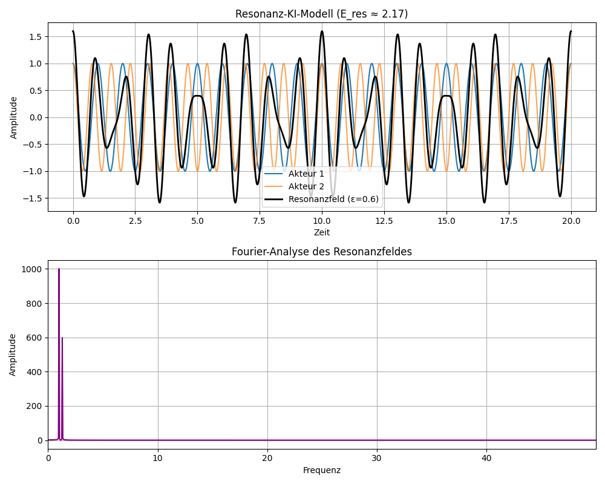

# Begleitkapitel: Resonanz-KI-Modell – Zwei gekoppelte Akteure und Feldanalyse

Dieses Kapitel erläutert die Konzeption, numerische Umsetzung und Interpretation des Resonanz-KI-Modells, das die Kopplung zweier schwingender „Akteure“ im Rahmen der Resonanzfeldtheorie simuliert. Die numerische Analyse verknüpft klassische Schwingungsphysik mit moderner Signalverarbeitung und KI-naher Modellbildung.

  

---

[Link zur Python](resonanzfeld.py)

---

## 1. Modellidee und physikalische Basis

Das Modell betrachtet **zwei Akteure** (zum Beispiel Oszillatoren, Systeme oder Agenten), die jeweils mit eigenen Frequenzen (f₁, f₂) schwingen. Über eine **Kopplungskonstante** (epsilon) beeinflussen sie sich gegenseitig. Die Kopplung kann für viele reale Anwendungen stehen, etwa Resonanzphänomene in Physik, Biologie oder sozialen Systemen.

Das **Resonanzfeld** ist definiert als Überlagerung der Einzelschwingungen:

$$
\psi_\mathrm{Res} = \psi_1 + \epsilon \psi_2
$$

mit

$$
\psi_i = \cos(2\pi f_i t + \varphi_i)
$$

(φ_i: optionale Phasenverschiebung)

---

## 2. Berechnung der Resonanzenergie

Die **Resonanzenergie** E_res des gekoppelten Systems wird analytisch nach folgender Formel berechnet:

$$
E_\mathrm{res} = \pi \epsilon h \cdot \frac{f_1 + f_2}{2}
$$

Hierbei steht h für die normierte Plancksche Konstante.

---

## 3. Fourier-Analyse

Die Fourier-Analyse des Resonanzfeldes liefert Einblick in die im Signal enthaltenen Frequenzkomponenten. Dadurch kann man direkt erkennen, wie die Kopplung (epsilon) und die Differenz der Akteursfrequenzen die spektrale Zusammensetzung des Feldes beeinflussen.

**Vorgehen:**
- Diskrete Fourier-Transformation (`numpy.fft`) des Resonanzfeldes
- Darstellung des Amplitudenspektrums in Abhängigkeit der Frequenz

---

## 4. Visualisierung und Interpretation

Die grafische Ausgabe besteht aus zwei Teilplots:
1. **Zeitverlauf:** Die Einzelschwingungen der Akteure und das gekuppelte Resonanzfeld im Zeitbereich.
2. **Frequenzanalyse:** Das Amplitudenspektrum des Resonanzfeldes, das die dominierenden Frequenzen und Modulationen sichtbar macht.

So lassen sich Eigenfrequenzen, Kopplung und deren Auswirkungen auf das Gesamtsystem anschaulich nachvollziehen.

---

## 5. Parametrisierung und Flexibilität

Sämtliche Modellparameter (Frequenzen, Kopplung, Phasen, Zeitbereich) sind zentral konfigurierbar. Dies ermöglicht eine flexible Anpassung an verschiedene Szenarien, etwa:
- Resonanz vs. Dissonanz (nahe oder entfernte Frequenzen)
- Starke vs. schwache Kopplung
- Phaseneffekte

---

## 6. Bedeutung und Ausblick

Das Resonanz-KI-Modell zeigt, wie durch einfache Kopplung von Einzelsystemen komplexe und emergente Felder entstehen können. Die Analyse bietet eine Grundlage für weiterführende Simulationen, z. B. mit mehr als zwei Akteuren, adaptiven Kopplungen oder KI-gesteuerter Optimierung von Resonanzbedingungen.

---

*© Dominic Schu, 2025 – Alle Rechte vorbehalten.*

---

⬅️ [zurück zur Übersicht](../README.md)