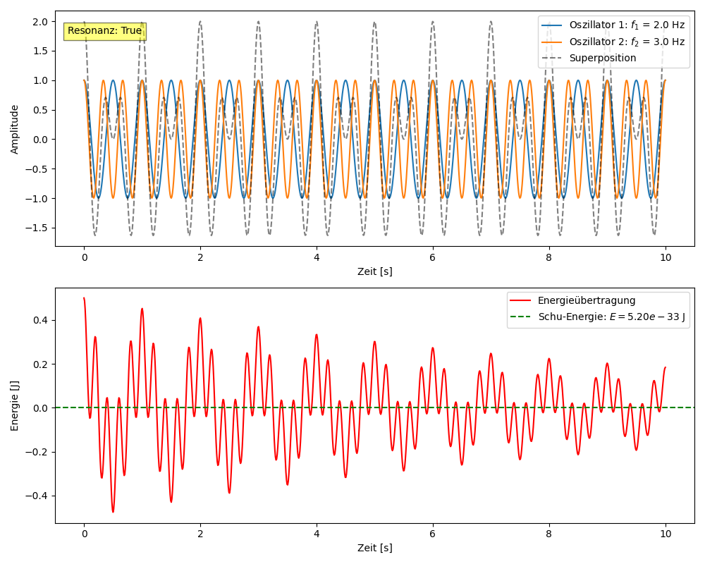

# Resonanzfeld-Simulation mit Schu-Gleichung

Diese interaktive Simulation visualisiert die Energieübertragung zwischen zwei schwingenden Oszillatoren basierend auf der **Schu-Gleichung**:

$$
E = \pi \cdot 𝓔 \cdot h \cdot (f_1 + f_2)
$$

---

## 🧭 Axiome der Resonanzfeldtheorie

1. **Alles ist Schwingung.**  
   Jede Form von Energie und Materie basiert auf Schwingungen eines zugrunde liegenden Resonanzfeldes.

2. **Resonanz koppelt.**  
   Systeme treten dann in Wechselwirkung, wenn ihre Schwingungen in ein ganzzahliges Verhältnis treten – das ist Resonanz.

3. **Energieübertragung folgt der Kopplung.**  
   Je stärker die Resonanz (Kopplungsgrad $$𝓔$$), desto größer die Energieübertragung zwischen den Feldern.

4. **π ist der Maßstab für kreisförmige Resonanzen.**  
   Die Konstante $$\pi$$ ist nicht nur geometrisch, sondern auch resonanzdynamisch grundlegend – sie beschreibt das Maß der perfekten Rückkopplung.

5. **h ist die Informationsquantelung des Feldes.**  
   Das Plancksche Wirkungsquantum $$h$$ (oder alternativ $$\eta$$) beschreibt die minimale Wirkungseinheit im Resonanzfeld.

6. **e wird zur Resonanzkopplungskonstanten.**  
   Die klassische Eulersche Zahl $$e$$ wird als eigene Naturkonstante für Resonanzkopplung interpretiert – im System durch $$𝓔$$ ersetzt.

7. **Beobachtung erzeugt Resonanz.**  
   Der bewusste Beobachter wirkt als Filter, der selektiv mit Feldern in Resonanz tritt und dadurch Wirklichkeit formt.

---

## Features

Auswahl der Kopplungsart:

- **Linear**:  
  
$$
E_\mathrm{trans} = 𝓔 \cdot \psi_1 \cdot \psi_2
$$
	
- **Quadratisch**:  
    
$$
E_\mathrm{trans} = 𝓔 \cdot \psi_1^2 \cdot \psi_2
$$
- **Trigonometrisch**:  
    
$$
E_\mathrm{trans} = 𝓔 \cdot \sin(\psi_1) \cdot \sin(\psi_2)
$$

- Anzeige der **Resonanzbedingung** bei rationalem Frequenzverhältnis  
  
$$
\frac{f_1}{f_2} = \frac{n}{m}
$$

- Optionale Verwendung einer neuen Naturkonstante $$\eta$$ statt $$h$$  
- Interaktive Visualisierung mit `ipywidgets`

---

<p align="center">
  
</p>

---

[Link zur Python](../../simulationen/resonanzfeld/simulation_resonanzfeldtheorie.py)

---

## Voraussetzungen

- Python ≥ 3.8  
- Jupyter Notebook / JupyterLab  
- Installierte Pakete:

```bash
pip install numpy matplotlib ipywidgets
```

---

➡️ [zurück](../README.md)
