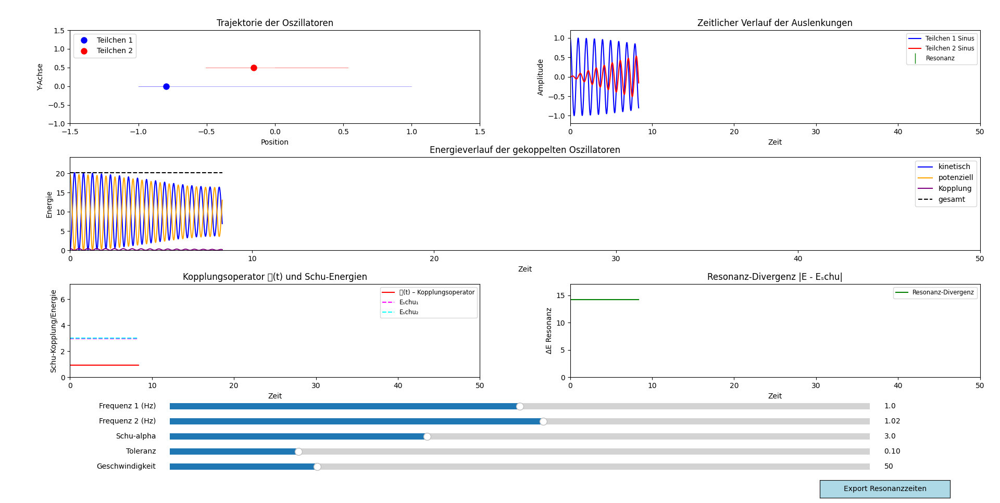

# 🧪 Simulation gekoppelter Oszillatoren

Interaktive Python-Simulation zur Visualisierung zweier gekoppelter harmonischer Oszillatoren.  
Das Modell demonstriert Kopplungseffekte, Energieaustausch, Resonanz und Energiebilanz anschaulich und dynamisch.

<p align="center">
  
</p>

---

## 🧠 Hintergrund: Resonanzfeldtheorie

Diese Simulation ist eingebettet in die **Resonanzfeldtheorie**, die davon ausgeht,  
dass alle Wechselwirkungen – von Quanten bis Makrosystemen – auf **gekoppelten Schwingungen** basieren.

### Grundannahmen

- **Felder** sind schwingende Informationsräume – Energie manifestiert sich durch **Resonanzkopplung**.  
- **Gekoppelte Oszillatoren** sind ein elementares Modell für Informationsübertragung im Raum.  
- **Energieaustausch ist frequenzbasiert** – maximale Effizienz bei Resonanz.  
- Die Naturkonstanten **π**, **𝓔** *(neue Kopplungskonstante)* und **ℎ** bilden die Basis der **Schu-Gleichung**:

$$
\mathbf{E = \pi \cdot \mathcal{E} \cdot h \cdot f}
$$

#### Bedeutung dieser Simulation

- Zeigt, wie **Energie gezielt in Resonanzfeldern wandert** – sichtbar gemacht durch den **klaren Energie-Pingpong** zwischen den Oszillatoren.  
- Verdeutlicht das Prinzip des **Resonators als Empfänger/Sender** im Feld.  
- Dient als **Experimentierfeld**, um neue Konzepte der Informationskopplung und Feldbewusstseins zu testen.

---

## 🔧 Funktionen

* **Numerische Lösung** gekoppelter Differentialgleichungen (`solve_ivp`)  
* **Interaktive Live-Animation** der Schwingungen inkl. Spurverfolgung  
* **Resonanz-Erkennung** mit Toleranzfenster und Dopplungsschutz  
* **Live-Justierung per Slider**: Frequenzen, Kopplungsstärke, Toleranz, Animationsgeschwindigkeit  
* **Dynamischer Energieplot**: kinetisch, potenziell, Kopplung, Gesamtenergie  
* **Visuelles Feedback bei Resonanz** (Aufleuchten der Oszillatoren)  
* **Export** von Resonanzzeitpunkten als CSV-Datei  

---

## 🧩 Struktur

* [`run.py`](run.py) – Einstiegspunkt mit UI und Steuerung  
* [`parameters_and_functions.py`](parameters_and_functions.py) – Physik, Gleichungslöser, Energieberechnung  
* [`animation.py`](animation.py) – Animation, Visualisierung, Energie-Plot  

---

## 🚀 Loslegen

### Abhängigkeiten installieren

```bash
pip install matplotlib numpy scipy
```

### Simulation starten

```bash
python run.py
```

---

## ℹ️ Hinweise

* Energieerhaltung wird ohne Dämpfung demonstriert.
* CSV-Export dokumentiert erkannte Resonanzzeitpunkte.
* Startbedingungen, Dämpfung oder neue Visualisierungen können leicht erweitert werden.

---

*© Dominic Schu, 2025 – Alle Rechte vorbehalten.*

---

⬅️ [zurück](../README.md)