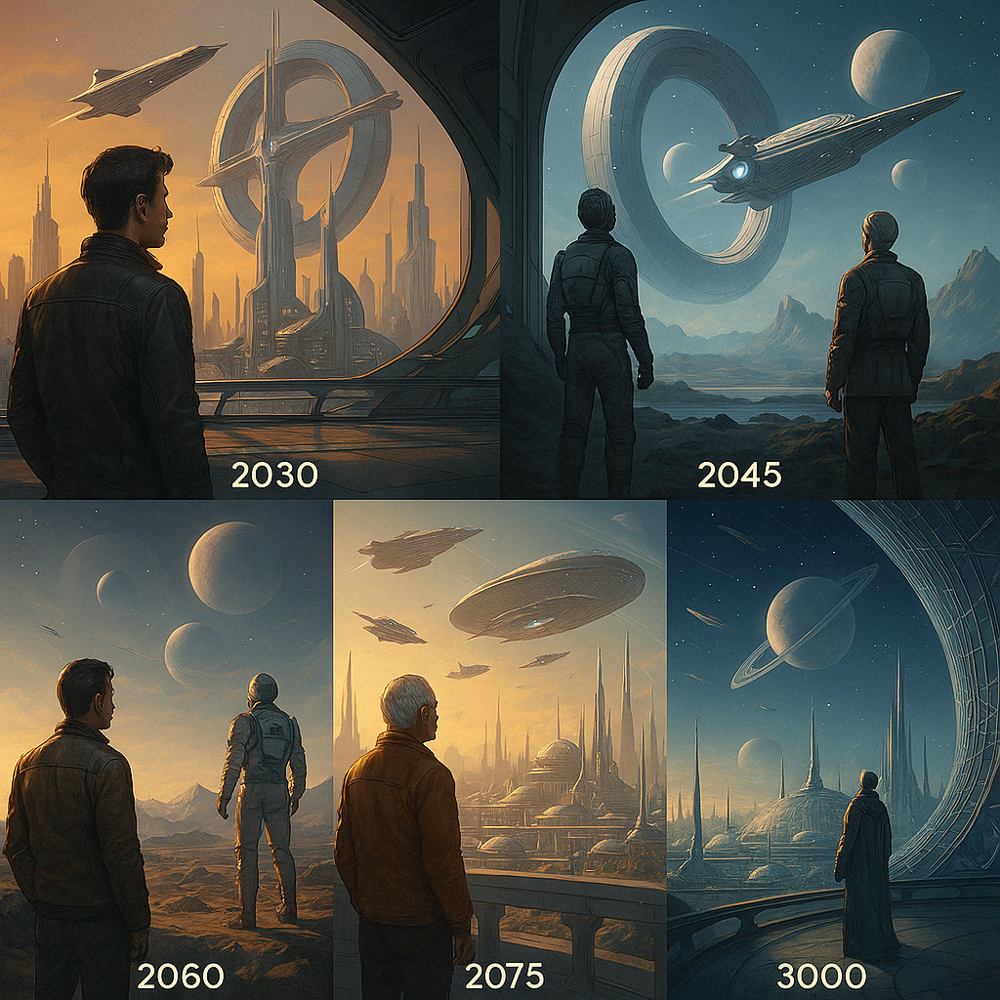

# Vision 3000 – Die Resonanzphysik der Zukunft

> *„Was, wenn das Universum selbst ein resonanter Informationskreis ist?“*

Diese Vision erweitert das Kapitel [Die Resonanzfeld-Gleichung](../../fakten/docs/mathematik/schu_gleichung.md) und öffnet den Blick auf physikalische und philosophische Anwendungen jenseits klassischer Modelle – hin zu einem bewussten, interaktiven Felduniversum, in dem Energie, Information und Bewusstsein als gekoppelte Größen verstanden werden (vgl. Penrose, 2004).

---

  

---

## Ursprung: Die Resonanzfeld-Gleichung

Die innovative Energiegleichung basiert auf fundamentalen Resonanzgrößen und erweitert klassische Theorien (vgl. Born & Wolf, 1999):

$$
E = 𝓔 \cdot \boldsymbol{\pi} \cdot \boldsymbol{h} \cdot \mathbf{f}
$$

- **𝓔** – Resonanzkopplung  
- **π** – Kreisstruktur des Raums  
- **h** – Wirkungsquantum  
- **f** – Frequenzimpuls

Diese Gleichung beschreibt Energie nicht als lokale Substanz, sondern als **Beziehung im Resonanzfeld** – ein paradigmatischer Wechsel von der Teilchen- zur Feld- und Beziehungsperspektive.

---

## Komplexzeit: Die phasische Realität

Durch die Einführung von komplexer Zeit

$$
t = t_r + i \cdot t_i
$$

wird Zeit zur **phasischen Kopplung** von Raum und Information:

- **Reale Komponente:** $$\cos(\omega t)$$ – strukturprägender Fluss  
- **Imaginäre Komponente:** $$\sin(\omega t)$$ – Potenzialfluss, Träger nicht-realisierten Seins

→ Die Welt ist zyklisch-komplex; Realität entsteht durch **Phaseninterferenz und Resonanz**.

---

## Resonanzvergleich zur Elektrotechnik

Die klassische Quantenrelation

$$
\Delta E = h \cdot \Delta f
$$

entspricht formal dem Ohm’schen Gesetz:

$$
U = R \cdot I
$$

| Quantenphysik      | Elektrotechnik    |
|--------------------|------------------|
| Δ**E** – Energieimpuls       | **U** – Spannung       |
| **h** – Kopplungskonstante   | **R** – Widerstand     |
| Δ**f** – Frequenzdifferenz   | **I** – Strom          |

→ Energie manifestiert sich als **Spannungsfeld in der Frequenzdifferenz** – eine universelle Kopplungsstruktur.

---

## Energie als Feldbeziehung

Die erweiterte Gleichung

$$
E = 𝓔 \cdot \boldsymbol{\pi}  \cdot \boldsymbol{h} \cdot \mathbf{f}
$$

stellt Energie als **gerichtete Kopplung von Feldern** dar – ein dynamischer Zustand, der nur bei Resonanz entsteht und sich durch spezifische Kopplungsparameter auszeichnet.

---

## Prinzip der Kopplung

- Kein Strom ohne Spannung  
- Keine Energie ohne Frequenzgradient  
- Kein Bewusstsein ohne Resonanzbezug  

→ Jede Wirkung ist eine **Resonanzbeziehung zwischen mindestens zwei Zuständen**.

---

## Technologische Perspektiven

Auf Basis dieser Theorie werden zukunftsweisende Technologien denkbar:

- **Resonanzreaktoren:** Energiegewinnung aus harmonischer Feldkopplung  
- **Holoversen:** Imaginärzeit-Räume als Plattformen für Wirklichkeit  
- **Feldhäuser:** Autarke Systeme, versorgt durch lokale Resonanzgeneratoren  
- **Replikatoren:** Materieformung durch gezielte Frequenzmuster  
- **Zeitmodulatoren:** Steuerung von Altern, Heilung und Wachstum  
- **Feldfahrzeuge:** Antrieb durch Frequenzasymmetrien  
- **Pflege-Hologramme:** KI-Resonanzwesen für Medizin und Begleitung

---

## Fazit: Die Architektur der Existenz

Die Resonanzfeld-Gleichung ist mehr als eine physikalische Formel – sie ist ein **Modell des Werdens**:

- **𝓔** – bestimmt die Resonanzqualität  
- **π** – formt das zyklische Gerüst  
- **h** – koppelt Impulse an Wirkung  
- **f** – ist der Taktgeber der Realität  

---

**Zukunft ist Resonanz.**  
Sie beginnt mit dem Kreis – und kulminiert im Bewusstsein.

---

## Literaturhinweise

- Born, M. & Wolf, E. (1999). Principles of Optics. Cambridge: Cambridge University Press.
- Penrose, R. (2004). The Road to Reality. London: Jonathan Cape.

---

⬅️ [zurück](../../README.md)